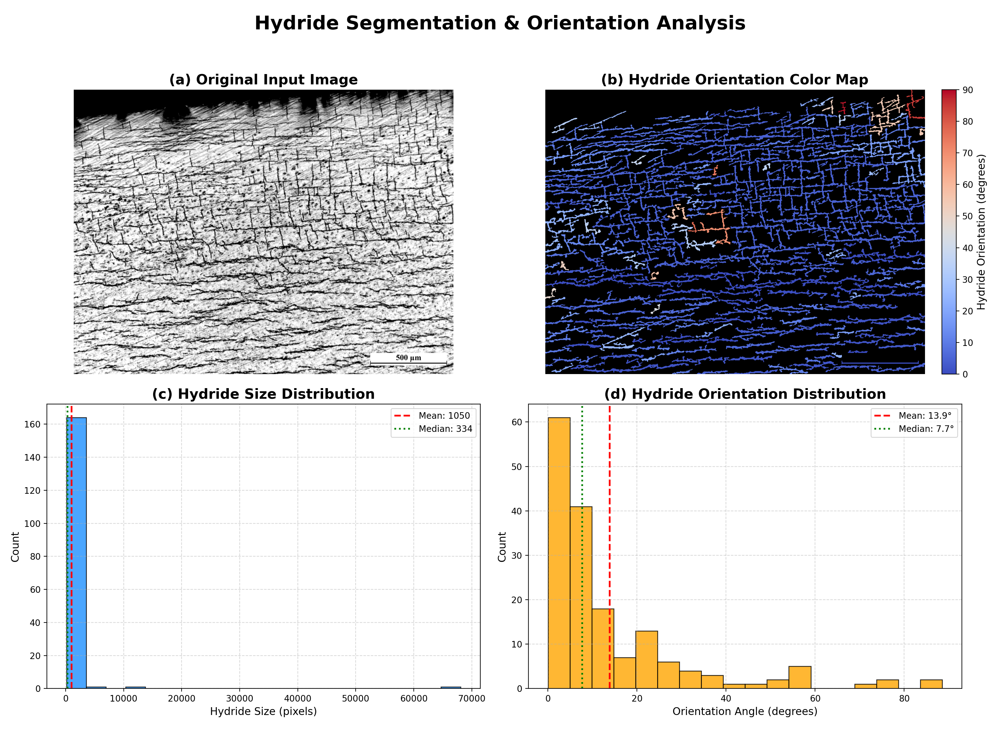

# HydrideSegmentation

HydrideSegmentation is a comprehensive toolkit for the segmentation and analysis of zirconium hydrides in microscopy images. It provides both advanced conventional algorithms and deep learning-based methods for hydride extraction, along with a user-friendly GUI for interactive analysis and visualization.

## Features

- **Hydride Segmentation**: Extracts hydrides from input images using either conventional image processing or deep learning models.
- **GUI Front-End**: Intuitive graphical interface for running segmentation, adjusting parameters, and visualizing results.
- **Quantitative Analysis**: Computes hydride orientation, size distribution, and other morphological statistics.
- **Publication-Quality Visualization**: Generates high-quality plots for hydride orientation maps, size distributions, and angle histograms.

### Code Structure

- `hydride_segmentation/core/gui_app.py` – main Tkinter application logic.
- `hydride_segmentation/core/analysis.py` – utilities for hydride orientation analysis and plotting.
- `hydride_segmentation/gui.py` – entry point with optional `--debug` mode.

## Example Workflow

1. **Input Image**: Provide a microscopy image of zirconium hydrides.
2. **Segmentation**: Choose between conventional or deep learning segmentation methods.
3. **Analysis**: The toolkit quantifies hydride orientation and size.
4. **Visualization**: Results are displayed in a multi-panel plot for publication or reporting.

## Example Output

Below is an example output generated by the toolkit, using the test image `test_data/3PB_SRT_data_generation_1817_OD_side1_8.png`:



- **(a) Original Input Image**: The raw microscopy image.
- **(b) Hydride Orientation Color Map**: Hydrides colored by their orientation angle. Note that horizontal hydrides are in blue while vertical ones are in red with color changing uniformaly from blue to red (see color bar!)
- **(c) Hydride Size Distribution**: Histogram of hydride sizes.
- **(d) Hydride Orientation Distribution**: Histogram of hydride orientation angles.

## Getting Started

1. **Install the package locally**:
   ```bash
   git submodule add <repository-url>
   cd HydrideSegmentation
   pip install -e .
   sudo apt-get install -y libgl1  # For OpenCV image display
   ```

2. **Run the analysis**:
   ```bash
   hydride-orientation --image test_data/3PB_SRT_data_generation_1817_OD_side1_8.png --shouldRunSegmentation
   ```

3. **Use the GUI**:
   ```bash
   hydride-gui
   ```
   Running with `--debug` skips the GUI and saves a six-panel plot to
   `test_data/results/3PB_SRT_data_generation_1817_OD_side1_8_combined.png`.

## Advanced Usage

- **Segmentation Options**: Select between conventional and ML models in the GUI.
- **Parameter Tuning**: Adjust CLAHE, thresholding, and morphological parameters for optimal segmentation.
- **Debug Mode**: Use `--debug` for detailed logging and annotated plots.
  The debug run creates a 2×3 figure combining segmentation and orientation analysis.

## Running Tests

The project includes a suite of `pytest` unit tests. After installing the
package and its requirements, run:

```bash
pytest
```

This will execute all tests under the `tests/` folder.

## Citation

If you use HydrideSegmentation in your research, please cite this repository.

---

For questions or contributions, see [CONTRIBUTE.md](CONTRIBUTE.md).  
Developers can find additional examples in [developer_guide.md](developer_guide.md).