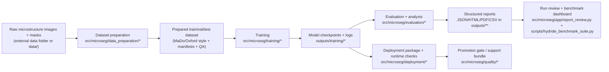
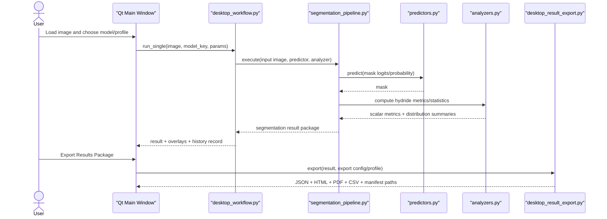

# Code Architecture and Data Flow Map

This guide provides a developer-facing map of how the repository is organized, how data moves through it, and where to find the right code/doc entry points quickly.

## 1) System Architecture (Component View)

```mermaid
flowchart TD
  subgraph clients["Client Surfaces"]
    qt["Qt Desktop\nhydride_segmentation/qt/main_window.py"]
    cli["CLI\nscripts/microseg_cli.py"]
    svc["Service/API\nhydride_segmentation/service.py + api/*"]
  end

  subgraph app["Application Orchestration (src/microseg/app)"]
    facade["facade.py"]
    orchestration["orchestration.py"]
    desktopwf["desktop_workflow.py"]
    exporter["desktop_result_export.py"]
    review["report_review.py"]
    hpcga["hpc_ga.py"]
    uiconfig["desktop_ui_config.py"]
    state["project_state.py"]
  end

  subgraph core["Segmentation Core (src/microseg)"]
    domain["domain/* + core/interfaces.py"]
    pipeline["pipelines/segmentation_pipeline.py"]
    infer["inference/predictors.py"]
    eval["evaluation/*"]
    corr["corrections/*"]
  end

  subgraph dataflow["Data Lifecycle"]
    dataprep["data_preparation/*"]
    dataops["dataops/*"]
    transforms["data/transforms.py + collate.py"]
  end

  subgraph training["Training Backends"]
    unet["training/unet_binary.py"]
    pixel["training/pixel_classifier.py + torch_pixel_classifier.py"]
    extmodels["HF/SMP backends via registry"]
  end

  subgraph gov["Governance + Deployment"]
    plugins["plugins/*"]
    quality["quality/*"]
    deploy["deployment/*"]
  end

  subgraph assets["Configs + Artifacts"]
    cfg["configs/*.yml"]
    weights["pre_trained_weights/metadata/*.json"]
    frozen["frozen_checkpoints/model_registry.json"]
    outputs["outputs/**"]
  end

  subgraph compat["Compatibility Layer"]
    legacy["hydride_segmentation/*"]
    adapter["hydride_segmentation/microseg_adapter.py"]
  end

  qt --> desktopwf
  qt --> exporter
  qt --> uiconfig
  qt --> state
  qt --> review

  cli --> orchestration
  cli --> dataprep
  svc --> facade

  desktopwf --> pipeline
  facade --> pipeline
  pipeline --> infer
  pipeline --> eval
  pipeline --> corr

  orchestration --> dataprep
  orchestration --> dataops
  orchestration --> unet
  orchestration --> pixel
  orchestration --> extmodels
  orchestration --> eval
  orchestration --> hpcga

  dataprep --> transforms
  dataops --> transforms
  unet --> plugins
  pixel --> plugins
  extmodels --> plugins
  eval --> quality
  deploy --> quality

  cfg --> orchestration
  cfg --> qt
  weights --> plugins
  frozen --> plugins
  outputs --> review
  outputs --> deploy

  legacy --> adapter
  adapter --> pipeline
```

## 2) End-to-End Data Flow (Research to Deployment)

## 3) Qt Runtime Interaction (Single Image)

## 4) Module Map with Code and Doc Links

| Area | Primary modules | What it does | Related docs |
|---|---|---|---|
| CLI entrypoints | [`scripts/microseg_cli.py`](../scripts/microseg_cli.py), [`scripts/hydride_benchmark_suite.py`](../scripts/hydride_benchmark_suite.py) | Unified train/evaluate/infer/dataset/deploy commands and benchmark orchestration | [`configuration_workflow.md`](configuration_workflow.md), [`hpc_airgap_top5_realdata_runbook.md`](hpc_airgap_top5_realdata_runbook.md) |
| Desktop Qt | [`hydride_segmentation/qt/main_window.py`](../hydride_segmentation/qt/main_window.py), [`hydride_segmentation/gui.py`](../hydride_segmentation/gui.py), [`hydride_segmentation/qt_gui.py`](../hydride_segmentation/qt_gui.py) | User-facing desktop workflow, run history, exports, settings | [`gui_user_guide.md`](gui_user_guide.md), [`local_desktop_product_spec.md`](local_desktop_product_spec.md) |
| App orchestration | [`src/microseg/app/orchestration.py`](../src/microseg/app/orchestration.py), [`src/microseg/app/facade.py`](../src/microseg/app/facade.py), [`src/microseg/app/workflow_profiles.py`](../src/microseg/app/workflow_profiles.py) | Command construction, workflow coordination, profile persistence | [`development_workflow.md`](development_workflow.md), [`phase4_orchestration_pane.md`](phase4_orchestration_pane.md) |
| Dataset preparation | [`src/microseg/data_preparation/pipeline.py`](../src/microseg/data_preparation/pipeline.py), [`src/microseg/data_preparation/binarization.py`](../src/microseg/data_preparation/binarization.py), [`src/microseg/data_preparation/resizing.py`](../src/microseg/data_preparation/resizing.py), [`hydride_segmentation/prepare_dataset.py`](../hydride_segmentation/prepare_dataset.py) | Pairing, mask normalization/binarization, resize-crop policy, manifest/report export | [`data_preparation.md`](data_preparation.md), [`training_data_requirements.md`](training_data_requirements.md), [`input_size_policy.md`](input_size_policy.md) |
| Dataset governance | [`src/microseg/dataops/training_dataset.py`](../src/microseg/dataops/training_dataset.py), [`src/microseg/dataops/split_planner.py`](../src/microseg/dataops/split_planner.py), [`src/microseg/dataops/quality.py`](../src/microseg/dataops/quality.py) | Split planning, leakage control, QA checks | [`phase9_model_lifecycle_dataops.md`](phase9_model_lifecycle_dataops.md), [`phase10_training_dataset_autoprepare.md`](phase10_training_dataset_autoprepare.md) |
| Training backends | [`src/microseg/training/unet_binary.py`](../src/microseg/training/unet_binary.py), [`src/microseg/training/torch_pixel_classifier.py`](../src/microseg/training/torch_pixel_classifier.py), [`src/microseg/training/pixel_classifier.py`](../src/microseg/training/pixel_classifier.py) | Binary segmentation training, checkpointing, resume, progress timing, reports | [`phase6_unet_backend.md`](phase6_unet_backend.md), [`phase18_transformer_backends.md`](phase18_transformer_backends.md), [`phase19_hf_sota_transformers.md`](phase19_hf_sota_transformers.md) |
| Inference + pipeline | [`src/microseg/pipelines/segmentation_pipeline.py`](../src/microseg/pipelines/segmentation_pipeline.py), [`src/microseg/inference/predictors.py`](../src/microseg/inference/predictors.py) | Model invocation and end-to-end segmentation execution | [`target_architecture.md`](target_architecture.md), [`mission_statement.md`](mission_statement.md) |
| Evaluation + analytics | [`src/microseg/evaluation/pixel_model_eval.py`](../src/microseg/evaluation/pixel_model_eval.py), [`src/microseg/evaluation/hydride_metrics.py`](../src/microseg/evaluation/hydride_metrics.py), [`src/microseg/evaluation/analyzers.py`](../src/microseg/evaluation/analyzers.py) | Metric computation, report generation, hydride-specific statistics | [`benchmark_metrics_reference.md`](benchmark_metrics_reference.md), [`scientific_validation.md`](scientific_validation.md) |
| Registry and pretrained handling | [`src/microseg/plugins/registry.py`](../src/microseg/plugins/registry.py), [`src/microseg/plugins/pretrained_weights.py`](../src/microseg/plugins/pretrained_weights.py), [`src/microseg/plugins/frozen_checkpoints.py`](../src/microseg/plugins/frozen_checkpoints.py) | Model metadata, checkpoint guidance, pretrained weight wiring | [`pretrained_model_catalog.md`](pretrained_model_catalog.md), [`offline_pretrained_transfer_workflow.md`](offline_pretrained_transfer_workflow.md), [`frozen_checkpoint_registry.md`](frozen_checkpoint_registry.md) |
| Deployment + quality | [`src/microseg/deployment/package_bundle.py`](../src/microseg/deployment/package_bundle.py), [`src/microseg/deployment/runtime_health.py`](../src/microseg/deployment/runtime_health.py), [`src/microseg/quality/phase_gate.py`](../src/microseg/quality/phase_gate.py), [`src/microseg/quality/support_bundle.py`](../src/microseg/quality/support_bundle.py) | Package, validate, smoke, runtime checks, promotion gates, support diagnostics | [`deployment_ops_workflow.md`](deployment_ops_workflow.md), [`phase26_deployment_runtime_modes.md`](phase26_deployment_runtime_modes.md), [`failure_taxonomy.md`](failure_taxonomy.md) |
| Compatibility layer | [`hydride_segmentation/microseg_adapter.py`](../hydride_segmentation/microseg_adapter.py), [`hydride_segmentation/inference.py`](../hydride_segmentation/inference.py), [`hydride_segmentation/ml_api.py`](../hydride_segmentation/ml_api.py) | Legacy API and GUI compatibility while core migrates to `src/microseg` | [`repository_blueprint.md`](repository_blueprint.md), [`phase2_desktop_refactor.md`](phase2_desktop_refactor.md) |
| Tests and validation | [`tests/`](../tests), [`tests/test_phase*.py`](../tests) | Regression coverage across phases, desktop, training, deployment, and data prep | [`tests/README.md`](../tests/README.md), [`development_workflow.md`](development_workflow.md) |

## 5) Fast Navigation for New Developers

1. Start with [`README.md`](../README.md) and [`docs/README.md`](README.md).
2. Read [`target_architecture.md`](target_architecture.md) and [`repository_blueprint.md`](repository_blueprint.md).
3. If your task is data prep, jump to [`data_preparation.md`](data_preparation.md) and `src/microseg/data_preparation/`.
4. If your task is training/benchmarking, jump to [`hpc_airgap_top5_realdata_runbook.md`](hpc_airgap_top5_realdata_runbook.md) and `src/microseg/training/`.
5. If your task is desktop UX/export, jump to [`gui_user_guide.md`](gui_user_guide.md) and `hydride_segmentation/qt/main_window.py`.
