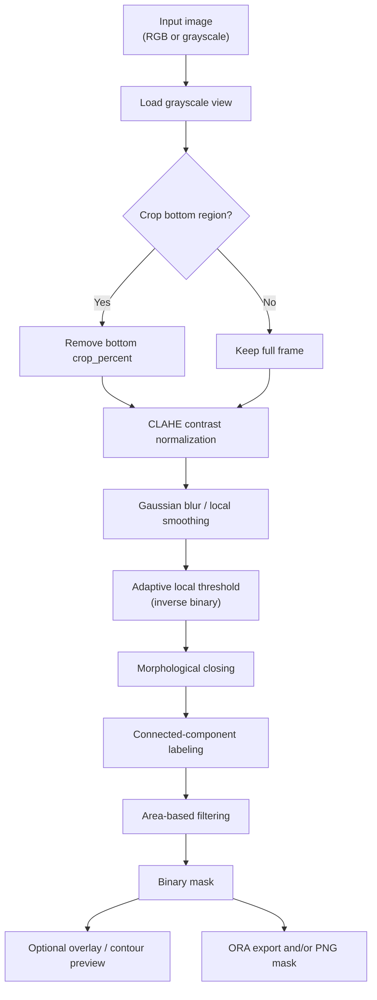

# Conventional Segmentation Pipeline

## Purpose

This page documents the classical, CPU-first hydride segmentation workflow that ships in the repository. It is the baseline method for fast inspection, debugging, and environments where neural-network inference is not required or not yet validated.

The current conventional path is implemented in two layers:

- `hydride_segmentation/core/conventional.py` for the reusable library pipeline
- `hydride_segmentation/segmentation_mask_creation.py` for the legacy GUI/service workflow with plotting and ORA export

The two implementations follow the same scientific idea:

1. normalize local contrast,
2. separate foreground from background with a local threshold,
3. clean the mask morphologically,
4. remove small components that are unlikely to be real hydride features,
5. export the mask for review and downstream analysis.

## Flow Sheet

## Step-By-Step Explanation

### 1. Load the image in grayscale

The conventional algorithm begins by reading the image as a grayscale intensity map.

Why this matters:

- hydride plates are typically judged from intensity contrast rather than color channels,
- grayscale simplifies thresholding and component extraction,
- this keeps the baseline deterministic and fast on CPU.

Implementation notes:

- the legacy class stores both the original image and the working image,
- the modern reusable helper expects an image array and runs the same stages without GUI state.

### 2. Optional bottom crop

The legacy pipeline can remove a percentage of rows from the bottom of the image.

Why this matters:

- some acquisition setups contain mounting artifacts, scale bars, or edge clutter at the bottom of the frame,
- a controlled crop can prevent the thresholding stage from being biased by non-sample regions.

Important caution:

- crop only when the removed region is known to be non-informative,
- never use cropping to hide poor segmentation quality,
- document the crop percentage in the run metadata.

### 3. CLAHE contrast normalization

CLAHE stands for contrast-limited adaptive histogram equalization.

Why this matters:

- hydride contrast is often local rather than global,
- the same image may contain bright and dim regions with different illumination,
- CLAHE improves the separation between hydride plates and the surrounding matrix before thresholding.

Scientific effect:

- increases local contrast,
- enhances weak plate edges,
- can also amplify sensor noise if pushed too hard.

### 4. Local smoothing before thresholding

The legacy implementation applies a small Gaussian blur before the adaptive threshold.

Why this matters:

- suppresses single-pixel noise,
- stabilizes the local mean estimate used by thresholding,
- reduces pepper noise that otherwise becomes tiny false-positive components.

The reusable core pipeline omits the explicit blur but still applies local contrast normalization and local thresholding. In practice, the blur in the legacy path is a noise-control step, not a conceptual requirement.

### 5. Adaptive local thresholding

The pipeline uses a local threshold rather than a single global threshold.

Why this matters:

- hydride images often have illumination gradients,
- a single threshold may over-segment bright regions and under-segment dim regions,
- local thresholding adapts to neighborhood intensity statistics.

The legacy implementation uses inverse binary thresholding:

- darker-than-local-background pixels become foreground,
- brighter background remains background.

This matches the common visual assumption for hydride plates in optical microscopy after contrast normalization.

### 6. Morphological closing

Closing is a dilation followed by erosion using a structuring element.

Why this matters:

- reconnects small breaks inside a hydride plate,
- fills narrow gaps and pinholes,
- improves component continuity before component filtering.

Trade-off:

- too little closing leaves fragmented objects,
- too much closing can merge neighboring plates and distort feature boundaries.

### 7. Connected-component labeling

After thresholding and closing, the binary mask is decomposed into connected components.

Why this matters:

- hydrides are not just pixels; they are discrete features,
- component labeling lets the pipeline reject isolated noise blobs,
- the same connected-component map can later be used for count, size, and orientation analysis.

### 8. Area-based filtering

Each labeled component is measured by area in pixels and compared to an area threshold.

Why this matters:

- removes tiny artifacts that are almost never true hydrides,
- provides a simple and explainable shape prior,
- makes the baseline less sensitive to threshold noise.

Scientific interpretation:

- area threshold is a physical proxy for "minimum meaningful feature size" in pixel units,
- it should be scaled to imaging resolution and the smallest plate you want to keep.

### 9. Mask export and review

The legacy runner can export:

- a binary mask PNG,
- an ORA layer stack with background + mask,
- intermediate plots for debugging and teaching.

Why this matters:

- the output is immediately inspectable in external tools,
- ORA preserves a layered review format,
- exported masks are suitable for downstream correction and dataset packaging.

## Parameter Reference

The table below documents the canonical parameter names as they appear in the reusable library and the legacy workflow.

| Parameter | Meaning | Why It Matters | Typical Starting Value | Typical Range | Notes |
|---|---|---|---|---|---|
| `clahe_clip_limit` / `clahe.clip_limit` | Limits local contrast amplification | Prevents CLAHE from over-amplifying noise | `2.0` | `1.5` to `4.0` | Raise only if contrast is weak and noise is controlled |
| `clahe_tile_grid` / `clahe.tile_grid_size` | Size of the local CLAHE tiles | Controls how local the contrast normalization is | `(8, 8)` | `(8, 8)` to `(16, 16)` | Smaller tiles respond more locally but can look noisier |
| `adaptive_window` / `adaptive.block_size` | Local neighborhood size for threshold estimation | Determines how much context each local threshold sees | `31` in the reusable core, `13` in the legacy demo preset | odd values from `21` to `51` are common | Must be odd and at least `3` |
| `adaptive_offset` / `adaptive.C` | Constant subtracted from the local statistic before thresholding | Controls threshold aggressiveness | `2` in the reusable core, `20` to `40` in older GUI/service presets | `0` to `15` for more permissive settings, higher for stricter foreground capture | In the inverse-threshold path, larger values usually reduce foreground area |
| `morph_kernel` / `morph.kernel_size` | Structuring-element size for closing | Repairs gaps and smooths binary shapes | `3` in the reusable core, `5` in the legacy demo preset | `3` to `7` | Keep the kernel small unless the plates are visibly fragmented |
| `morph_iters` / `morph.iterations` | Number of morphology passes | Strengthens the closing effect | `1` in the reusable core, `0` in the legacy demo preset | `0` to `2` | `0` is useful when the thresholded mask is already clean |
| `area_threshold` | Minimum component area in pixels | Rejects tiny noise blobs | `95` in the GUI sample preset, `150` in the service defaults | depends on pixel size and magnification | Scale this with image resolution and expected smallest plate |
| `crop` | Enables bottom crop | Removes a known non-sample region | `false` | `false` / `true` | Use only when the bottom strip is not scientifically relevant |
| `crop_percent` | Bottom crop amount in percent | Controls how much of the frame is removed | `10` in the GUI sample preset, `0` in service defaults | `0` to `20` | Should be justified in the run record |

### Validation Constraints

The API layer validates these structural rules:

- `clahe_clip_limit > 0`
- `clahe_tile_grid` must contain two values, both at least `1`
- `adaptive_window` must be odd and at least `3`
- `morph_kernel` must be odd and at least `1`
- `morph_iters >= 0`

These are not arbitrary coding limits. They exist because the underlying algorithms assume them.

## Parameter Lineage And Defaults

This repository has more than one historical parameter surface, so the documentation must be explicit about which one is being discussed.

### Reusable core defaults

`hydride_segmentation/core/conventional.py` uses:

- `clahe_clip_limit = 2.0`
- `clahe_tile_grid = (8, 8)`
- `adaptive_window = 31`
- `adaptive_offset = 2`
- `morph_kernel = 3`
- `morph_iters = 1`

### Legacy GUI/service presets

The historical GUI/service sample preset uses a more aggressive thresholding profile:

- `adaptive.block_size = 13`
- `adaptive.C = 40` in the GUI debug path
- `morph.kernel_size = (5, 5)`
- `morph.iterations = 0`
- `area_threshold = 95`
- `crop = false`
- `crop_percent = 10`

### Why the difference matters

The reusable core defaults are better for general documentation and reproducibility. The GUI/service presets are demonstration-oriented and may be tuned for a specific sample image. When you write reports or tutorials, always say which preset you used.

## How To Tune The Pipeline

Start with the default settings, then change only one family of parameters at a time.

### If the mask is too fragmented

- decrease `adaptive.C` slightly,
- increase `morph_kernel`,
- increase `morph_iters` from `0` to `1`,
- check whether CLAHE is too weak.

### If the mask is too noisy

- increase `adaptive.C`,
- reduce `clahe_clip_limit`,
- reduce `morph_kernel`,
- increase the area threshold.

### If neighboring plates merge

- reduce `morph_kernel`,
- reduce `morph_iters`,
- lower `adaptive.C`,
- verify that the crop is not removing a structure boundary.

### If small valid plates disappear

- reduce `area_threshold`,
- reduce the strength of closing,
- check whether the image resolution is unusually high or low relative to the current threshold.

## Typical Use Cases

- quick CPU baseline comparison,
- sanity-checking a new dataset,
- debugging model output against a transparent rule-based reference,
- teaching the relationship between local contrast, thresholding, and connected components,
- generating an explainable fallback when ML checkpoints are not available.

## What This Baseline Is Not

- It is not a learned model.
- It is not a substitute for a validated production checkpoint when scientific accuracy is the primary goal.
- It does not learn morphology from data.
- It does not handle every texture regime equally well.

The value of this baseline is explainability, reproducibility, and speed.

## Related Documentation

- [`docs/algorithms.md`](algorithms.md)
- [`docs/student_onramp.md`](student_onramp.md)
- [`docs/usage_commands.md`](usage_commands.md)
- [`docs/results_analysis.md`](results_analysis.md)
- [`docs/scientific_validation.md`](scientific_validation.md)
