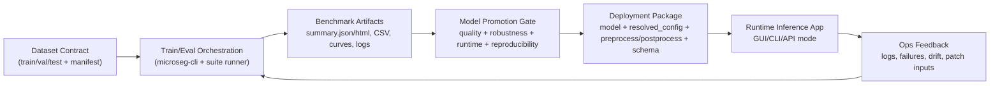

# HydrideSegmentation Deployment And Productization Master Roadmap

## 1. Purpose

This document is the single execution guide for taking HydrideSegmentation from strong research workflows to a robust, maintainable, deployment-grade product.

It covers:

- model-selection rigor
- deployment packaging and rollback safety
- app user experience and operational convenience
- maintainability, patching, and upgrade governance
- test strategy and release gates

## 2. Scope And Outcomes

### In scope

- end-to-end benchmark-to-deployment flow for binary hydride segmentation
- local desktop workflows plus HPC/air-gapped operations
- release/patch lifecycle and support diagnostics
- architectural standards for future model additions

### Out of scope

- cloud multi-tenant SaaS control plane
- real-time streaming inference services
- labeling workforce management tooling

### Target outcomes (project-level KPIs)

1. Any approved model can be deployed with no manual code edits.
2. Failed runs are diagnosable from logs/artifacts without rerun in at least 90% of cases.
3. New researcher/operator onboarding to first valid run is under 30 minutes.
4. Patch release turnaround is under 1 business day for high-priority defects.
5. Model comparison decisions are traceable to fixed metrics, fixed data split, and reproducible configs.

## 3. Execution Principles

1. Contract-first architecture: preprocessing, model interface, and report schema are versioned contracts.
2. Reproducibility before velocity: benchmark mode + manifest freeze + explicit seed policies.
3. Safe change management: compatibility, migration notes, rollback path, and patch playbook are mandatory.
4. Observability by default: structured event logs and run artifacts are treated as first-class outputs.
5. UX for non-developers: preflight checks and one-command profiles reduce operational friction.

## 4. Target Operating Architecture



## 5. Workstreams

### Workstream A: Model excellence and objective comparison

- maintain 10-model benchmark parity (scratch + pretrained)
- enforce fixed data split and reproducible configs
- add promotion gates with explicit threshold policies

### Workstream B: Deployment and operations

- define deployment package contract
- make rollout/rollback deterministic
- ensure diagnostic completeness in queued HPC environments

### Workstream C: UX and productivity

- prevent avoidable failures via preflight validation
- simplify common actions using run profiles and guided workflows
- improve discoverability and operator help within docs/UI

### Workstream D: Sustainability and upgrades

- release cadence with semantic versioning
- compatibility testing across schema/config changes
- hotfix process and migration documentation

## 6. Stage Plan (Implementation Roadmap)

### Current Execution Snapshot (2026-02-28)

Completed P0 implementations aligned to this roadmap:

1. Unified preflight module and CLI command (`microseg-cli preflight`) for train/eval/benchmark/deploy.
2. Deployment package contract tooling (`deploy-package`, `deploy-validate`, `deploy-smoke`) with schema + checksum validation.
3. Promotion gate module and CLI (`promote-model`) with policy thresholds and optional registry stage update.
4. Phase-gate extension with optional release-policy checks and deployment package validation inputs.
5. Support bundle + compatibility fingerprint commands (`support-bundle`, `compatibility-matrix`) for post-mortem diagnostics.
6. Benchmark suite preflight logic consolidated to shared helper (single source of truth for pretrained readiness checks).
7. Stage 6 runtime health baseline added via `microseg-cli deploy-health` (global + per-image checks with failure codes and queue-style concurrency controls).
8. Service-mode worker batch command added (`microseg-cli deploy-worker-run`) with bounded queue controls.
9. Canary/shadow package comparison command added (`microseg-cli deploy-canary-shadow`) with disagreement and GT-backed gain summaries.
10. Deployment performance harness added (`microseg-cli deploy-perf`) with throughput and p50/p90/p95/p99 latency reporting.

## Stage 0: Governance And Baseline Freeze

### Objective

Lock baseline behavior and establish objective promotion standards.

### Deliverables

1. Baseline benchmark snapshot committed (config + summary artifacts metadata pointers).
2. Promotion metric policy file with threshold placeholders.
3. Ownership matrix for release manager, model approver, and ops approver.

### Success criteria

1. Baseline run is reproducible from committed config and documented dataset manifest hash.
2. Promotion decision template is used in every model-review PR.

### Required tests

1. `PYTHONPATH=. pytest -q`
2. `microseg-cli phase-gate --phase-label "Stage0 Governance" --strict`

### Cross-check evidence

- `outputs/phase_gates/*`
- benchmark summary with immutable config hash

## Stage 1: Deployment Contract Standardization

### Objective

Introduce one canonical deployment package format for all approved models.

### Deliverables

1. Deployment package schema doc (`model artifact`, `resolved config`, `pre/post policy`, `schema version`, `checksums`).
2. CLI export/import contract (`microseg-cli` command extension or package helper script).
3. Validation command to verify package completeness before deployment.

### Success criteria

1. Any of the 10 benchmarked models can be packaged and loaded by the same runtime interface.
2. Package validation catches missing files or schema mismatches before run start.

### Required tests

1. Unit tests for package schema validation.
2. Integration tests: package -> load -> one inference roundtrip on synthetic image.
3. Regression tests for backward compatibility with existing checkpoint loading.

### Cross-check evidence

- package manifest JSON
- validation report
- smoke inference log artifact

## Stage 2: UX Preflight And Operator Guardrails

### Objective

Reduce operator mistakes and improve first-run success.

### Deliverables

1. Unified preflight checks for train/eval/benchmark/deploy.
2. Actionable error messages with exact fix suggestions.
3. Standardized run profiles: `smoke`, `full_benchmark`, `airgap_transfer`, `deploy_check`.

### Success criteria

1. Preflight catches at least 90% of previously observed path/config/weights issues.
2. New operator can run benchmark smoke path in under 30 minutes using docs only.

### Required tests

1. Unit tests for each preflight rule.
2. Integration tests for positive/negative preflight scenarios.
3. GUI workflow test for preflight invocation and user-facing diagnostics.

### Cross-check evidence

- preflight report JSON
- run abort logs containing deterministic error codes and hints

## Stage 3: Observability Hardening For Queue Workloads

### Objective

Ensure every run has enough telemetry for post-mortem diagnosis.

### Deliverables

1. Structured run event taxonomy (stage start/end, status, failure codes, durations).
2. Standard log bundle format for issue reporting.
3. Optional watchdog escalation categories (`idle`, `wall`, `resource`, `dependency`).

### Success criteria

1. At least 90% of failed runs classified into known failure taxonomy without rerun.
2. Mean time-to-diagnose decreases by at least 50% from current baseline.

### Required tests

1. Unit tests for event emission payload shape.
2. Integration test forcing train/eval timeout and confirming complete log artifacts.
3. Bench suite test confirming `suite_events.jsonl` and per-run logs are generated.

### Cross-check evidence

- `${output_root}/logs/suite_events.jsonl`
- `${output_root}/logs/<run_tag>/run_events.jsonl`
- post-mortem checklist completion record

## Stage 4: Model Promotion And Registry Governance

### Objective

Promote only robust, reproducible models to deployable status.

### Deliverables

1. Promotion gate spec with mandatory metrics and minimums.
2. Candidate registry status fields: `experimental`, `candidate`, `approved`, `deprecated`.
3. Decision report template with rationale and dissent section.

### Success criteria

1. Every approved model has complete benchmark evidence (multi-seed + diagnostics).
2. Promotion decisions can be re-audited using stored artifacts only.

### Required tests

1. Registry schema validation tests.
2. Benchmark aggregate validation tests for required columns/metrics.
3. Regression test ensuring ranking logic remains deterministic.

### Cross-check evidence

- candidate decision report
- benchmark aggregate CSV with quality/robustness/runtime fields
- registry diff showing state transition

## Stage 5: Release, Patch, And Rollback Discipline

### Objective

Operationalize reliable releases and fast incident response.

### Deliverables

1. Release checklist: compatibility, migration notes, docs sync, artifact signatures.
2. Patch protocol for urgent fixes with constrained scope and targeted regression suite.
3. Rollback runbook with previous known-good package activation procedure.

### Success criteria

1. Hotfix release SLA under 1 business day for priority defects.
2. Rollback execution under 15 minutes in staging rehearsal.

### Required tests

1. Release-candidate smoke suite on clean environment.
2. Patch branch test plan: targeted + critical-path regression.
3. Rollback rehearsal test once per release cycle.

### Cross-check evidence

- release notes with schema/version deltas
- rollback rehearsal log
- signed artifact checksums

## Stage 6: Deployment Runtime Maturity

### Objective

Support stable and supportable production inference operations.

### Deliverables

1. Runtime health checks (`model load`, `preprocess`, `inference`, `output write`).
2. Optional service mode (batch/API worker) with queue-safe concurrency controls.
3. Drift and confidence monitoring hooks for incoming image cohorts.

### Success criteria

1. Runtime error rate below agreed SLO target.
2. Drift alerts trigger before major metric degradation in benchmark-like holdout checks.

### Required tests

1. Service smoke tests with concurrent requests/jobs.
2. Load test on representative 512x512 images.
3. Canary/shadow comparison test against current approved model.

### Cross-check evidence

- runtime health logs
- drift report snapshots
- shadow comparison deltas

## Stage 7: Continuous Upgrade Framework

### Objective

Enable low-friction future model additions and infrastructure changes.

### Deliverables

1. Change-impact template for new architecture integration.
2. Compatibility matrix (Python/CUDA/driver/library versions).
3. Quarterly tech debt and deprecation review.

### Success criteria

1. New model backend integration does not require ad-hoc pipeline rewrites.
2. Upgrade regressions are caught by compatibility suite before release.

### Required tests

1. New-backend contract tests.
2. Compatibility suite across supported environments.
3. End-to-end benchmark smoke for old and new schema versions.

### Cross-check evidence

- compatibility matrix report
- deprecation register
- upgrade migration notes

## 7. Cross-Stage Validation Matrix

| Validation type | Minimum frequency | Owner | Must produce |
|---|---|---|---|
| Unit tests | every PR | feature author | passing CI logs |
| Integration tests | every PR touching workflow boundaries | feature author | artifact-backed test evidence |
| End-to-end smoke benchmark | weekly and before release | release owner | `summary.json/html` + logs |
| Air-gap transfer drill | every release candidate | ops owner | transfer checksum + validate-pretrained pass |
| Rollback rehearsal | every release cycle | release + ops owners | rollback timing and success report |
| Documentation sync review | every release | docs owner | updated `README` + `docs/README` + relevant runbooks |

## 8. Promotion Gate Template (Use For Each Candidate Model)

1. Dataset lock:
- dataset manifest hash fixed
- split IDs fixed

2. Reproducibility:
- seed set includes at least 3 seeds for final comparison
- config committed and immutable for run review

3. Quality:
- threshold checks on `mean_iou`, `macro_f1`, `foreground_dice`

4. Robustness:
- inspect `false_positive_rate`, `false_negative_rate`, `matthews_corrcoef`, `cohen_kappa`

5. Operations:
- runtime budget and GPU memory profile within deployment constraints

6. Traceability:
- links to summary artifacts, run logs, and model metadata

7. Decision:
- approve / reject / needs-more-data with explicit rationale

## 9. Patch And Upgrade Policy

### Patch classes

1. P0: production-blocking or data-integrity risk.
2. P1: major workflow breakage without data corruption.
3. P2: non-critical defects and UX/documentation issues.

### Patch process

1. Open issue with failure signature and affected version.
2. Reproduce with minimal artifact bundle.
3. Fix in narrow-scope branch with targeted tests.
4. Run critical regression subset + smoke.
5. Release patch with migration/rollback notes.

### Upgrade process

1. Propose change with impact checklist.
2. Implement with compatibility tests.
3. Publish migration notes if schema/config behavior changed.
4. Perform staging benchmark smoke before merge.

## 10. PR-Sized Backlog To Execute This Roadmap

1. Add deployment package schema and validator command.
2. Add unified preflight module for train/eval/benchmark/deploy.
3. Add failure taxonomy and machine-readable error codes.
4. Add model promotion policy config and registry status fields.
5. Add release checklist and rollback runbook docs.
6. Add service-mode runtime health checks and queue controls.
7. Add compatibility matrix generation script and scheduled validation.

Each item must include:

- code changes
- tests
- docs
- success metrics instrumentation

## 11. Operational Commands (Current Baseline)

```bash
export REPO_ROOT=/home/kvmani/ml_works/hydride_segmentation
cd "$REPO_ROOT"
source .venv/bin/activate

# Full tests
PYTHONPATH=. pytest -q

# Phase quality gate
microseg-cli phase-gate --phase-label "Roadmap Stage Check" --strict

# Benchmark suite (example)
python scripts/hydride_benchmark_suite.py \
  --config configs/hydride/benchmark_suite.top5_scratch_vs_pretrained.realdata.yml \
  --strict
```

## 12. Governance And Review Cadence

1. Weekly execution review:
- stage progress vs success criteria
- blockers and decision log updates

2. Bi-weekly architecture review:
- contract changes
- compatibility implications
- upgrade/deprecation impacts

3. Release readiness review (per release):
- checklist completion
- artifact and log evidence
- rollback rehearsal status

4. Quarterly strategy review:
- KPI trend
- roadmap reprioritization
- model portfolio updates

## 13. Definition Of Done (For This Master Roadmap)

A stage is complete only when all are true:

1. Deliverables implemented.
2. Success criteria met with evidence.
3. Required tests pass.
4. Cross-check artifacts exist and are linked.
5. Documentation synchronized across `README`, `docs/README`, and impacted runbooks.
