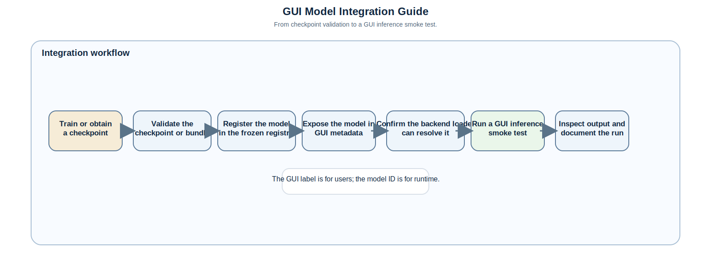
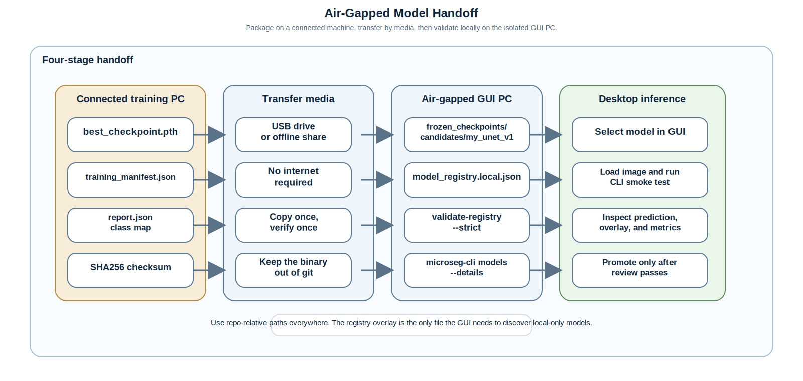
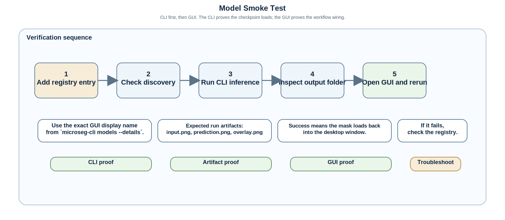
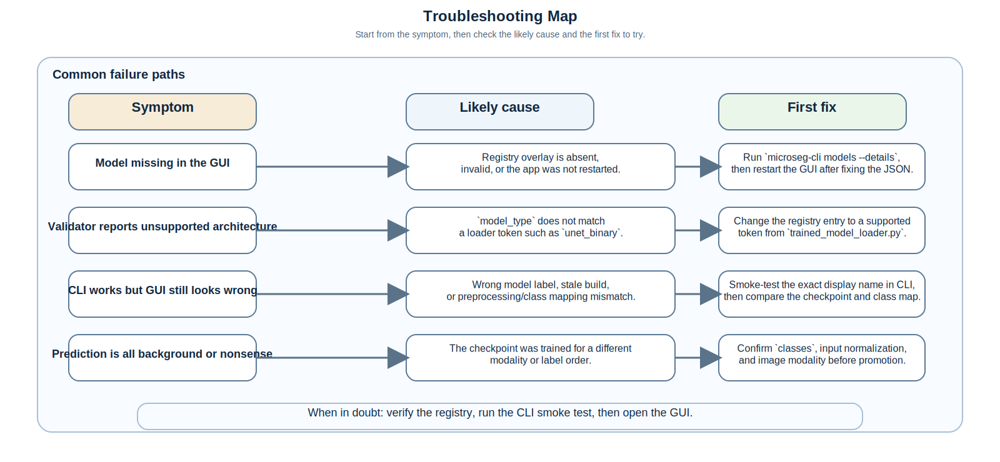

# How To Integrate a Trained `.pth` Model Into GUI Inference

This guide explains how to take a trained PyTorch checkpoint and make it available inside the desktop GUI for inference on an air-gapped PC.

It is written for beginners, but it does not hide the important details:

- the GUI does not guess what your checkpoint means,
- the runtime loader needs the exact architecture token and class map,
- the checkpoint must be registered with repository-relative metadata,
- the first proof should be a CLI smoke test, not the GUI,
- the air-gapped machine should not need internet access to run inference.

## What Success Looks Like

When the integration is correct, you can:

1. see the model in the GUI model selector,
2. run the same model from the command line,
3. load an image in the GUI and run inference without the window freezing,
4. inspect the predicted mask, overlay, and metrics,
5. keep the binary out of git while preserving scientific traceability.

## The Flow At A Glance









## Before You Start

You need four things before the GUI can use your model:

1. the checkpoint file itself, usually `best_checkpoint.pth` or `model.pth`,
2. a local registry entry that points to that file,
3. the exact architecture token used by the loader,
4. the class mapping used during training.

If any one of those is wrong, the GUI may still show the model name, but inference will fail or produce nonsense.

The GUI selector and the CLI use the same discovery path:

- `frozen_checkpoints/model_registry.json`
- optional `frozen_checkpoints/model_registry.local.json`
- successful trained-run folders under `outputs/runs/`

You normally do not edit GUI code when adding a new model. You update the registry metadata, restart the app, and the model appears if the checkpoint is valid.

### Critical Terms

The repository uses a few names that are easy to mix up:

| Term | Meaning | Example |
| --- | --- | --- |
| `model_id` | Stable runtime key used by the registry and loader | `my_unet_v1` |
| `model_nickname` | Friendly name shown to users | `my_unet_v1_optical` |
| `model_type` | Loader architecture token, not a free-form label | `unet_binary` |
| `checkpoint_path_hint` | Repo-relative path to the checkpoint | `frozen_checkpoints/candidates/my_unet_v1/best_checkpoint.pth` |
| `classes` | Class indices, names, and colors | background `0`, hydride `1` |

If you omit `--model` or `--model-name` on the CLI, inference defaults to the first discovered trained model. In this repository that is `Hydride ML (UNet)` when the default checkpoint is present locally.

Important:

- `model_type` must be one of the exact tokens recognized by the loader in `src/microseg/inference/trained_model_loader.py`.
- Do not invent your own backend name.
- If your model is a binary U-Net, use `unet_binary`, not a local nickname.

### Air-Gapped Assumptions

This tutorial assumes:

- the training machine and the inference machine are separate,
- the inference machine is offline or air-gapped,
- the checkpoint, registry overlay, and any reports are copied by USB or another offline transfer method,
- all Python packages needed for the GUI were already installed before the machine was isolated.

## Recommended Folder Layout

Keep the checkpoint and overlay together inside the repository tree:

```text
HydrideSegmentation/
  frozen_checkpoints/
    candidates/
      my_unet_v1/
        best_checkpoint.pth
    model_registry.json
    model_registry.local.json
  test_data/
    3PB_SRT_data_generation_1817_OD_side1_8_250x250.png
  outputs/
    inference/
```

Rules to follow:

- keep the checkpoint binary under `frozen_checkpoints/candidates/` until you are confident it is good enough to promote,
- keep the binary out of git,
- keep the registry path repo-relative,
- keep the class mapping identical to the one used during training.

The repository already ignores checkpoint binaries and `*.local.json` overlays, so the local files can stay on disk without showing up in git status.

## Step 1: Package The Model On The Training Machine

From the machine where the model was trained, collect at least:

- the checkpoint file, for example `best_checkpoint.pth`,
- the training run manifest or report,
- the class mapping used for the final model,
- the input size assumptions used during training,
- the SHA-256 checksum for the checkpoint.

If you have a `report.json` or `training_manifest.json`, keep it with the checkpoint. That is the easiest way to recover provenance later.

Example checksum command:

```bash
sha256sum best_checkpoint.pth > best_checkpoint.pth.sha256
```

If you are moving the model between machines, put the files into a compact folder before transfer:

```text
my_unet_v1_package/
  best_checkpoint.pth
  best_checkpoint.pth.sha256
  report.json
  training_manifest.json
  class_map.json
```

## Step 2: Copy The Model Onto The Air-Gapped PC

On the air-gapped machine, place the checkpoint under the repository tree:

```text
frozen_checkpoints/candidates/my_unet_v1/best_checkpoint.pth
```

If you later decide the model is stable enough for routine use, move it to `frozen_checkpoints/promoted/` and update the registry stage accordingly.

Do not place the binary in an arbitrary directory outside the repo if you want the GUI and CLI to discover it automatically.

## Step 3: Add A Local Registry Overlay

For a local-only model, create `frozen_checkpoints/model_registry.local.json`.

That file is merged at runtime with the canonical registry and does not need to be committed.

Minimal example:

```json
{
  "schema_version": "microseg.frozen_checkpoint_registry.v1",
  "updated_utc": "2026-04-09T00:00:00Z",
  "models": [
    {
      "model_id": "my_unet_v1",
      "model_nickname": "my_unet_v1_optical",
      "model_type": "unet_binary",
      "framework": "pytorch",
      "input_size": "variable",
      "input_dimensions": "H x W x 3",
      "checkpoint_path_hint": "frozen_checkpoints/candidates/my_unet_v1/best_checkpoint.pth",
      "artifact_stage": "candidate",
      "source_run_manifest": "outputs/training/my_unet_v1/training_manifest.json",
      "quality_report_path": "outputs/training/my_unet_v1/report.html",
      "file_sha256": "PUT_THE_CHECKSUM_HERE",
      "file_size_bytes": 12345678,
      "application_remarks": "Binary hydride segmentation for optical microscopy.",
      "short_description": "Use for optical hydride segmentation on the air-gapped GUI.",
      "detailed_description": "Binary feature segmentation checkpoint trained on the local hydride dataset. Use the same class order and preprocessing that were used during training.",
      "classes": [
        { "index": 0, "name": "background", "color_hex": "#000000" },
        { "index": 1, "name": "hydride", "color_hex": "#00FFFF" }
      ]
    }
  ]
}
```

What matters most:

- `checkpoint_path_hint` must be repo-relative.
- `model_type` must match the loader token exactly.
- `classes` must match training.
- `artifact_stage` should be `candidate` until you are comfortable promoting the model.
- the GUI and CLI both read the same registry metadata, so one file controls both selectors.

If you are adding a multi-class model, extend the `classes` array and keep the indices consistent with the training labels.

## Step 4: Verify That The Registry Can See The Model

Before opening the GUI, verify the model is discoverable:

```bash
microseg-cli models --details
microseg-cli validate-registry --config configs/registry_validation.default.yml --strict
```

What to check:

- your `model_id` appears in the listing,
- the checkpoint path resolves to a real file,
- the validator does not report an unsupported architecture token,
- the GUI label matches the display name you expect to see in the dropdown.

If the model does not appear, do not move on to the GUI yet. Fix the registry first.

## Step 5: Run A CLI Smoke Test

The CLI is the cleanest proof that the checkpoint itself loads correctly.

Use a small test image first:

```bash
microseg-cli infer \
  --config configs/inference.default.yml \
  --image test_data/3PB_SRT_data_generation_1817_OD_side1_8_250x250.png \
  --model "Registry: my_unet_v1_optical (unet_binary)" \
  --output-dir outputs/inference/my_unet_v1_smoke \
  --set enable_gpu=false \
  --set device_policy=cpu
```

Replace the model name with the exact display name shown by `microseg-cli models --details` or the GUI selector. If you leave the model flag out entirely, the CLI uses the first discovered trained model.

If you are still testing a checkpoint before adding a registry entry, you can use the legacy adapter and pass the path directly:

```bash
microseg-cli infer \
  --config configs/inference.default.yml \
  --image test_data/3PB_SRT_data_generation_1817_OD_side1_8_250x250.png \
  --model-name "Hydride ML (legacy adapter)" \
  --output-dir outputs/inference/my_unet_v1_direct_smoke \
  --set params.checkpoint_path=frozen_checkpoints/candidates/my_unet_v1/best_checkpoint.pth \
  --set enable_gpu=false \
  --set device_policy=cpu
```

The CLI run should produce a dedicated output folder containing at least:

- `input.png`
- `prediction.png`
- `overlay.png`
- `metrics.json`
- `manifest.json`

If this step fails, fix the model metadata or checkpoint before touching the GUI.

## Step 6: Open The GUI And Select The Model

Launch the desktop app:

```bash
hydride-gui
```

Then:

1. load the sample image or your own test image,
2. open the model selector,
3. select the registry display name you just verified in the CLI,
4. check the model guidance text shown in the sidebar,
5. confirm the checkpoint hint points to the file you copied.

What to expect:

- the model name is shown as a user-facing label,
- the guidance panel shows the nickname, backend, stage, and checkpoint path hint,
- conventional controls hide when a learned model is selected,
- the run banner shows progress while inference is running,
- the result is loaded back into the window when the subprocess finishes.

## Step 7: Run GUI Inference

Choose a small test image first, then click `Run Segmentation`.

Good first test:

- `test_data/3PB_SRT_data_generation_1817_OD_side1_8_250x250.png`

What success looks like:

- the GUI stays responsive,
- the status banner changes from idle to running,
- the prediction appears in the `Predicted Mask` tab,
- the overlay appears in the `Overlay` tab,
- the metrics panel updates,
- the exported run folder appears under `outputs/`.

If the model is correct, the mask should not be empty unless the image truly contains no foreground.

## Step 8: Confirm The Result Folder

The GUI and CLI both write run folders under `outputs/`.

Inspect the exported folder and make sure it contains the same artifacts you saw from the CLI smoke test:

- the input image,
- the predicted mask,
- the overlay,
- the metric JSON,
- the manifest JSON.

That is the easiest way to confirm that the GUI did not silently drop part of the result.

## Step 9: Promote Only After The Model Is Proven Useful

Once the model passes CLI and GUI checks on representative images:

1. move the checkpoint from `frozen_checkpoints/candidates/` to `frozen_checkpoints/promoted/`,
2. update the registry stage from `candidate` to `promoted`,
3. keep the class mapping and architecture token unchanged,
4. keep the provenance fields intact.

Only promote a checkpoint if you are comfortable using it for routine inference.

## Troubleshooting

### The model does not appear in the GUI

Likely causes:

- the local registry overlay is missing,
- the JSON file has a syntax error,
- `checkpoint_path_hint` points to a non-existent file,
- the app was not restarted after the registry changed,
- the `model_type` token is not supported by the loader.

What to do:

1. run `microseg-cli models --details`,
2. run `microseg-cli validate-registry --config configs/registry_validation.default.yml --strict`,
3. confirm the checkpoint exists at the path in the registry,
4. restart the GUI.

### The CLI says the architecture is unsupported

Likely cause:

- `model_type` was written as a local nickname instead of a loader token.

What to do:

- change `model_type` to one of the supported tokens in `src/microseg/inference/trained_model_loader.py`,
- for a binary U-Net, use `unet_binary`.

### The CLI smoke test works, but the GUI result looks wrong

Likely causes:

- you selected the wrong model label in the GUI,
- the class mapping is wrong,
- the model was trained on a different modality or preprocessing chain,
- the checkpoint file and the registry entry do not describe the same model.

What to do:

1. compare the CLI model name and GUI model name,
2. confirm the class indices and colors,
3. compare the training manifest with the checkpoint you copied,
4. re-run the GUI on the same small test image.

### The GUI runs but the mask is empty or nonsense

Likely causes:

- the image modality does not match training,
- the input size assumptions differ too much,
- the checkpoint is incomplete or mismatched,
- normalization during training and inference is inconsistent.

What to do:

- try a representative image from the training domain,
- compare the result with a known-good image,
- confirm the training config and checkpoint provenance,
- do not promote the model until the issue is understood.

### The air-gapped PC cannot validate or render docs

That is a separate environment problem, not a model problem.

The GUI inference path does not need internet once the repo, packages, checkpoint, and registry overlay are in place.

## Beginner Checklist

Before you call the model integrated, check all of these:

- the checkpoint is copied under `frozen_checkpoints/candidates/` or `frozen_checkpoints/promoted/`,
- the registry overlay points to the copied file,
- the loader token is one of the supported architecture identifiers,
- the class mapping matches training,
- `microseg-cli validate-registry --strict` passes,
- the CLI smoke test loads the checkpoint successfully,
- the GUI can select the model and load the result back into the window,
- the model produces sensible output on at least one representative image.

## Related Docs

- [`docs/frozen_checkpoint_registry.md`](frozen_checkpoint_registry.md)
- `frozen_checkpoints/README.md` for the lifecycle-folder policy and overlay rules
- [`docs/usage_commands.md`](usage_commands.md)
- [`docs/gui_user_guide.md`](gui_user_guide.md)
- [`docs/model_selection_decision_tree.md`](model_selection_decision_tree.md)
- [`docs/offline_pretrained_transfer_workflow.md`](offline_pretrained_transfer_workflow.md)
