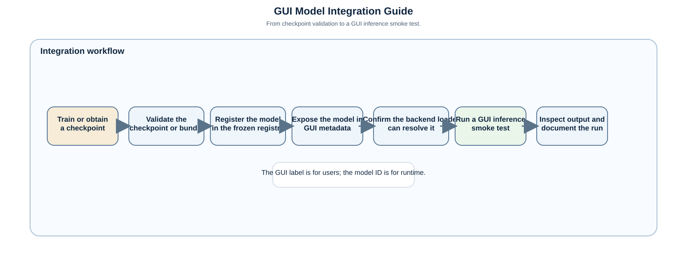
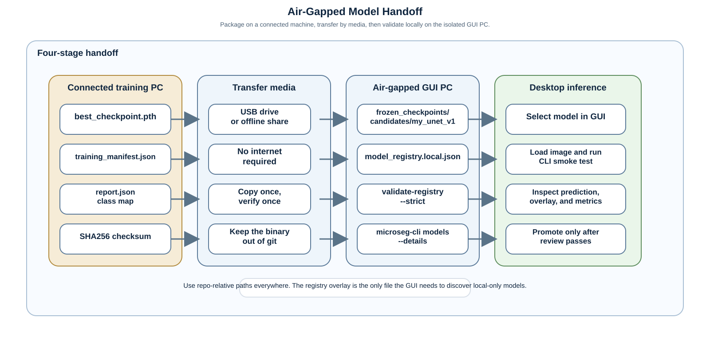
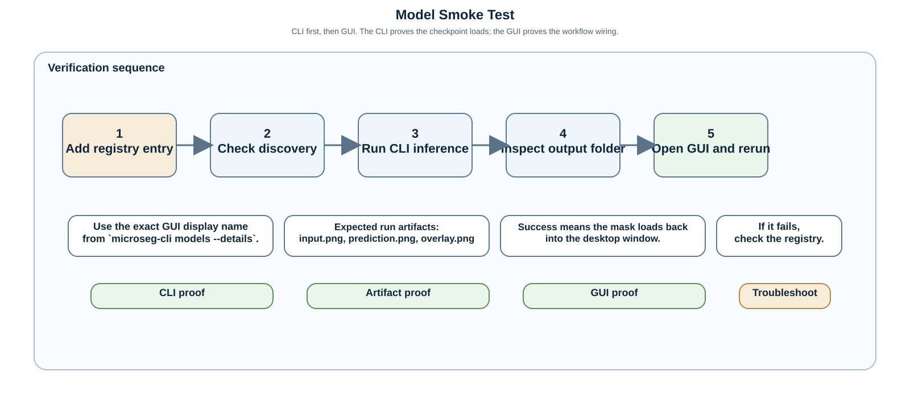
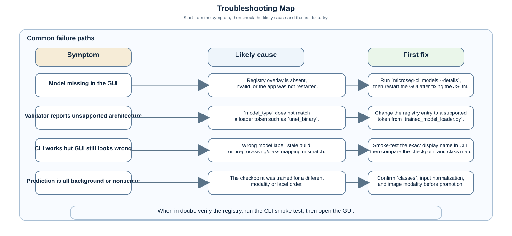

# How To Install A Trained Checkpoint Into GUI Inference

This guide explains how to take a trained PyTorch checkpoint and make it available inside the desktop GUI and the CLI, including on an air-gapped PC.

Trained checkpoint binaries (`.pt`, `.pth`, `.ckpt`, `.onnx`) are deliberately not tracked in git, so a fresh clone or a freshly deployed machine has no model file at all. The installer closes that gap: it reads the checkpoint, copies it into the right lifecycle folder, proves it runs, and registers it, without anyone editing JSON by hand.

## The Short Version

In the GUI:

1. open `Settings > Installed Models...`,
2. click `Install Model...`,
3. pick your checkpoint file,
4. confirm the name,
5. click `Install`.

The model appears in the selector immediately. No restart, no code change, no manual registry editing.

The equivalent command line:

```bash
microseg-cli install-model --checkpoint path/to/best_checkpoint.pth --model-id my_unet_v1 --nickname my_unet_v1_optical
```

The rest of this guide explains what that does and how to check it.

## Why This Works Without Editing Code

Model discovery is entirely metadata-driven. The GUI selector and the CLI both read the same sources:

- `frozen_checkpoints/model_registry.json`, the canonical registry tracked in git,
- `frozen_checkpoints/model_registry.local.json`, a local overlay merged on top of it at runtime,
- successful trained-run folders under `outputs/runs/`.

The installer only writes to the overlay. The canonical registry is never modified, and the overlay is already excluded from git, so an installed model stays local to the machine it was installed on.

Checkpoints written by this repository are also self-describing. Each one carries `model_architecture`, `backend`, and the resolved training `config`, which is exactly what the runtime loader needs to rebuild the network. That is why the installer can fill in architecture, input size, parameter count, checksum, and training provenance for you.

## The Flow At A Glance









## What The Installer Does

Each install runs these steps in order and stops at the first failure:

1. **Introspect.** Reads the checkpoint on CPU and recovers architecture, backend, training config, input size, parameter count, SHA-256, file size, training timestamp, epoch, and best validation loss.
2. **Check the architecture.** The architecture token must be one the inference loader can build. Unsupported tokens are rejected with the list of supported ones.
3. **Copy.** Copies the file to `frozen_checkpoints/<stage>/<model_id>/<filename>`, where the folder matches the artifact stage you chose. The source file is copied, not moved.
4. **Verify.** Loads the copied checkpoint for real and runs one synthetic forward pass. This is what catches a state dictionary that disagrees with the architecture it claims; metadata alone cannot detect that.
5. **Register.** Writes the entry into `frozen_checkpoints/model_registry.local.json`.
6. **Validate.** Runs the standard registry validator over the result.

If any step fails, the copied file and the registry overlay are both rolled back. A failed install never leaves a half-registered model behind.

Every install writes a machine-readable report to `outputs/model_install/<model_id>/install_report.json` for traceability.

## Critical Terms

| Term | Meaning | Example |
| --- | --- | --- |
| `model_id` | Stable runtime key used by the registry and loader | `my_unet_v1` |
| `model_nickname` | Friendly name shown to users | `my_unet_v1_optical` |
| `model_type` | Loader architecture token, read from the checkpoint | `unet_binary` |
| `checkpoint_path_hint` | Repository-relative path to the installed checkpoint | `frozen_checkpoints/candidates/my_unet_v1/best_checkpoint.pth` |
| `artifact_stage` | Lifecycle stage; decides the destination folder | `candidate` |
| `classes` | Class indices, names, and colors | background `0`, hydride `1` |

You normally do not set `model_type` yourself. The installer reads it from the checkpoint and refuses values the loader cannot build.

The class map is the one thing that cannot be recovered from the checkpoint. It defaults to background `0` and hydride `1`, and it must match the labels used during training. Edit it in the install form, or pass `--classes` on the command line, when your model is not a binary hydride model.

## Air-Gapped Assumptions

This guide assumes:

- the training machine and the inference machine are separate,
- the inference machine is offline,
- the checkpoint is copied by USB or another offline transfer method,
- all Python packages needed for the GUI were installed before the machine was isolated.

Nothing in the install path needs internet access.

## Step 1: Package The Model On The Training Machine

Collect at least:

- the checkpoint file, for example `best_checkpoint.pth`,
- the training run manifest or report, if you have one,
- the class mapping used for the final model.

The checksum does not need to be computed by hand; the installer records SHA-256 for you.

## Step 2: Install From The GUI

Launch the desktop app:

```bash
hydride-gui
```

Then:

1. open `Settings > Installed Models...`,
2. read the table: every registered model is listed with a status of `ready`, `no_checkpoint_required`, `checkpoint_missing`, or `unsupported_architecture`,
3. click `Install Model...`,
4. click `Browse...` and select the checkpoint,
5. read the detected panel; it shows the architecture, training input size, parameter count, size, checksum, and training provenance,
6. adjust the model id and nickname if you want different names,
7. choose the stage, normally `candidate` until the model is proven,
8. edit the class map if your model is not a binary hydride model,
9. keep `Verify with one forward pass` enabled,
10. click `Install`.

On success the model is registered, the selector reloads, and the new model becomes the active selection.

## Step 3: Install From The Command Line Instead

The command line does the same work through the same code path.

Inspect a checkpoint before committing to anything:

```bash
microseg-cli inspect-checkpoint --checkpoint path/to/best_checkpoint.pth
```

Install it:

```bash
microseg-cli install-model --checkpoint path/to/best_checkpoint.pth --model-id my_unet_v1 --nickname my_unet_v1_optical --stage candidate
```

Useful options:

- `--architecture` overrides the token read from the checkpoint,
- `--classes` takes inline JSON or a path to a JSON file,
- `--remarks`, `--short-description`, `--detailed-description` set the user guidance shown in the GUI,
- `--source-run-manifest` and `--quality-report-path` record provenance,
- `--no-verify-forward-pass` skips the synthetic inference check,
- `--overwrite` replaces an existing local entry with the same id,
- `--as-json` prints the machine-readable result.

With no `--model-id`, the identifier is derived from the filename. With no `--nickname`, the nickname is the model id with a `_local` suffix.

## Step 4: Confirm The Model Is Discoverable

```bash
microseg-cli models --details
```

Every model now reports an availability line. A model whose checkpoint is missing reports `checkpoint_missing` and explains what to do.

To validate the registry files themselves:

```bash
microseg-cli validate-registry --config configs/registry_validation.default.yml --strict
```

## Step 5: Run A Smoke Test

```bash
microseg-cli infer --config configs/inference.default.yml --image test_data/3PB_SRT_data_generation_1817_OD_side1_8_250x250.png --model "Registry: my_unet_v1_optical (unet_binary)" --output-dir outputs/inference/my_unet_v1_smoke
```

Use the exact display name shown by `microseg-cli models`. The run should produce `input.png`, `prediction.png`, `overlay.png`, `metrics.json` and `manifest.json`.

Then repeat in the GUI: load a small image, select the model, and click `Run Segmentation`.

## Step 6: Promote Only After The Model Is Proven

Once the model passes checks on representative images, reinstall it at the promoted stage:

```bash
microseg-cli install-model --checkpoint path/to/best_checkpoint.pth --model-id my_unet_v1 --nickname my_unet_v1_optical --stage promoted --overwrite
```

This moves the registered copy into `frozen_checkpoints/promoted/` and updates the stage. Keep the class mapping and architecture unchanged when you do this.

Only promote a checkpoint you are comfortable using for routine inference.

## Removing A Model

In the GUI, select the row in `Settings > Installed Models...` and click `Remove`. You are asked whether to remove the registry entry only, or to also delete the checkpoint file.

On the command line:

```bash
microseg-cli uninstall-model --model-id my_unet_v1 --delete-checkpoint
```

Only locally installed models can be removed. Entries from the shipped registry are left alone.

## What Happens When No Checkpoint Is Installed

On a machine with no checkpoint file:

- models that need a missing checkpoint are shown in the selector but disabled, with a tooltip naming the missing file,
- the application starts on `Hydride Conventional`, which needs no checkpoint,
- attempting to run an unavailable model explains the problem and points at `Settings > Installed Models...` instead of failing mid-run.

The conventional pipeline remains fully usable in that state.

## Troubleshooting

### The install is rejected with an unsupported architecture

The checkpoint declares an architecture the inference loader cannot build. The error lists the supported tokens. Confirm the checkpoint came from a supported backend, or pass `--architecture` if the recorded token is wrong but the weights match a supported architecture.

### The install fails verification

The checkpoint loaded but the forward pass failed, or the state dictionary does not match the architecture. This usually means the file is truncated, was saved from a different model, or the training config recorded in it does not describe those weights. Nothing is registered, and the copied file is removed.

### The model does not appear in the selector

Check in this order:

1. `microseg-cli models --details` and read the availability line,
2. `microseg-cli validate-registry --config configs/registry_validation.default.yml --strict`,
3. confirm the checkpoint exists at the registered path,
4. in the GUI, reopen `Settings > Installed Models...`, which reloads the catalog.

### The model runs but the mask is empty or nonsense

Likely causes:

- the image modality does not match training,
- the class mapping does not match training,
- normalization during training and inference is inconsistent.

Try a representative image from the training domain, confirm the class indices, and do not promote the model until the issue is understood.

### The air-gapped PC cannot validate or render docs

That is an environment problem, not a model problem. The install and inference paths do not need internet.

## Checklist

Before you call the model integrated:

- the install reported `ok`,
- verification ran the forward pass,
- the class mapping matches training,
- `microseg-cli validate-registry --strict` passes,
- a CLI smoke test produced a sensible mask,
- the GUI can select the model and load the result back into the window,
- the install report under `outputs/model_install/` is kept with the run records.

## Related Docs

- [`docs/phase34_model_installation.md`](phase34_model_installation.md) for the closeout record of this workflow
- [`docs/frozen_checkpoint_registry.md`](frozen_checkpoint_registry.md)
- `frozen_checkpoints/README.md` for the lifecycle-folder policy and overlay rules
- [`docs/usage_commands.md`](usage_commands.md)
- [`docs/gui_user_guide.md`](gui_user_guide.md)
- [`docs/model_selection_decision_tree.md`](model_selection_decision_tree.md)
