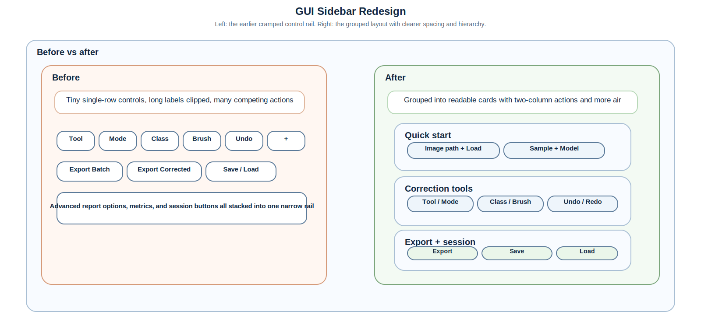

# GUI User Guide (Qt Desktop)

## Primary Workflows

1. Load image (or bundled sample) and select model.
2. Run segmentation.
3. Inspect prediction in split view and Results Dashboard.
4. Rate segmentation quickly with `👍`/`👎` and optional comment (auto-saved).
5. Correct annotations when needed.
6. Export corrected sample and/or full results package (`json` + `html` + `pdf` + `csv`).
7. Package datasets for training.
8. Save session and resume later.
9. Run full train/infer/evaluate/package jobs from Workflow Hub.
10. Review model-specific frozen-checkpoint tips before selecting ML models.
11. Use Dataset Prep + QA to preview split plans, run data QA, and gate training launches.

While inference is running, the top status banner shows the current stage, elapsed time, and an ETA estimate when the app has enough history to infer one.
During recursive batch jobs it also shows processed-image counts, percent complete, and rolling ETA updates as inference, feedback/provenance capture, and export steps finish.
Single-image and batch inference now both run through the in-process background worker path, which keeps the GUI responsive while allowing warmed ML bundles to be reused across runs.
The main model selector is intentionally narrow for deployment use: `Hydride ML (UNet)` is the default trained checkpoint, and `Hydride Conventional` remains available as the fallback baseline.
The desktop now uses a split layout: the left sidebar holds project/model/correction controls, while the right workspace keeps the image tabs large and readable.
The left control rail now defaults to a narrower progressive-disclosure layout:
- `Quick Start` stays visible with load/select/run controls
- `Run Setup / Status` carries model metadata, preprocessing summary, warm-load status, and segmentation progress
- `Active Run` appears after inference with review/export shortcuts plus annotator/feedback fields
- advanced setup, correction tools, export/session, workflow extras, and logs stay hidden behind the gear menu until explicitly opened

The desktop log now appears in a shared bottom strip under the main workspace instead of consuming sidebar width, and it is shown by default on startup.
Input, mask, overlay, and batch-summary image views all expose local zoom, pan, fit, and display-contrast controls. The main active-run image views keep pan and zoom synchronized so inspection stays aligned across tabs.

The control rail keeps image loading, sample selection, and model selection on separate rows so the ML model list remains readable without forcing the image workspace to collapse.
Advanced controls are grouped behind collapsible sections:
- `Inference Setup` for config and calibration
- `Correction Tools` for conventional tools and layer controls
- `Export & Session` for exports, saves, and report options
- `Workflow Extras` for workflow notes and profile management

## Correction Workflow

Tools:
- `brush`: paint/erase locally
- `polygon`: click polygon vertices, right-click to commit
- `lasso`: freehand region commit on mouse release
- `feature_select`: click connected component to delete (erase mode) or relabel (add mode)

Class controls:
- `Edit Classes` allows `index,name,#RRGGBB[,description]` editing.
- `Class` selector sets active class index for add-mode drawing and relabel operations.

Inspection controls:
- zoom in/out/reset
- synchronized split-view pan/zoom
- transparency sliders for predicted, corrected, and diff layers

Feedback controls:
- always-visible `👍` / `👎` buttons for one-click model feedback
- optional comment text in the notes field (auto-saved to feedback record)
- no modal prompts; downvote does not require comment or correction
- corrected masks are linked into the same feedback record when they differ from prediction

Conventional controls (Hydride Conventional model):
- CLAHE clip limit and tile grid
- adaptive threshold block size and `C`
- morphology kernel and iterations
- area threshold and optional crop percentage

## Exporting Corrections

`Export Corrected Sample` supports selectable formats:
- indexed PNG
- color PNG
- NumPy `.npy`

Output includes correction metadata and provenance (`correction_record.json`).
If available, correction export metadata also includes optional feedback linkage fields (`feedback_record_id`, `feedback_record_dir`).

`Export Results Package` writes deployment-facing outputs:
- `results_summary.json` with predicted/corrected statistics and analysis config
- `results_report.html`
- `results_report.pdf`
- `results_metrics.csv`
- `artifacts_manifest.json`
- input/mask/overlay/orientation-map/distribution images for predicted and corrected masks

Report customization controls:
- report profile: `balanced`, `full`, `audit`
- section toggles: metadata, calibration, key summary, scalar table, distributions, overlays, diff, artifact manifest
- metric checklist (advanced): select exact scalar metrics for export
- key-metric cutoff (`Top-K`) and CSV output toggle

Batch export:
- `Export Batch Summary` (menu/button) exports selected history runs or all runs if none selected.
- outputs: `batch_results_summary.json`, `batch_results_report.html`, optional `batch_results_report.pdf`, `batch_metrics.csv`
- batch summary now also includes `artifacts_manifest.json` plus `runs/` with one full per-image result package each; the root HTML links directly into those per-run summaries.
- desktop scalar displays and report tables round floating metrics to two decimals for consistent scientific readability.

## Recursive Folder Inference (GUI + CLI parity)

`Run Batch` supports folder-first operation:

1. Click `Run Batch`.
2. Select an input folder (or cancel to fall back to manual file selection).
3. The app scans recursively (default) for configured image globs (`*.png`, `*.jpg`, `*.jpeg`, `*.tif`, `*.tiff`, `*.bmp`).
4. Each discovered image is inferred, feedback/provenance is captured, and the run is exported under the final batch package in one pass.
5. The app writes `runs/` per-image artifacts plus `batch_results_summary.json`, `batch_results_report.html`, optional PDF/CSV outputs, `artifacts_manifest.json`, and `resolved_config.json`.
6. The batch summary inspector opens automatically at the end of the run for immediate review.

The exported batch HTML includes one aligned row per image with:

- input image preview
- predicted mask preview
- overlay preview
- key scalar metrics (including hydride area fraction/count when available)
- direct links to the corresponding per-run `results_summary.json` / HTML report package under `runs/`

ML preprocessing preview:

- when `Hydride ML (UNet)` is selected, the live input preview shows the actual processed image being fed to inference rather than only the raw file
- `Adjust Contrast Before Inference` now shows a two-panel split view: raw source on the left, processed-for-inference image on the right
- desktop logs now write explicit preprocessing records for original size, resized size, resize scale, contrast mode/parameters, channel duplication, and mask rescaling back to source size

GUI-native batch summary inspector:

- open from `File -> Open Batch Results Summary...` or `Results Dashboard -> Open Batch Summary`
- load any exported `batch_results_summary.json`
- inspect aggregate batch summary at top, select per-image rows on the left, and review large input/mask/overlay panels with detailed per-image statistics on the right

## Session Persistence

- `Save Session` writes a restartable project folder with images, masks, class map, notes, and UI state.
- `Load Session` restores run state and correction workspace.

## Appearance And UI Config

- Use `Settings -> Appearance & Export Settings` to adjust readability and defaults:
  - base/heading/monospace font size
  - menu, tab, toolbar, and status-bar font size
  - control padding, panel spacing, table row density
  - high-contrast mode
  - startup window geometry and screen clamping
  - default export profile and output toggles
- Load/save YAML from the dialog.
- Default config file: `configs/app/desktop_ui.default.yml`
- Startup override: `hydride-gui --ui-config configs/app/desktop_ui.default.yml`
- The main workspace now keeps advanced panels behind the gear button near the top controls.
- The image workspace is fit-to-view aware on resize and tab changes, so small test images fill the available viewport better.
- Each image viewport includes its own zoom controls, plus Ctrl+mouse-wheel zoom and drag-based scrolling.
- The application restores or clamps its window size so it stays on-screen on single or dual-monitor setups.

## Sidebar Redesign

The left control rail now uses grouped cards instead of a dense button strip:

The revised layout puts the most common actions first:

- quick start: load image, sample, and model selection
- correction tools: interaction, overlay, and feedback controls
- export and session: output packaging and persistence

The goal is to keep the controls readable without forcing the image workspace to become too narrow.

## Results Dashboard

`Results Dashboard` provides:
- side-by-side predicted/corrected scalar metrics
- hydride fraction, hydride count, feature density, orientation summary, and size summary
- orientation map + size/orientation distributions for predicted and corrected masks
- adjustable plotting parameters:
  - orientation bins
  - size bins
  - minimum feature-pixel threshold
  - size axis scale (`linear`/`log`)
  - orientation colormap

## Spatial Calibration (Optional)

Default reporting units are pixels.

To enable micron-based reporting:
- click `Scan Metadata Scale` to auto-detect TIFF/DPI scale metadata when available
- or click `Calibrate Scale...`, draw a known line, and enter its real-world length

When calibration is active, size-related metrics and report outputs include micron-based values (`um`, `um^2`) in addition to pixel metrics.

## Pipeline Hub

The `Workflow Hub` tab includes orchestration sub-tabs:
- `Inference`: launches `microseg-cli infer`
- `Training`: launches `microseg-cli train`
- `Evaluation`: launches `microseg-cli evaluate`
- `Packaging`: launches `microseg-cli package`
- `Dataset Prep + QA`: preview/prepare dataset layouts and run dataset QA checks
- `Run Review`: inspect and compare training/evaluation report JSON files
- `HPC GA Planner`: generate scheduler-ready multi-candidate bundles for HPC training/evaluation runs
- feedback loop commands are available from CLI and can be orchestrated from shell:
  - `feedback-bundle`
  - `feedback-ingest`
  - `feedback-build-dataset`
  - `feedback-train-trigger`

Operational behavior:
- one active orchestration job at a time
- live command output log
- job completion/failure status dialogs
- config path + override support per job
- per-job GPU controls (`Enable GPU` + `device policy`) with CPU fallback behavior
- default is CPU execution unless GPU is explicitly enabled
- training tab includes backend selection (`unet_binary`, `smp_unet_resnet18`, `smp_deeplabv3plus_resnet101`, `smp_unetplusplus_resnet101`, `smp_pspnet_resnet101`, `smp_fpn_resnet101`, `hf_segformer_b0`, `hf_segformer_b2`, `hf_segformer_b5`, `hf_upernet_swin_large`, `transunet_tiny`, `segformer_mini`, `torch_pixel`, `sklearn_pixel`)
- training tab includes optional `Require dataset QA pass before launch` gate
- `unet_binary` supports early stopping and resume checkpoint path
- training tab supports validation sample tracking:
  - total tracked sample count per epoch
  - fixed val file names (`|` separated)
  - random remainder sampling
  - progress logging interval configuration
  - optional HTML report writing
- evaluation tab supports tracked sample panel count/seed and HTML report toggle

Dataset Prep + QA tab highlights:
- supports split-layout and unsplit `source/masks` onboarding
- configurable leakage-aware split controls (`strategy`, `group mode`, `regex`)
- optional RGB mask conversion using JSON colormap mapping
- searchable preview table with global IDs and planned split assignment
- in-app QA report run with strict/non-strict controls

Workflow profiles:
- save/load YAML profiles for:
  - `dataset_prepare`
  - `training`
  - `evaluation`
  - `hpc_ga`
- profile schema: `microseg.workflow_profile.v1`

Run Review tab highlights:
- load baseline/candidate report JSON files
- auto summarize report metadata and key metrics
- compare metric deltas in table form (`baseline`, `candidate`, `delta`, `delta %`)
- includes schema/backend/config-consistency indicators for safe run comparisons

HPC GA Planner highlights:
- architecture list + hyperparameter range controls
- supports `novelty` and `feedback_hybrid` fitness modes
- supports air-gapped pretrained sweeps via config-driven fields (`pretrained_init_mode`, `pretrained_model_map`, `pretrained_registry_path`)
- novelty-oriented synthesis for first-pass sweeps
- feedback-aware ranking using prior run bundles and metric/runtime weighting
- scheduler mode selection (`slurm`, `pbs`, `local`)
- `Analyze Feedback` action to write ranked summary reports before launching next sweep
- one-click generation of:
  - `submit_all.sh`
  - per-candidate job scripts
  - candidate parameter files (`json` + `yml`)
  - plan manifest (`ga_plan_manifest.json`)
- supports profile save/load scope `hpc_ga`
- recommended air-gapped profile config: `configs/hpc_ga.airgap_pretrained.default.yml`

## Model Guidance Panel

The model description area now includes metadata pulled from `frozen_checkpoints/model_registry.json` when available:
- model nickname and type
- expected input dimensions
- checkpoint path hint
- lifecycle stage (`smoke`, `candidate`, `promoted`, `builtin`)
- application suitability remarks
- short user tips
- optional quality report path

This helps users select the right model for optical/TEM or other microstructural contexts.
Smoke-stage models are debug-only and are not intended for scientific reporting.

For a step-by-step beginner tutorial on copying a trained `.pth` checkpoint into the GUI workflow on an air-gapped machine, see [`docs/gui_model_integration_guide.md`](gui_model_integration_guide.md).

## Sample Onboarding And Logs

- Bundled sample images are available from:
  - `File -> Open Sample`
  - top-bar `Load Sample`
- Desktop logs are written to:
  - `outputs/logs/desktop/`

## Trained model discovery (architecture-aware)

The model dropdown now includes inference-capable trained models discovered from:

- `outputs/runs/<run_name>/` (successful runs only)
- frozen checkpoint registry entries when paths are valid

A trained run is considered inference-eligible when it has:

- `report.json` with status `ok`/`success`/`completed`
- a resolvable model checkpoint path
- architecture metadata (`model_architecture`) compatible with repo-supported trainable families

Failed/incomplete runs are skipped and not shown as runnable model options.

When troubleshooting model loading:

1. confirm run status in `report.json`
2. confirm checkpoint file exists at declared `model_path`
3. confirm architecture is one of the supported trainable families
4. verify required backend dependencies are installed (for example `transformers` for HF backends)
5. for local-only checkpoints, confirm the registry overlay and GUI model label match the copied file
