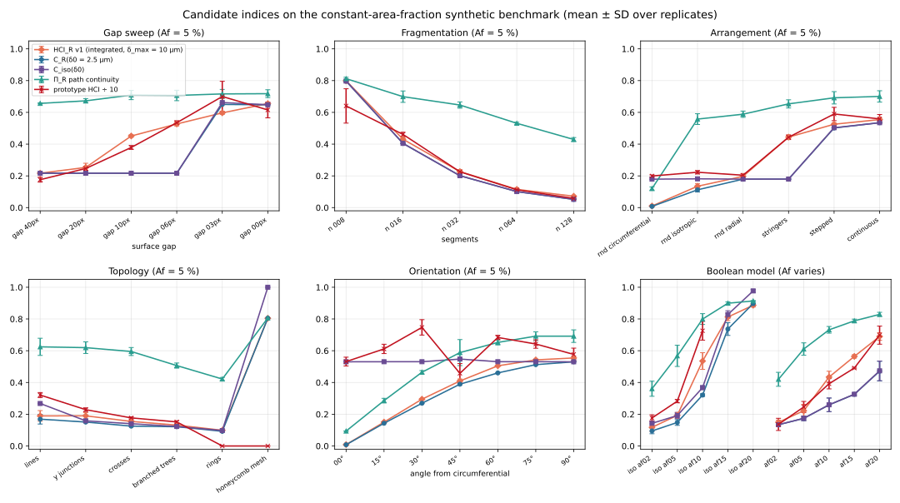

# Hydride Connectivity Index (HCI): Scientific Specification and Algorithm

| Field | Value |
|---|---|
| Document | HCI specification, formulation `hci.v1` (candidate label `hci.v1-candidate` in Phase 37) |
| Status | **Approved by the owner (2026-09-27, decisions in §13) and implemented in MicroSeg 2.0.0.** Enabled by default in the web UI and available through the CLI and Python. Still labelled experimental until the field-data validation (§11) is complete |
| Date | 2026-09-27 |
| Supersedes | The formulation section of [`hydride_connectivity_index.md`](hydride_connectivity_index.md), which remains the audit record of the intern prototype |
| Companion documents | [`hci_synthetic_benchmark.md`](hci_synthetic_benchmark.md) (validation data), [`hci_implementation_plan.md`](hci_implementation_plan.md) (next development phase) |
| Evidence | `scripts/hci_candidate_study.py`, [`hci_candidate_study.report.json`](hci_candidate_study.report.json) |


## 1. Scope and Scientific Motivation

Hydrides that precipitate in zirconium-alloy cladding and pressure tubes embrittle the
component. Three microstructural attributes control how damaging a given hydrogen content is:
the **amount** of hydride, its **orientation** relative to the principal stress, and its
**connectivity**, meaning whether individual platelets link into long paths along which a
crack can run. MicroSeg already reports amount (area fraction, Af) and orientation (Fn,
length-weighted Fn). It reports nothing about connectivity.

Two specimens with identical Af and Fn can behave very differently. Short, isolated radial
platelets are far less harmful than the same platelets stacked into a through-wall chain. The
aim of the HCI is to put a number on that difference that is:

- **defined from the segmented mask alone**, so it applies equally to ML and conventional
  segmentation and to human-corrected masks;
- **dimensionless, bounded and physically interpretable**;
- **insensitive to the amount of hydride when the arrangement is fixed**, and sensitive to the
  arrangement when the amount is fixed;
- **directional** where the physics is directional (radial, through-wall cracking), with an
  isotropic variant for general microstructures; and
- **reproducible**: every threshold is in physical units, every step is deterministic, and
  every result carries full provenance.

The descriptor is framed as microstructural *connectivity* in general. It is expected to
transfer to other networked features on the MicroSeg roadmap, such as grain-boundary phases,
crack networks and interconnected porosity.

## 2. Prior Work and Positioning

### 2.1 Hydride-specific descriptors

| Descriptor | Idea | Limitation relevant here |
|---|---|---|
| Radial hydride fraction (RHF) and Fn | Orientation-weighted hydride fraction or count | No information on linkage between hydrides |
| Hydride Continuity Coefficient (HCC) | Projected radial length of hydrides that are close enough to be considered continuous, within a band | Band and closeness rules are empirical; result depends on band placement |
| Radial Hydride Continuity Factor (RHCF) — Billone et al. [1] | Maximum projected radial hydride length within a fixed arc window, normalised by wall thickness | Window-based; designed for high-burnup radial-hydride assessment |
| Radial Hydride Continuous Path (RHCP) — Simon et al. [2]; Dijkstra implementation in PROPHET [3, 4] | Optimal through-wall crack path through a cost field weighted by hydride and matrix fracture toughness (hydride:matrix 1:50) | Single weakest path (extreme-value statistic); depends on the assumed toughness ratio |
| Intern HCI prototype (this project) | Cluster weights combining junction/endpoint topology, mean primary-branch length and nearest-cluster distance, area-weighted | See §3: failed invariance and boundedness checks, contains implementation defects, and does not separate amount from connectivity |

### 2.2 Classical connectivity descriptors

Materials and stereology science already provides rigorous connectivity measures that are
rarely applied to hydrides:

- the **Euler characteristic**, or connectivity density (Minkowski functionals) [5, 6];
- **percolation** cluster statistics, including the mean cluster size and correlation length, and
  continuum percolation of sticks [7, 8];
- the **two-point cluster function** and **lineal-path function**, which distinguish
  microstructures of equal volume fraction by connectedness [9, 10]; and
- **skeleton-graph analysis**, covering branches, junctions and loops [11–13].

### 2.3 What is new in this specification

This specification claims novelty for the following, and does **not** claim a new path metric:

1. A **directional connectivity function** C_u(δ). It is the area-weighted mean projected
   hydride coverage of single-linkage clusters, normalised by a declared reference length. It is
   bounded, provably monotone in the association distance and under cluster merging, and defined
   for a single cluster. It keeps the intent and the area-weighted form of the intern prototype.
2. The **HCI as the integral of C_u(δ)** over bridgeable ligament lengths, computed exactly in one
   Kruskal pass. It is reported with the *critical linking distance* δ½ and the *connectivity
   length* ξ_u (µm). The spacing information that the prototype put into an unbounded ratio
   L̄/d_min becomes a bounded, threshold-free index plus a physical spacing in µm.
3. A **topological decomposition** of the hydride skeleton into branching excess β and
   independent loops μ, with the exact identity N_E = β + 2C − 2μ. The identity yields a bounded
   **network closure** κ and explains analytically why the prototype's (B+1)/N term is a
   constant 1/2 for any degree-3 tree.
4. A **controlled constant-area-fraction benchmark** with exact ground truth
   ([`hci_synthetic_benchmark.md`](hci_synthetic_benchmark.md)), plus a set of testable **design
   axioms** (§4). Any connectivity descriptor, including RHCF and RHCP, can be scored against them.

The companion path-continuity descriptor Π_u (§5.4) is explicitly an RHCP-type measure. What it
adds is an exact geodesic distance-transform formulation and an area-weighted average over
paths through every hydride pixel. It is reported for comparison with the literature, not as the
headline.

## 3. The Intern Prototype and Why It Is Not Adopted

The prototype (`HARSHAD_WORK/HCI_2_4_works_1 (1).py`, recorded by SHA-256 in the candidate study
report) defines

$$
w_i = \frac{B_i + 1}{N_i}\cdot\frac{\bar L}{d_{\min,i}}, \qquad N_i = N_{E,i} + B_i, \qquad
\mathrm{HCI}_{\mathrm{proto}} = \frac{\sum_i A_i w_i}{\sum_i A_i}
$$

The implementation audit in [`hydride_connectivity_index.md`](hydride_connectivity_index.md) §4
lists 12 defects. The benchmark adds the following quantitative evidence, detailed in §10:

- **Two code paths give two answers.** The workbook value and `compute_hci()` differ on the
  same mask, by 6.05 against 4.41 on one gap-sweep sample.
- **Unbounded and density-driven.** L̄/d_min grows when clusters are longer *or* when they are
  closer. At constant arrangement it therefore grows with the amount of hydride, which is the
  confound the index was meant to remove.
- **Single-cluster collapse.** A specimen whose hydrides form one network, the most connected
  possible case, has no neighbour distance and receives HCI = 0.
- **The topology term does not measure branching.** For any tree whose junctions all have
  degree 3, the identity of §5.5 gives N_E = B + 2, so (B+1)/N = 1/2 however much it branches.
  Degree-4 junctions *lower* the term to (B+1)/(3B+2). Only loops raise it.

Its scientific intent is preserved in v1. That intent is area weighting, reward for long
clusters, reward for small spacing and recognition of branching or linking. v1 expresses each
element through a quantity with a defined meaning and range.

## 4. Design Axioms

Each axiom is testable on the synthetic benchmark. "Index" means any candidate specimen-level
connectivity value.

| ID | Axiom | Benchmark test |
|---|---|---|
| A1 | **Amount–arrangement separation**: at constant Af, the index ranks arrangements by connectivity | `gap_sweep`, `fragmentation`, `arrangement` |
| A2 | **Bounded and interpretable**: range [0, 1]; 0 means no connected extent and 1 means a field-spanning network | all families |
| A3 | **Monotone under linking**: joining two clusters never decreases the index | `gap_sweep`, proof in §5.6 |
| A4 | **Monotone in fragmentation**: splitting the same hydride into more pieces never increases it | `fragmentation` |
| A5 | **Defined degenerate cases**: an empty mask returns `not_applicable`; a single cluster returns a finite value; no silent 0 | `degenerate` |
| A6 | **Exact symmetries**: invariant to flips; a transpose swaps the radial and circumferential variants; the isotropic variant is invariant | `invariance` |
| A7 | **Resolution consistency**: with thresholds in µm, results agree within tolerance at ×0.5 and ×2 sampling | `invariance/scale_*` |
| A8 | **Robust to segmentation noise**: specks, pinholes, spurs and boundary roughness change the value by at most 5 % | `invariance` noise cases |
| A9 | **Directionality where declared**: the radial variant follows hydride angle; the isotropic variant does not | `orientation` |
| A10 | **Deterministic and traceable**: identical input, configuration and code give identical output with full provenance | repeat runs, manifest |

## 5. Formulation `hci.v1-candidate`

### 5.1 Notation and preprocessing

- Ω is the field of H × W pixels and *a* the pixel size in µm. Directions u: radial R = image *y*,
  circumferential C = image *x*, and isotropic (iso).
- M ⊂ Ω is the binary hydride mask, formed from a declared set of foreground class indices.
- **Cleaning**: remove 8-connected components of area < A_min, then fill holes of area < A_hole
  that do not touch the border. Both thresholds are in µm² and converted with *a*.
- **Components** C_1 … C_n are the 8-connected components of the cleaned mask, with areas A_j.
- **Surface gap** between components *j* and *k*:
  g_jk = a · (min over p ∈ C_j, q ∈ C_k of ‖p − q‖ − 1).
  This is the length of the matrix ligament on the straight segment between their nearest pixels.

### 5.2 Connectivity function

**Association.** For a distance δ ≥ 0, build the graph G_δ whose vertices are the components and
whose edges join components with g_jk ≤ δ. The **clusters** K ∈ 𝒦(δ) are the connected components
of G_δ, i.e. single-linkage clustering at level δ. Association edges are *synthetic*. They
contribute no area, are never rasterised into the mask, and are exported separately, so they can
never create false junctions (prototype defect 4.9).

**Extent.** For a cluster K and direction u ∈ {R, C}, S_K(u) is the **projected hydride
coverage**: the length of the union of the projections of the member *hydride* pixels onto u, i.e.
the number of distinct rows (R) or columns (C) they occupy, times a. Bridged gaps therefore add
no extent. A linked chain with gaps covers the same length as the same hydride merged into one
line. The benchmark shows this matters: a bounding-span definition scores a bridged chain *above*
the merged line (0.662 against 0.648, §10.2). For iso, S_K is the maximum Feret diameter of the
member pixels, which is rotation invariant but does include bridged gaps.

**Connectivity function.**

$$
C_u(\delta) = \frac{\sum_{K \in \mathcal{K}(\delta)} A_K \min\!\left(1, \dfrac{S_K(u)}{L_u}\right)}{\sum_{K} A_K},
\qquad A_K = \sum_{j \in K} A_j
$$

L_u is the **reference length**. Its default is the field extent along u (H·a for R, W·a for C,
min(H, W)·a for iso). For cladding, the recommended reference is the wall thickness, so
C_R = 1 means that every hydride belongs to a through-wall cluster. Specimens are only comparable at the same L_u, and
every result records it.

**Interpretation.** C_u(δ) is the expected fraction of the reference length covered by the
cluster to which a randomly chosen hydride pixel belongs, when matrix ligaments up to δ count as
bridged. Its unnormalised form

$$
\xi_u(\delta) = \frac{\sum_K A_K\, S_K(u)}{\sum_K A_K} \quad [\mu\mathrm{m}]
$$

is the **connectivity length**, the area-weighted mean cluster extent. It plays the role of the
percolation correlation length and is intensive when clusters are much smaller than the field.

### 5.3 The HCI: integrated connectivity

Kruskal's algorithm over gaps sorted in ascending order gives every merge event, so the whole
non-decreasing step function δ ↦ C_u(δ) on [0, δ_max] is obtained exactly in one pass. The
**Hydride Connectivity Index** is its mean over the declared range of bridgeable ligaments:

$$
\mathrm{HCI}_u = \frac{1}{\delta_{\max}} \int_0^{\delta_{\max}} C_u(\delta)\, \mathrm{d}\delta \;\in\; (0, 1]
$$

**Why integrate rather than pick a threshold.** C_u at one δ0 is a step function of every gap.
It cannot tell a 3 µm gap from a 20 µm gap once both exceed δ0, and it jumps when noise moves a
gap across δ0. On the benchmark, C_R(δ0) treats aligned stringers and random segments
identically (0.179 against 0.179). It also changes by 17 % under boundary roughness because a
6 px gap shrinks below 5 px. HCI_R, the integral, separates the stringers (0.444 against 0.197), rises
strictly as gaps close, and changes by only 1.7 % for the same stringer sample, and by at most
5.4 % over all reference samples (§10.6). Physically,
integration represents a uniform uncertainty about the critical matrix ligament that fails
between neighbouring hydrides, from 0 up to δ_max.

**Headline.** HCI_R for tube specimens, which measures through-wall connectivity, and HCI_iso for
unoriented microstructures. δ_max defaults to `auto`: one fifth of the length of the smallest
hydride accepted after clean-up (owner decision D4), floored at one pixel. A fixed value (the
evidence used 10 µm, about 5× a typical optical hydride thickness) is required when specimens are
compared (§10.9). δ_max is always recorded. Specimens are comparable only at equal δ_max and L_u.

**Always reported with the HCI:**

- C_u(δ0) at the report distance δ0, which defaults to δ_max. The Phase 37 study used 2.5 µm,
  the prototype's 5 px at 0.5 µm/px.
- The **critical linking distance** δ½,u, the smallest δ with C_u(δ) ≥ ½, or `"not_reached"`.
  This is a physical spacing measure. On the gap sweep it recovers the designed gap exactly
  while the gap is below the lateral spacing of neighbouring chains (e.g. 6 px = 3 µm ⇒ δ½ = 3 µm).
- ξ_u(δ0) in µm, and the curve C_u on the reporting grid.

### 5.4 Companion: path continuity Π_u

The cost field is c(p) = ε on hydride and 1 on matrix. The default ε = 0 gives the pure matrix
ligament; ε = 0.02 reproduces the RHCP toughness ratio of 1:50 [2, 3]. D_in and D_out are
geodesic cumulative costs from the two opposite field edges normal to u, computed with Dijkstra
on the 8-neighbour grid (`skimage.graph.MCP_Geometric`). For every pixel,
ℓ(p) = D_in(p) + D_out(p) is the matrix ligament of the cheapest edge-to-edge path through p.

$$
\Pi_u = \big\langle \max\bigl(0, 1 - \ell(p)/L_u\bigr) \big\rangle_{p \in M}, \qquad
\Pi_u^{\mathrm{best}} = \max\bigl(0, 1 - \min_p \ell(p)/L_u\bigr)
$$

Π_u has no association threshold. Adding hydride can never increase ℓ(p), so Π_u^best is
monotone under set inclusion. However, Π_u responds to **alignment**, not to gap placement.
Along a chain, a crack crosses the same total matrix length whether it lies in inter-hydride gaps
or beyond the chain's ends (§10.2). This complements HCI rather than replacing it. The 8-neighbour
metric has a known anisotropic error of up to about 8 %; a fast-marching variant is a planned
option.

### 5.5 Companion: skeleton topology

Skeletonise the cleaned mask (Zhang–Suen / Lee [11, 12]), collapse junction pixels within a
thickness-scaled radius into one node (§6, step 9), and trace branches between nodes [13]. Only real hydride pixels are
used. For each cluster and for the specimen, report:

| Symbol | Definition |
|---|---|
| N_E | Endpoints (degree 1) |
| N_J, {d_j} | Collapsed junctions and their degrees (≥ 3) |
| β | Branching excess Σ_j (d_j − 2) |
| C | Skeleton components |
| μ | Independent loops, μ = C − χ, with χ the 8-connected Euler characteristic |
| κ | Network closure 2μ / (β + 2C) |

**Identity.** Every connected component with at least one edge satisfies
Σ deg = 2E and E = V − 1 + μ. Summing over components gives

$$
N_E = \beta + 2C - 2\mu \quad\Longrightarrow\quad \kappa = \frac{2\mu}{\beta + 2C} = 1 - \frac{N_E}{\beta + 2C} \in [0, 1]
$$

κ = 0 for any forest (free-ended), κ = 1 for a network with no free ends, and κ is the fraction of
potential free ends that are closed into loops. Report N_J, N_E and μ as densities per mm² and β
per cluster. Topology is reported *beside* HCI, not multiplied into it: §10.4 shows that loops do
not by themselves imply continuity.

**The prototype's term decoded.** (B+1)/(N_E+B) with B = N_J becomes
(N_J + 1)/(β + 2C − 2μ + N_J). For a single degree-3 tree, β = N_J and μ = 0, so the term is 1/2
exactly.

### 5.6 Properties

| Property | Statement | Argument |
|---|---|---|
| Bounded | 0 < C_u(δ) ≤ 1 and 0 < HCI_u ≤ 1 whenever M ≠ ∅ | Convex combination of values in (0, 1]; HCI is a mean of C_u |
| Monotone in δ | δ₁ < δ₂ ⇒ C_u(δ₁) ≤ C_u(δ₂) | 𝒦(δ₂) is a coarsening of 𝒦(δ₁); coverage of a union is ≥ that of each member, so no pixel's weight falls |
| Monotone under linking | Reducing any inter-cluster gap, or adding a bridge of negligible area, does not decrease C_u(δ) for any δ, hence not HCI_u | Merges happen at smaller or equal δ; the argument above applies pointwise, then integrate |
| Strict gap sensitivity | Closing a gap g < δ_max strictly increases HCI_u if the resulting merge extends the coverage of either cluster (e.g. collinear hydrides) | C_u then rises on the interval of δ between the new and old gap, which has positive length |
| Single cluster | C_u = min(1, S/L_u), independent of δ | No neighbour distance is involved |
| Symmetry | Flips leave all variants unchanged; a transpose swaps R ↔ C and leaves iso unchanged | Extents are permutation-equivariant under these maps |
| Amount scaling | Duplicating a stationary microstructure into a larger field at the same L_u leaves ξ_u unchanged | Area weighting is intensive |
| Resolution | With A_min, A_hole and δ in µm, the change under resampling is limited to discretisation of extents (±1 px) and of gaps | Verified numerically in §10.6 (≤ 2.1 %) |

**Not guaranteed.** C_u(δ0) is not continuous in the gap at fixed δ0; HCI_u, its integral, is
piecewise linear in each gap. Adding an isolated hydride can lower HCI_u, because the value is a mean.
This is intended: the specimen is then *less* connected on average.

## 6. Algorithm

The computation runs as eleven steps:

1. **Normalise input.** Select the foreground class set, then binarise. Record the class map,
   the pixel size and any resize or rotation from the run manifest. A missing pixel size is
   allowed only with an explicit `units: px` flag, and results are then marked
   not comparable across magnifications.
2. **Clean.** Apply A_min and A_hole in µm², keeping the pre-cleaning and post-cleaning areas.
3. **Label.** Compute 8-connected components, with areas, bounding extents and convex-hull vertices.
4. **Build the gap graph.** Compute the Euclidean distance transform of the matrix with
   nearest-feature indices. For every pair of 8-adjacent pixels whose nearest components differ,
   compute the gap as the distance between their nearest feature pixels minus one. Keep the
   minimum per component pair. This yields the Voronoi-neighbour graph, which contains the
   minimum spanning tree and is therefore sufficient for single linkage. Cost is O(HW); nothing
   is quadratic in the number of pixels (prototype defect 4.10).
5. **Linkage.** Sort the edges by gap and run Kruskal union-find, recording each merge event.
6. **Cluster geometry.** For R and C, each cluster's projected coverage is the size of the union
   of its members' occupied row or column sets. Store each as a sorted interval list, so a merge
   costs O(k) in the number of intervals. For iso, the Feret diameter comes from the convex hull of
   the members' hull vertices.
7. **Indices.** Integrate the step function C_u exactly over [0, δ_max] to get HCI_u; evaluate
   C_u(δ0), ξ_u(δ0), δ½,u and the curve on the reporting grid.
8. **Path continuity.** Run two MCP sweeps per direction, then compute ℓ, Π_u and Π_u^best, and
   the best path for the overlay.
9. **Topology.** Skeletonise, then collapse junction pixels that lie within a thickness-scaled
   radius (default: the local distance-transform value) into one node. This ensures a degree-4
   crossing is not split into two degree-3 nodes (§10.8, item 6). Trace branches, then compute the Euler
   characteristic, κ and the densities.
10. **Quality flags.** Raise flags for:
    - clusters touching the border (extent truncated);
    - clusters capped at 1;
    - thickness below 3 px, where the skeleton is unreliable;
    - an input that was resampled;
    - fewer than 5 clusters, where statistics are weak;
    - removal of more than 10 % of the area by cleaning.
11. **Emit.** Write the result object, the cluster table, the overlays and the report sections (§8).

**Complexity** is O(HW log HW) overall, dominated by the MCP sweeps. The design target is
≤ 2 s and ≤ 1 GB peak memory for a 2048 × 2048 mask on one CPU core.

## 7. Parameters

| Symbol | Config key | Default | Unit | Valid range | Purpose and guidance |
|---|---|---:|---|---|---|
| — | web `hci_enabled` | `true` | — | bool | Enabled by default in the web UI (owner decision); the CLI and Python run it on request |
| — | `hci.formulation_id` | `hci.v1` | — | fixed | Recorded in every result |
| — | `hci.foreground_class_indices` | `[1]` | — | ≥ 1 | Hydride class set (0/255 and RGB masks are also accepted, with a warning) |
| — | (fixed) | 8 | — | 8 | Pixel connectivity for components and skeleton |
| A_min | `hci.min_feature_area_um2` | 5.0 | µm² | 0 – 50 | Removes specks; set it at or above the segmentation noise floor. 5 µm² is 20 px at 0.5 µm/px |
| A_hole | `hci.max_hole_area_um2` | 5.0 | µm² | 0 – 50 | Fills segmentation pinholes |
| δ_max | `hci.max_bridge_distance` | `auto` | µm (px uncalibrated) | `auto` or > 0 | Largest matrix ligament considered bridgeable; defines the HCI integral. **Owner default: `auto` = `auto_bridge_fraction` × smallest accepted hydride length.** Use one fixed value (e.g. 10 µm) for every specimen that will be compared (§10.9) |
| f | `hci.auto_bridge_fraction` | 0.2 | — | (0, 5] | Fraction of the reference hydride length used by `auto` |
| — | `hci.auto_size_statistic`, `hci.auto_size_percentile` | `min`, 10 | — | `min` or `percentile` (0–100) | Reference hydride length for `auto`: smallest (default) or a percentile of the Feret lengths (50 = median, which is robust to fragments) |
| δ0 | `hci.report_distance` | `auto` (= δ_max) | µm | 0 – δ_max | Association distance for the reported C_u(δ0), ξ_u and cluster table |
| — | `hci.resolution_floor_px` | 4 | px | ≥ 0 | Lower bound on both clean-up thresholds: features or holes below 2 × 2 px are not resolvable |
| — | `hci.curve_points` | 41 | — | ≥ 2 | Points of the reported C_u(δ) grid on [0, δ_max] (the HCI integral itself is exact) |
| L_R, L_C | `hci.reference_length_radial_um` / `_circumferential_um` | field extent | µm | > 0 | Use the wall thickness for through-wall assessment; must match across compared specimens |
| — | (all reported) | radial, circumferential, isotropic | — | — | Frame follows the Fn convention (x circumferential) |
| ε | `hci.path_hydride_cost` | 0.0 | — | 0 – 1 | 0 = pure ligament; 0.02 = RHCP toughness ratio |
| — | `hci.topology_enabled`, `hci.path_enabled` | `true` | — | bool | Companion descriptors |
| — | (not implemented) | — | — | — | Spur pruning is not applied; one-pixel spurs are handled exactly by the junction bookkeeping |

## 8. Output Contract (`microseg.hci_result.v1`)

The example below is real output from `analyze_continuity` on the benchmark sample
`arrangement__radial_stringers__r00`, with lists shortened to two items (`…`).

```json
{
  "schema_version": "microseg.hci_result.v1",
  "formulation_id": "hci.v1",
  "status": "ok",
  "status_reason": null,
  "unit": "um",
  "specimen": {
    "HCI": {
      "radial": 0.4346,
      "circumferential": 0.0082,
      "isotropic": 0.45
    },
    "connectivity_at_report_distance": {
      "radial": 0.57,
      "circumferential": 0.0104,
      "isotropic": 0.5862
    },
    "connectivity_length": {
      "radial": 145.9263,
      "circumferential": 2.667,
      "isotropic": 150.0698
    },
    "critical_linking_distance": {
      "radial": 3.0,
      "circumferential": null,
      "isotropic": 3.0
    },
    "critical_linking_distance_reached": {
      "radial": true,
      "circumferential": false,
      "isotropic": true
    },
    "max_bridge_distance": 10.0,
    "max_bridge_distance_source": "user",
    "report_distance": 10.0,
    "smallest_hydride_length": 45.5111,
    "auto_reference_hydride_length": 45.5111,
    "reference_length": {
      "radial": 256.0,
      "circumferential": 256.0,
      "isotropic": 256.0
    },
    "path_continuity": {
      "radial": 0.6536,
      "radial_best": 0.707,
      "radial_best_ligament": 75.0,
      "circumferential": 0.0932,
      "circumferential_best": 0.0957,
      "circumferential_best_ligament": 231.5
    },
    "area_fraction_raw": 0.0499,
    "area_fraction_cleaned": 0.0499,
    "n_components": 36,
    "n_clusters_at_report_distance": 10,
    "median_hydride_thickness": 2.0,
    "topology": {
      "endpoints": 72,
      "junctions": 0,
      "junction_degree_histogram": {},
      "branching_excess": 0,
      "loops": 0,
      "skeleton_components": 36,
      "network_closure": 0.0,
      "identity_residual": 0,
      "skeleton_length": 1580.2487,
      "density_unit": "per_mm2",
      "endpoints_density": 1098.6328,
      "junctions_density": 0.0,
      "loops_density": 0.0
    }
  },
  "curve": {
    "delta": [
      0.0,
      0.25,
      "…"
    ],
    "C_radial": [
      0.1790377525518006,
      0.1790377525518006,
      "…"
    ],
    "C_circumferential": [
      0.0078125,
      0.0078125,
      "…"
    ],
    "C_isotropic": [
      0.1790698772207306,
      0.1790698772207306,
      "…"
    ],
    "n_clusters": [
      36,
      36,
      "…"
    ],
    "step_breaks": [
      0.0,
      3.0,
      "…"
    ],
    "step_C_radial": [
      0.1790377525518006,
      0.537109375,
      "…"
    ],
    "step_C_circumferential": [
      0.0078125,
      0.0078125,
      "…"
    ],
    "step_C_isotropic": [
      0.1790698772207306,
      0.5605579727606979,
      "…"
    ],
    "merge_events_within_max_bridge_distance": [
      {
        "delta": 3.0,
        "a": 1,
        "b": 9
      },
      {
        "delta": 3.0,
        "a": 2,
        "b": 11
      },
      "…"
    ]
  },
  "clusters": [
    {
      "cluster_id": "K0001",
      "members": [
        4,
        10,
        13,
        22,
        25,
        33
      ],
      "area": 546.0,
      "extent": {
        "radial_coverage": 174.0,
        "circumferential_coverage": 4.0,
        "feret": 174.38070623275027
      },
      "weight": {
        "radial": 0.6796875,
        "circumferential": 0.015625,
        "isotropic": 0.6811746337216807
      },
      "touches_border": false,
      "bridges": [
        {
          "a": 4,
          "b": 13,
          "gap": 3.0,
          "p_rc": [
            160,
            328
          ],
          "q_rc": [
            167,
            328
          ]
        }
      ],
      "topology": {
        "endpoints": 12,
        "junctions": 0,
        "branching_excess": 0
      }
    }
  ],
  "n_clusters_reported": 10,
  "parameters": {
    "formulation_id": "hci.v1",
    "max_bridge_distance": 10.0,
    "auto_bridge_fraction": 0.2,
    "auto_size_statistic": "min",
    "report_distance": "auto",
    "min_feature_area_um2": 5.0,
    "resolution_floor_px": 4.0,
    "path_hydride_cost": 0.0
  },
  "calibration": {
    "pixel_size_um": 0.5,
    "source": "manifest",
    "unit": "um"
  },
  "provenance": {
    "code_version": "1.2.0",
    "formulation_id": "hci.v1",
    "input_sha256": "a02386021384ada9…",
    "mask_source": "predicted",
    "timestamp": "2026-09-27T10:19:18+00:00",
    "runtime_s": 0.3796
  },
  "quality_flags": [],
  "warnings": []
}
```

- `not_applicable` covers masks that are empty after cleaning, and directions for which
  L_u = 0. Numeric fields are then `null`, never 0.
- The cluster table is also exported as CSV. Overlays are PNG: the cluster colour map, synthetic
  bridges in a distinct colour, the best path for each direction and the topology nodes.
- Predicted and human-corrected masks go through the same core and carry `mask_source`, so
  correction effects on HCI can be quantified.

## 9. Failure Modes and Tuning Guidance

| Symptom | Likely cause | Action |
|---|---|---|
| C_R(δ0) jumps between near-identical fields | A gap near δ0 links or unlinks a large cluster | Expected for a threshold value; compare HCI_R (the integral) and δ½ instead |
| HCI close to 1 in many specimens | L_u much smaller than the cluster sizes, or a field narrower than the wall | Set L_u to the wall thickness; image the full wall |
| Different magnifications disagree | Thresholds given in px, or no pixel size | Provide `pixel_size_um`; never compare `units: px` results |
| Loops or junctions far above expectation | Thin or noisy masks give spurious skeleton cycles | Check the thickness flag; raise A_hole; enable small spur pruning and report it |
| Π_R ≫ HCI_R | Aligned but unlinked hydrides (stringers) | Physically meaningful; interpret both |
| Border-truncated flag on the main clusters | Field smaller than the network | Enlarge or stitch fields; the value is then a lower bound |

## 10. Evidence from the Synthetic Benchmark

The data are the committed `hci_synthetic_v1` benchmark: 203 masks, Af = 5.00 ± 0.05 % for all
controlled families, and 5 replicates (3 for orientation). The candidates are the intern prototype
run unmodified, and the v1 descriptors computed by the reference harness
`scripts/hci_candidate_study.py` with the defaults of §7. The full per-sample results are in
[`hci_candidate_study.report.json`](hci_candidate_study.report.json).

<!-- EVIDENCE:BEGIN (generated from docs/hci_candidate_study.summary.json) -->


**Reading the report keys.** In the study JSON, `IBAR_R`/`IBAR_C`/`IBAR_iso` are the v1 HCI.
`HCI_R`/`HCI_C`/`HCI_iso` are the connectivity function C_u at δ0, and `HCI_R_span` is the
rejected bounding-span variant.

### 10.1 Axiom scorecard

Each cell gives the number of replicates in which the expected order holds across all conditions (absolute tolerance 0.01), and Spearman's ρ between condition rank and value over all samples.

| Family (expected) | Prototype (workbook) | C_R(δ0) | **HCI_R v1** | Π_R |
|---|---|---|---|---|
| Gap sweep (↑ as gap closes) | 1/5, ρ = 0.94 | 5/5, ρ = 0.64 | **5/5, ρ = 0.99** | 0/5, ρ = 0.69 |
| Fragmentation (↓ with pieces) | 5/5, ρ = -0.98 | 5/5, ρ = -0.98 | **5/5, ρ = -0.98** | 5/5, ρ = -0.97 |
| Arrangement (↑ in listed order) | 0/5, ρ = 0.85 | 5/5, ρ = 0.98 | **5/5, ρ = 0.99** | 2/5, ρ = 0.92 |
| Orientation (↑ with angle) | 0/3, ρ = 0.13 | 3/3, ρ = 0.99 | **3/3, ρ = 0.98** | 2/3, ρ = 0.91 |

### 10.2 Gap sweep (Af = 5 %, 5 replicates, mean ± SD)

| Gap (px) | Prototype workbook | Prototype `compute_hci` | C_R(δ0), span extent | C_R(δ0), coverage | **HCI_R v1** | δ½,R (µm) | Π_R |
|---|---|---|---|---|---|---|---|
| 40 | 1.76 ± 0.15 | 1.53 ± 0.25 | 0.217 ± 0.000 | 0.217 ± 0.000 | **0.217 ± 0.000** | 20.0 | 0.657 ± 0.003 |
| 20 | 2.46 ± 0.12 | 2.51 ± 0.27 | 0.217 ± 0.000 | 0.217 ± 0.000 | **0.253 ± 0.026** | 10.0 | 0.673 ± 0.014 |
| 10 | 3.79 ± 0.12 | 3.68 ± 0.23 | 0.217 ± 0.000 | 0.217 ± 0.000 | **0.451 ± 0.008** | 5.0 | 0.709 ± 0.029 |
| 06 | 5.35 ± 0.13 | 5.52 ± 0.69 | 0.217 ± 0.000 | 0.217 ± 0.000 | **0.527 ± 0.013** | 3.0 | 0.707 ± 0.033 |
| 03 | 7.00 ± 0.96 | 7.57 ± 2.63 | 0.662 ± 0.000 | 0.650 ± 0.000 | **0.597 ± 0.010** | 1.5 | 0.716 ± 0.029 |
| 00 | 6.15 ± 0.50 | 7.07 ± 2.04 | 0.648 ± 0.000 | 0.648 ± 0.000 | **0.655 ± 0.005** | 0.0 | 0.718 ± 0.025 |

### 10.3 Arrangement and fragmentation (Af = 5 %)

| Condition | Prototype workbook | C_R(δ0) | **HCI_R v1** | HCI_iso v1 | δ½,R (µm) | Π_R |
|---|---|---|---|---|---|---|
| random circumferential | 1.99 ± 0.07 | 0.008 ± 0.000 | **0.010 ± 0.001** | 0.204 ± 0.007 | not reached | 0.120 ± 0.010 |
| random isotropic | 2.23 ± 0.11 | 0.112 ± 0.014 | **0.135 ± 0.016** | 0.209 ± 0.008 | 14.5 | 0.558 ± 0.034 |
| random radial | 2.04 ± 0.10 | 0.179 ± 0.001 | **0.197 ± 0.004** | 0.198 ± 0.004 | 17.0 | 0.588 ± 0.020 |
| radial stringers | 4.43 ± 0.14 | 0.179 ± 0.001 | **0.444 ± 0.012** | 0.459 ± 0.012 | 3.2 | 0.653 ± 0.026 |
| radial stepped | 5.90 ± 0.42 | 0.502 ± 0.000 | **0.525 ± 0.008** | 0.527 ± 0.008 | 0.0 | 0.692 ± 0.039 |
| radial continuous | 5.59 ± 0.28 | 0.535 ± 0.000 | **0.555 ± 0.010** | 0.555 ± 0.010 | 0.0 | 0.701 ± 0.036 |
| n 008 | 6.40 ± 1.08 | 0.797 ± 0.000 | **0.799 ± 0.002** | 0.799 ± 0.002 | 0.0 | 0.812 ± 0.009 |
| n 016 | 4.61 ± 0.14 | 0.404 ± 0.000 | **0.431 ± 0.012** | 0.431 ± 0.012 | 9.6 | 0.699 ± 0.036 |
| n 032 | 2.26 ± 0.07 | 0.201 ± 0.000 | **0.227 ± 0.012** | 0.228 ± 0.012 | 14.0 | 0.646 ± 0.020 |
| n 064 | 1.12 ± 0.05 | 0.101 ± 0.000 | **0.115 ± 0.004** | 0.117 ± 0.004 | 15.0 | 0.531 ± 0.007 |
| n 128 | 0.58 ± 0.01 | 0.052 ± 0.000 | **0.072 ± 0.002** | 0.077 ± 0.003 | 14.0 | 0.429 ± 0.012 |

### 10.4 Topology (Af = 5 %, equal total length)

| Shape | Prototype workbook | **HCI_iso v1** | HCI_R v1 | κ measured | κ truth | Endpoints measured / truth | Junctions measured / truth | Loops measured / truth |
|---|---|---|---|---|---|---|---|---|
| lines | 3.21 ± 0.16 | **0.294 ± 0.005** | 0.190 ± 0.033 | 0.00 ± 0.00 | 0.00 | 48.0 / 48.0 | 0.0 / 0.0 | 0.0 / 0.0 |
| y junctions | 2.29 ± 0.11 | **0.218 ± 0.024** | 0.190 ± 0.020 | 0.00 ± 0.00 | 0.00 | 72.0 / 72.0 | 24.0 / 24.0 | 0.0 / 0.0 |
| crosses | 1.77 ± 0.06 | **0.178 ± 0.010** | 0.155 ± 0.010 | 0.00 ± 0.00 | 0.00 | 96.0 / 96.0 | 24.2 / 24.0 | 0.0 / 0.0 |
| branched trees | 1.52 ± 0.07 | **0.136 ± 0.005** | 0.132 ± 0.005 | 0.00 ± 0.00 | 0.00 | 144.0 / 144.0 | 96.0 / 96.0 | 0.0 / 0.0 |
| rings | 0.00 ± 0.00 | **0.108 ± 0.004** | 0.099 ± 0.002 | 1.00 ± 0.00 | 1.00 | 0.0 / 0.0 | 0.0 / 0.0 | 24.0 / 24.0 |
| honeycomb mesh | 0.00 ± 0.00 | **1.000 ± 0.000** | 0.805 ± 0.000 | 1.00 ± 0.00 | 1.00 | 0.0 / 0.0 | 22.0 / 22.0 | 12.0 / 12.0 |

### 10.5 Orientation: the same 12 lines rotated (Af = 5 %)

| Angle from circumferential | Prototype workbook | **HCI_R v1** | HCI_iso v1 | C_iso(δ0) | Π_R |
|---|---|---|---|---|---|
| 00° | 5.32 ± 0.28 | **0.009 ± 0.000** | 0.550 ± 0.009 | 0.530 ± 0.000 | 0.094 ± 0.000 |
| 15° | 6.11 ± 0.29 | **0.150 ± 0.001** | 0.554 ± 0.006 | 0.531 ± 0.000 | 0.286 ± 0.014 |
| 30° | 7.47 ± 0.49 | **0.295 ± 0.004** | 0.578 ± 0.010 | 0.531 ± 0.000 | 0.464 ± 0.011 |
| 45° | 4.58 ± 0.61 | **0.410 ± 0.012** | 0.580 ± 0.020 | 0.547 ± 0.005 | 0.588 ± 0.082 |
| 60° | 6.84 ± 0.14 | **0.505 ± 0.003** | 0.586 ± 0.001 | 0.531 ± 0.000 | 0.652 ± 0.016 |
| 75° | 6.42 ± 0.27 | **0.542 ± 0.004** | 0.562 ± 0.005 | 0.531 ± 0.000 | 0.692 ± 0.027 |
| 90° | 5.77 ± 0.40 | **0.555 ± 0.011** | 0.555 ± 0.012 | 0.530 ± 0.000 | 0.692 ± 0.040 |

The morphology is identical in every row; only its angle changes. The prototype, an isotropic formula, varies across rotations with a coefficient of variation of 15 %. C_iso(δ0) varies by 1.1 % and HCI_iso v1 by 2.4 %.

### 10.6 Invariance and robustness (relative change against the unperturbed sample)

| Perturbation | Prototype workbook | C_R(δ0) | **HCI_R v1** | C_iso(δ0) | Π_R |
|---|---|---|---|---|---|
| transpose | 7.7 % | 0.0 % | **0.0 %** | 0.0 % | 0.0 % |
| flip lr | 0.6 % | 0.0 % | **0.0 %** | 0.0 % | 0.0 % |
| flip ud | 3.6 % | 0.0 % | **0.0 %** | 0.0 % | 0.0 % |
| scale 0.5 | 6.8 % | 0.3 % | **2.1 %** | 0.2 % | 0.6 % |
| scale 2.0 | 5.8 % | 0.1 % | **1.2 %** | 0.1 % | 0.8 % |
| boundary roughness | 19.3 % | 17.0 % | **5.4 %** | 17.9 % | 1.2 % |
| speckle | 0.0 % | 0.0 % | **0.0 %** | 0.0 % | 0.0 % |
| pinholes | 0.0 % | 0.0 % | **0.0 %** | 0.0 % | 0.0 % |
| spurs | 1.9 % | 0.2 % | **0.5 %** | 0.0 % | 0.2 % |
| breaks | 0.5 % | 0.7 % | **1.8 %** | 0.1 % | 0.9 % |

Each value is the maximum absolute relative change over the three reference samples (stringers, random isotropic, honeycomb mesh; the prototype returns 0 for the mesh, so only two samples count for it). For a transpose, the radial value is compared with the reference's circumferential value.

### 10.7 Boolean model, degenerate cases and runtime

| Boolean model condition | Prototype workbook | **HCI_R v1** | **HCI_iso v1** | Π_R |
|---|---|---|---|---|
| isotropic, Af = 2 % | 1.77 ± 0.20 | **0.117 ± 0.025** | **0.168 ± 0.015** | 0.361 ± 0.048 |
| isotropic, Af = 5 % | 2.82 ± 0.10 | **0.193 ± 0.018** | **0.250 ± 0.017** | 0.568 ± 0.067 |
| isotropic, Af = 10 % | 7.26 ± 0.59 | **0.535 ± 0.053** | **0.614 ± 0.049** | 0.800 ± 0.034 |
| isotropic, Af = 15 % | n/a | **0.812 ± 0.023** | **0.896 ± 0.022** | 0.899 ± 0.008 |
| isotropic, Af = 20 % | n/a | **0.886 ± 0.011** | **0.977 ± 0.006** | 0.913 ± 0.003 |
| radial, Af = 2 % | 1.36 ± 0.38 | **0.149 ± 0.014** | **0.150 ± 0.014** | 0.420 ± 0.044 |
| radial, Af = 5 % | 2.46 ± 0.35 | **0.222 ± 0.040** | **0.224 ± 0.041** | 0.611 ± 0.039 |
| radial, Af = 10 % | 3.92 ± 0.32 | **0.434 ± 0.037** | **0.440 ± 0.035** | 0.732 ± 0.021 |
| radial, Af = 15 % | 4.91 ± 0.05 | **0.564 ± 0.011** | **0.578 ± 0.015** | 0.788 ± 0.010 |
| radial, Af = 20 % | 6.98 ± 0.57 | **0.690 ± 0.024** | **0.727 ± 0.022** | 0.829 ± 0.013 |

| Degenerate case | Prototype workbook | HCI_R v1 | HCI_iso v1 | v1 status |
|---|---|---|---|---|
| empty | n/a | n/a | n/a | not_applicable |
| speck below min area | n/a | n/a | n/a | not_applicable |
| single segment | 0.00 ± 0.00 | 0.203 ± 0.000 | 0.203 ± 0.000 | ok |
| single spanning radial | 0.00 ± 0.00 | 1.000 ± 0.000 | 1.000 ± 0.000 | ok |
| single ring | 0.00 ± 0.00 | 0.211 ± 0.000 | 0.243 ± 0.000 | ok |
| single mesh cluster | 0.00 ± 0.00 | 0.719 ± 0.000 | 0.967 ± 0.000 | ok |
| two parallel lines | 1.68 ± 0.00 | 0.398 ± 0.000 | 0.398 ± 0.000 | ok |

Prototype runs: 195 completed, 6 exceeded the 300 s limit (all six isotropic Boolean samples at Af ≥ 15 %), and 2 were empty. The median prototype runtime was 3.6 s per 512 × 512 mask, with a maximum of 62 s among completed runs. The v1 reference harness took 68 s for all 203 masks, about 0.34 s per mask, including path continuity and topology.


### 10.8 Findings

1. **The prototype does not separate connectivity from other factors.**
   - It ranks the fragmentation family correctly. It misses the expected order in every
     arrangement replicate and in 4 of 5 gap-sweep replicates.
   - Being isotropic, it should stay constant across the orientation family. Instead it varies
     with a coefficient of variation of 15 %.
   - It *decreases* when collinear hydrides finally merge (gap 3 → 0 px).
   - It assigns 0 to the two most connected topologies (rings and the honeycomb mesh), and to any
     single cluster, including a border-to-border hydride.
   - It changes by 7.7 % under a transpose, which should leave it unchanged.
   - Its runtime exceeds 300 s per mask once hydrides percolate.

   These are formulation-level failures, independent of the coding defects listed in the audit.
2. **HCI_R v1 satisfies every ordering axiom in every replicate.** It rises strictly as gaps
   close (0.217 → 0.655), falls with fragmentation, and follows orientation. At constant Af it
   separates random radial segments (0.197), aligned stringers (0.444), stepped linked chains
   (0.525) and continuous lines (0.555).
3. **Integration is necessary.** A single-threshold C_R(δ0) cannot tell stringers from random
   segments (0.179 against 0.179). It also changes by 17 % when boundary roughness moves a 6 px gap
   below δ0. The integral reduces that sensitivity to 5.4 %, slightly above the 5 % A8 target
   under a deliberately harsh 10 % boundary-flip perturbation.
4. **Projected coverage is necessary.** With a bounding-span extent, a bridged chain scores above
   the merged line (0.662 against 0.648). With coverage the two are equal within tolerance.
5. **δ½ recovers the designed spacing exactly**: 20, 10, 5, 3 and 1.5 µm for gaps of 40, 20, 10,
   6 and 3 px at 0.5 µm/px. It is therefore a calibrated physical spacing measure, not only an
   index.
6. **Topology extraction matches ground truth**: endpoints, junctions and loops are exact for
   lines, Y, trees, rings and the mesh. Crosses show 0.2 extra junctions on average, because
   degree-4 junctions sometimes split into two degree-3 nodes on the skeleton. Junction-cluster
   merging within a thickness-scaled radius is therefore a requirement (§6, step 9).
7. **Loops are not continuity.** Rings (κ = 1) score the *lowest* HCI of all topologies at equal
   length, and the mesh (κ = 1) the highest. This justifies reporting κ beside HCI rather than
   multiplying it in, as the prototype did.
8. **Π_R complements HCI.** It responds strongly to alignment and orientation, but only weakly to
   gap placement along a chain (0.657 → 0.718), for the reason given in §5.4. As a mean it is the
   most noise-robust descriptor (at most 1.2 %).
9. **Area fraction still matters physically.** In the Boolean model both HCI variants rise
   steeply between 5 and 15 % Af for isotropic sticks, the continuum-percolation transition. At
   equal Af ≥ 10 %, radial sticks give a lower HCI_R than isotropic sticks, because aligned
   sticks rarely intersect. HCI is therefore not independent of Af across specimens; it separates the
   two when Af is controlled, as axiom A1 requires. The real-data protocol must report HCI
   together with Af and test whether HCI adds explanatory power beyond it (§11.5).
10. **Resolution consistency.** With thresholds in µm, the ×0.5 and ×2 resampled masks change
    HCI_R by ≤ 2.1 %, within the A7 tolerance. The prototype changes by up to 6.8 % because its
    thresholds are in pixels.


### 10.9 Production implementation and the δ_max rule

The production library (`src/microseg/evaluation/continuity/`, evaluated by
`scripts/hci_benchmark_evaluation.py`, results in `docs/hci_evidence/`) reproduces the study
harness. The exceptions are exact rather than grid-based integration, exact topology, and the
changes introduced with the owner's δ_max rule. Ordering axioms (replicates meeting the expected
order) and robustness under four δ_max rules:

| δ_max rule | Gap sweep | Fragmentation | Arrangement | Orientation | Change under 2 px breaks | Change under ×0.5 resolution |
|---|---|---|---|---|---|---|
| auto: 1/5 of smallest hydride (**owner default**) | 5/5 | 5/5 | 3/5 | 1/3 | −61 % | 1.3 % |
| auto: 1/5 of P10 length | 5/5 | 5/5 | 3/5 | 1/3 | −59 % | 1.3 % |
| auto: 1/5 of median length | 5/5 | 5/5 | 3/5 | 1/3 | 2.4 % | 0.9 % |
| fixed 10 µm | **5/5** | **5/5** | **5/5** | **3/3** | **1.8 %** | 1.8 % |

**Interpretation.**

- Any image-derived δ_max integrates different images over different ranges. A single small
  fragment then sets the range for the whole image under the `min` rule.
- The owner's default is kept, as decided, because it is scale-free and needs no user input for
  a single image.
- Comparisons between specimens must use one fixed δ_max, and the web UI, CLI and documentation
  say so wherever the value is set or reported.
- Skeleton topology now matches the ground truth for every benchmark topology, including
  four-way crossings. The identity residual is exactly 0 on all 196 benchmark masks.

### 10.10 Real micrographs from the intern report

The inputs are the Table 2 images of the intern report (25, 70 and 200 ppm), stored in
`test_data/hci_report_images/`. Calibration comes from the 100 µm scale bar: the report masks
are 3.21 µm/px. Results were produced by `scripts/hci_real_image_study.py` and are in
`docs/hci_evidence/real_report_images/`.

| Specimen | Area fraction | Prototype (reported) | Prototype (re-run on report mask) | HCI R | HCI C | HCI iso | δ½ R (µm) | κ |
|---|---:|---:|---:|---:|---:|---:|---:|---:|
| 25 ppm | 0.053 | 2.59 | 2.44 | 0.038 | 0.155 | 0.208 | 88 | 0.02 |
| 70 ppm | 0.091 | 3.38 | 3.12 | 0.046 | 0.182 | 0.246 | 51 | 0.04 |
| 200 ppm | 0.137 | 8.02 | 6.97 | 0.061 | 0.261 | 0.347 | 24 | 0.13 |

The HCI values use fixed δ_max = 10 µm. Re-running the unchanged prototype on the report's mask
figures reproduces the reported trend; the values differ because the figures are
lower-resolution copies. The v1 descriptors separate effects the prototype merged:

- The hydrides are circumferential, so through-wall connectivity stays low (HCI R ≤ 0.06).
- Circumferential connectivity and closure rise with hydrogen content.
- The linking distance shrinks from 88 µm to 24 µm.

Area fraction also rises from 5 % to 14 %, so this series cannot separate amount from
connectivity. That is why the constant-area-fraction benchmark is the validation basis. At this
resolution the owner's automatic rule sets δ_max to one pixel (3.2 µm), because the smallest
accepted hydride is about 10 µm long.
<!-- EVIDENCE:END -->

## 11. Real-Data Validation Protocol (required before promotion)

1. **Dataset.**
   - Specimens: at least three hydrogen levels (e.g. 25, 70, 200 ppm), as-received and
     reoriented conditions, including the book-chapter reorientation series.
   - Imaging: at least 10 non-overlapping fields per specimen at a fixed magnification and
     recorded pixel size. Fields must span the full wall, or be stitched.
2. **Masks.** Model-predicted and human-corrected masks for a subset, to quantify the
   segmentation contribution to HCI variance.
3. **Repeatability.** Report the within-specimen coefficient of variation and bootstrap 95 %
   confidence intervals over fields. The target within-specimen CV is ≤ 10 % for HCI_R.
4. **Sensitivity.** Sweep δ_max, A_min and A_hole over the ranges in §7, and resample to ×0.5 and ×2.
   Report the elasticity ∂ln HCI/∂ln θ for each parameter θ.
5. **Discrimination.** Compare conditions with a mixed model (field nested in specimen). Test
   whether HCI adds explanatory power beyond Af and Fn, using the partial correlation and the
   change in R².
6. **Expert agreement.** Have three or more metallurgists rank blinded field sets by perceived
   connectivity. Report Kendall's τ between HCI and the consensus ranking.
7. **Property correlation.** Correlate with an independent measure, such as ring-compression
   strain energy or offset strain, DBTT, or DHC velocity and threshold. Benchmark against RHF,
   RHCF and RHCP computed on the same masks.
8. **Promotion.** HCI is promoted from experimental only if items 3–7 meet targets agreed in
   advance, and the owner signs off.

## 12. Promotion Gates

| Gate | Criterion |
|---|---|
| G1 | All axioms A1–A10 pass on `hci_synthetic_v1` in the automated test suite |
| G2 | Exact-symmetry tests pass bitwise; resolution change ≤ 5 %; noise change ≤ 5 % |
| G3 | Topology extraction matches benchmark ground truth: N_E and N_J exact for lines, Y and X; μ exact for rings and mesh |
| G4 | CLI, desktop and web adapters return identical results for identical mask and config |
| G5 | Performance target of §6 met on the reference machine |
| G6 | Real-data protocol items 3–7 complete, with an approved validation report |
| G7 | README, algorithms, GUI, CLI, web and testing documentation synchronised |

## 13. Owner Decisions (2026-09-27)

| # | Decision | Recommendation |
|---|---|---|
| D1 | Adopt v1 (integrated linkage HCI plus companions) instead of reproducing the prototype formula | **Approved.** The prototype is kept only in the study harness for lineage |
| D2 | Public name | **Approved: Hydride Connectivity Index** |
| D3 | Headline direction | HCI_R for tube specimens (through-wall), HCI_iso otherwise |
| D4 | δ_max default (and δ0 for reporting) | **Decided: automatic, 1/5 of the smallest accepted hydride after clean-up, editable by users.** δ0 = δ_max. Fixed and median-based rules are offered; the evidence on comparability is in §10.9 |
| D5 | Reference length | Wall thickness when known; field extent otherwise, flagged |
| D6 | Topology in the headline | No; report κ and densities alongside |
| D7 | Path metric ε default | 0 (pure ligament); report ε = 0.02 in the validation study for RHCP comparability |
| D8 | Validation dataset and property measure | **Out of scope for now;** the owner's team will validate against field data later |

## 14. References

> Citation details below were checked against publisher and index listings on 2026-09-27. Volumes
> and pages marked † should be re-verified against the final published versions before manuscript
> submission.

1. M.C. Billone, T.A. Burtseva, R.E. Einziger, Ductile-to-brittle transition temperature for
   high-burnup cladding alloys exposed to simulated drying-storage conditions, *J. Nucl. Mater.*
   433 (2013) 431–448.
2. P.-C.A. Simon, C. Frank, L.-Q. Chen, M.R. Daymond, M.R. Tonks, A.T. Motta, Quantifying the
   effect of hydride microstructure on zirconium alloys embrittlement using image analysis,
   *J. Nucl. Mater.* 547 (2021) 152817.
3. Development of an image analysis code for hydrided Zircaloy using Dijkstra's algorithm and
   sensitivity analysis of radial hydride continuous path (PROPHET), *J. Nucl. Mater.* 567 (2022). †
4. D. Woo, Y. Lee, Understanding the mechanical integrity of Zircaloy cladding with various radial
   and circumferential hydride morphologies via image analysis, *J. Nucl. Mater.* 584 (2023) 154560.
5. K. Mecke, D. Stoyan (Eds.), *Statistical Physics and Spatial Statistics*, Lecture Notes in
   Physics 554, Springer (2000).
6. A. Odgaard, H.J.G. Gundersen, Quantification of connectivity in cancellous bone, with special
   emphasis on 3-D reconstructions, *Bone* 14 (1993) 173–182.
7. D. Stauffer, A. Aharony, *Introduction to Percolation Theory*, 2nd ed., Taylor & Francis (1994).
8. G.E. Pike, C.H. Seager, Percolation and conductivity: a computer study. I, *Phys. Rev. B* 10
   (1974) 1421–1434.
9. S. Torquato, J.D. Beasley, Y.C. Chiew, Two-point cluster function for continuum percolation,
   *J. Chem. Phys.* 88 (1988) 6540–6547.
10. B. Lu, S. Torquato, Lineal-path function for random heterogeneous materials, *Phys. Rev. A* 45
    (1992) 922–929.
11. T.Y. Zhang, C.Y. Suen, A fast parallel algorithm for thinning digital patterns, *Commun. ACM*
    27 (1984) 236–239.
12. T.C. Lee, R.L. Kashyap, C.N. Chu, Building skeleton models via 3-D medial surface/axis
    thinning algorithms, *CVGIP: Graph. Models Image Process.* 56 (1994) 462–478.
13. J. Nunez-Iglesias, A.J. Blanch, O. Looker, M.W. Dixon, L. Tilley, A new Python library to
    analyse skeleton images confirms malaria parasite remodelling of the red blood cell membrane
    skeleton, *PeerJ* 6 (2018) e4312.
14. J.C. Gower, G.J.S. Ross, Minimum spanning trees and single linkage cluster analysis, *J. R.
    Stat. Soc. C* 18 (1969) 54–64.
15. E.W. Dijkstra, A note on two problems in connexion with graphs, *Numer. Math.* 1 (1959) 269–271.
16. J.-S. Kim, T.-H. Kim, D.-H. Kook, Y.-S. Kim, Effects of hydride morphology on the embrittlement
    of Zircaloy-4 cladding, *J. Nucl. Mater.* 456 (2015) 235–245. †
