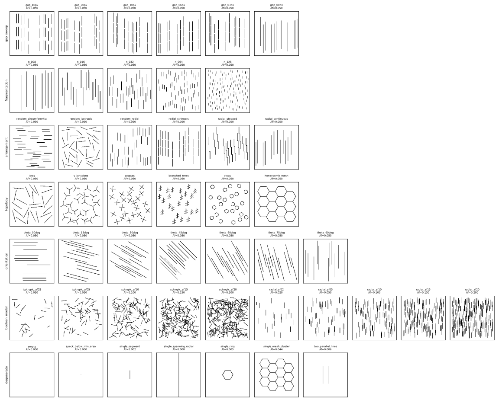

# HCI Synthetic Benchmark (`hci_synthetic_v1`)

## Purpose

A connectivity descriptor can only be validated if you know the right answer in advance.
Real micrographs never provide that: hydrogen content, area fraction, orientation, spacing and
segmentation error all change together. The report behind the intern HCI prototype shows the
problem directly. Its three specimens (25, 70 and 200 ppm) also differ in total hydride area
(3272, 5051 and 8483 px), so the reported HCI increase (2.59, 3.38, 8.02) cannot be attributed to
connectivity rather than to the amount of hydride.

This benchmark removes that confound. Each **family** varies exactly one morphological factor
while the **hydride area fraction is held at 5.00 % (±0.05 percentage points)**. It therefore
serves three purposes:

1. **Concept validation**: does a candidate index rank the conditions in the physically expected
   order?
2. **Code validation**: do skeleton-graph extraction, association and clustering reproduce the
   exact ground truth recorded for every sample?
3. **Regression**: masks regenerate bit-for-bit from the manifest, so any later implementation can
   be checked against frozen expectations.

The formulation this benchmark was built to test is in
[`hci_specification.md`](hci_specification.md). The evidence it produced is in §10 of that
document.

## Location and Regeneration

| Item | Path |
|---|---|
| Generator library | `src/microseg/evaluation/continuity/synthetic.py` |
| CLI | `scripts/generate_hci_synthetic_benchmark.py` |
| Config | `configs/hci_synthetic_benchmark.default.yml` |
| Committed dataset | `test_data/hci_synthetic_v1/` (203 masks, about 2 MB) |
| Tests | `tests/test_phase37_hci_synthetic_benchmark.py` |

```bash
python scripts/generate_hci_synthetic_benchmark.py
```

```bash
python scripts/generate_hci_synthetic_benchmark.py --set output_dir=tmp/hci_bench --set benchmark.replicates=10 --set benchmark.target_area_fraction=0.10
```

List overrides use JSON, for example `--set 'benchmark.families=["gap_sweep","topology"]'`.
Generation is deterministic: the same config reproduces identical masks, which the test suite
checks against the committed files.



## Construction

Every sample is an explicit **centerline network** (nodes and straight edges) rasterised as a
union of **capsules** of diameter `thickness_px` (default 4 px, which is 2 µm at the nominal 0.5 µm/px).

- **Coordinates.** Points are `(x, y)`: `x` is the image column (circumferential) and `y` the image row
  (radial). This matches the Fn convention and the tube frame introduced in release 1.2.0.
  Angles are measured from the circumferential axis, so 90° is radial.
- **Area matching.** A scalar size parameter (segment length, arm length, cell side) is solved by
  bisection, then by a deterministic local scan, until the raster area fraction is within
  tolerance. If the tolerance cannot be met, generation raises an error; it never falls back
  silently.
- **Separation.** Objects meant to be separate keep a matrix clearance of at least 12 px
  (6 µm), wider than any association distance under test. As a result, raster connected
  components equal the intended components, and each sample records this as
  `topology_consistent`.
- **Placement.** Objects are placed by random sequential placement with rejection. Jammed
  configurations restart from the continuing random stream, which keeps the result deterministic.
- **Discretisation.** A capsule whose centreline sits exactly on integer pixel coordinates has
  a raster width of `t + 1`. Random sub-pixel placement averages this out; the degenerate
  cases use half-pixel centres.

## Families

| Family | Varied factor (condition order) | Held constant | Expected behaviour of a connectivity index |
|---|---|---|---|
| `gap_sweep` | Surface gap between 3 collinear radial segments in 10 chains: 40, 20, 10, 6, 3, 0 px (0 = one merged line) | Af, count, orientation, thickness | Non-decreasing as the gap closes |
| `fragmentation` | Same total length split into 8, 16, 32, 64, 128 radial segments | Af, orientation, clearance | Non-increasing with fragment count |
| `arrangement` | 36 equal segments: random circumferential, random isotropic, random radial, radial stringers (gap 6 px), radial staircase linked by 10 px steps, continuous radial lines | Af, segment count before merging | Radial continuity non-decreasing in this order; linkage: all random layouts < stringers < stepped ≈ continuous |
| `topology` | 24 lines, Y (degree 3), X (degree 4), branched trees (4 side branches), hexagonal rings, one honeycomb mesh | Af, object count (except mesh) | Closure κ = 0 for open shapes, 1 for rings and mesh; the mesh is the most connected; rings are *not* more continuous than lines |
| `orientation` | 12 identical lines at 0, 15, …, 90° from circumferential | Af, count, length | Radial index follows the angle; isotropic index approximately constant |
| `boolean_model` | Overlapping random 60 px segments at Af = 2, 5, 10, 15, 20 %, isotropic and radial | Segment length, thickness | Non-decreasing in Af; shows the continuum-percolation response (this family is deliberately *not* at constant Af) |
| `degenerate` | Empty, sub-threshold speck, single segment, single border-to-border radial line, single ring, single mesh cluster, two parallel lines | — | Explicit status for empty inputs; finite values for single clusters; no zero-weight fallback |
| `invariance` | Transpose, horizontal/vertical flips, resolution ×0.5 and ×2, boundary roughness, speckle, pinholes, spurs, 2 px breaks, each applied to three reference samples | — | Exact symmetries hold bitwise (transpose swaps radial and circumferential); others within tolerance |

Replicates: 5 per condition, 3 for `orientation` and `boolean_model`, 1 for `degenerate` and
`invariance`. The total is 203 samples.

## Ground Truth Per Sample

`network_ground_truth()` computes the following exactly from the centerline graph:

| Field | Meaning |
|---|---|
| `total_length_px` | Sum of centerline edge lengths |
| `n_components` | Connected components of the centerline graph |
| `n_endpoints` | Nodes of degree 1 |
| `n_junctions`, `junction_degree_histogram` | Nodes of degree ≥ 3, by degree |
| `branching_excess` | β = Σ (d_j − 2) over junctions |
| `n_independent_loops` | Cyclomatic number μ = E − V + C |
| `network_closure` | κ = 2μ / (β + 2C) (see the specification, §5.4) |
| `raster_components` | 8-connected components of the rasterised mask |
| `topology_consistent` | `raster_components == n_components` |

For `boolean_model`, segments overlap, so the graph counts segments and `raster_components` is the
physical cluster count. For noise perturbations in `invariance`, the graph describes the
unperturbed geometry. Both cases are expected to report `topology_consistent = false`.

## Files and Manifest

```text
test_data/hci_synthetic_v1/
    manifest.json             # schema microseg.hci_synthetic_benchmark.v1
    masks/<family>/<id>.png   # single channel, 0 = matrix, 1 = hydride
    geometry/<family>.json    # centerline nodes, edges, object ids per sample
    overview.png              # replicate 0 of every condition
```

Each manifest sample records `sample_id`, `family`, `condition`, `condition_value`,
`replicate`, `seed`, `mask_path`, `height`, `width`, `thickness_px`, `pixel_size_um`,
`target_area_fraction`, `area_fraction`, `area_fraction_matched`, `parameters` and
`ground_truth`. The manifest-level `families` block states the question, the varied and
controlled factors, and the expected relation for every family. An automated validator can
therefore check an index without any knowledge of the generator.

Resolution-scaled invariance samples record their own `pixel_size_um` (0.25 or 1.0 µm/px),
so physical-unit formulations can be tested for resolution invariance.

## How to Use It to Validate an Implementation

1. Compute the candidate index for every mask using `pixel_size_um` from the manifest.
2. Within each family and replicate, check the expected relation across the condition order.
   Report the fraction of replicates that satisfy it and the effect size relative to
   replicate scatter.
3. For `invariance`, compare against the reference sample: exact equality for symmetries,
   and the tolerances in the specification for the rest.
4. For skeleton-graph code, compare measured endpoints, junction degrees, loops and closure with
   `ground_truth`. Tolerances are set out in the specification.

[`scripts/hci_candidate_study.py`](../scripts/hci_candidate_study.py) is the reference harness that
performs these steps for the prototype and the v1 candidates.

## Limitations

- Hydrides are straight capsules of uniform thickness. Real hydrides are curved, tapered,
  stacked in platelets and imaged with blur. A realism family with waviness, thickness
  variation and optical blur before thresholding is planned (see
  [`hci_implementation_plan.md`](hci_implementation_plan.md)).
- Only one area fraction (5 %) is area-matched by default; the config allows other levels.
- The benchmark tests *ranking* and *invariance*, not physical correctness. Physical relevance
  requires the real-data validation described in the specification.
