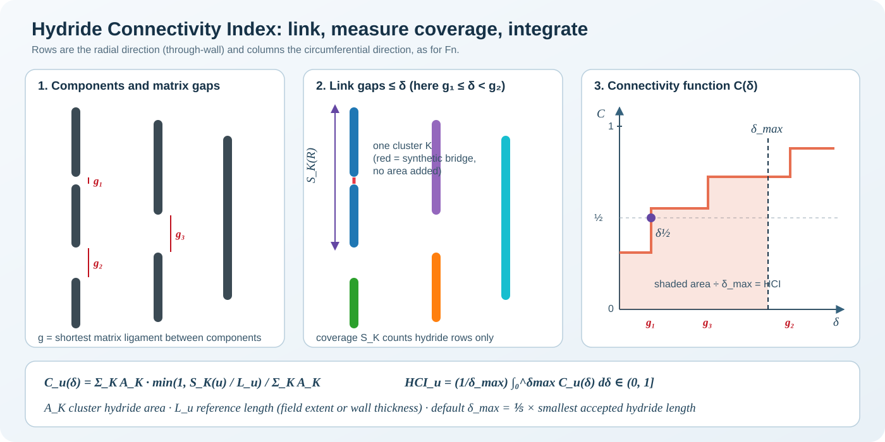
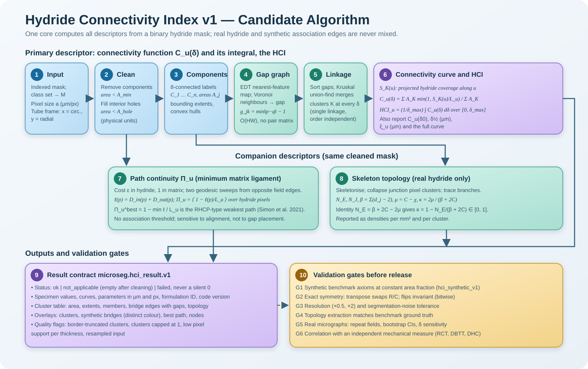

# Hydride Connectivity Index: Theory and Algorithm

This page is the mathematical and algorithmic reference for the Hydride Connectivity Index (HCI),
formulation `hci.v1`, as implemented in `src/microseg/evaluation/continuity/`.

| Document | Content |
|---|---|
| [`hci_specification.md`](hci_specification.md) | Scope, axioms, parameters, output contract and validation evidence |
| [`hci_synthetic_benchmark.md`](hci_synthetic_benchmark.md) | The constant-area-fraction validation benchmark |
| [`hci_user_guide.md`](hci_user_guide.md) | Step-by-step use from the browser, the CLI and Python |



## 1. The Question the HCI Answers

A segmented hydride micrograph is usually summarised by two numbers:

- the **area fraction**, which says how much hydride there is; and
- **Fn**, the radial hydride fraction, which says which way the hydrides point.

Neither says whether the hydrides **link into long connected paths**. Two micrographs with the
same area fraction and Fn can contain either short, isolated platelets or the same platelets
stacked into a continuous chain, and the second is far more damaging. The HCI measures this
difference. It is designed to satisfy four requirements:

1. **Bounded and dimensionless.** It lies in $(0, 1]$. It is 1 when every hydride belongs to a
   cluster spanning the reference length.
2. **Separates connectivity from amount.** At constant area fraction it ranks arrangements by
   connectivity.
3. **Directional where the physics is directional.** A radial (through-wall) variant, a
   circumferential variant and an isotropic variant.
4. **Robust and reproducible.** It is defined for every non-empty mask, invariant under exact
   symmetries, consistent across resolution when thresholds are physical, and computed
   deterministically.

## 2. Notation

| Symbol | Meaning |
|---|---|
| $M \subset \Omega$ | Cleaned binary hydride mask on an $H \times W$ pixel field $\Omega$ |
| $a$ | Pixel size in µm (lengths in pixels when uncalibrated, $a = 1$) |
| $u \in \{R, C, \mathrm{iso}\}$ | Direction: radial (image rows), circumferential (columns), isotropic |
| $C_1,\dots,C_n$ | 8-connected components of $M$ |
| $A_j$ | Area of component $C_j$ |
| $g_{jk}$ | Surface gap between components $j$ and $k$ |
| $\mathcal{K}(\delta)$ | Clusters at association distance $\delta$ |
| $S_K(u)$ | Extent of cluster $K$ along $u$ (projected coverage or Feret diameter) |
| $L_u$ | Reference length along $u$ |
| $C_u(\delta)$ | Connectivity function |
| $\delta_{\max}$ | Bridging range, the upper limit of the HCI integral |

## 3. Definitions

### 3.1 Clean-up

Components with area below $A_{\min}$ are removed, and interior holes below $A_{\mathrm{hole}}$
are filled. Both thresholds are in µm² when $a$ is known (default 5 µm², the prototype's
20 px at 0.5 µm/px) and in pixels otherwise. Both are bounded below by a resolution floor of
$2 \times 2$ pixels, because smaller features cannot be resolved.

### 3.2 Surface gap

$$
g_{jk} \;=\; a\left(\min_{p \in C_j,\; q \in C_k} \lVert p - q \rVert_2 \;-\; 1\right).
$$

$p$ and $q$ are pixel centres. $g_{jk}$ is the length of matrix on the straight segment joining
the two nearest pixels. Two components separated by one matrix pixel have $g = a$.

### 3.3 Single-linkage clusters

For $\delta \ge 0$, define the graph $G_\delta$ on the components with an edge wherever
$g_{jk} \le \delta$. The clusters $\mathcal{K}(\delta)$ are its connected components, which is
single-linkage clustering at level $\delta$. The edges are **synthetic bridges**. They add no
area and are never rasterised into the mask, so they cannot create false junctions in the
skeleton.

### 3.4 Extent

For $u \in \{R, C\}$, the **projected hydride coverage** is

$$
S_K(u) \;=\; a \cdot \Bigl|\, \bigcup_{j \in K} \pi_u(C_j) \Bigr|,
$$

where $\pi_u$ projects pixels onto the rows ($R$) or columns ($C$) and $|\cdot|$ counts
distinct rows or columns. Bridged gaps therefore add **no** extent. A chain with gaps covers
exactly the length its hydride covers, which is the length it would cover if merged. For the
isotropic variant, $S_K(\mathrm{iso})$ is the maximum Feret diameter of the member pixels.

### 3.5 Connectivity function and HCI

$$
C_u(\delta) \;=\; \frac{\displaystyle\sum_{K \in \mathcal{K}(\delta)} A_K \, \min\!\left(1, \frac{S_K(u)}{L_u}\right)}{\displaystyle\sum_{K \in \mathcal{K}(\delta)} A_K},
\qquad A_K = \sum_{j \in K} A_j,
$$

$$
\boxed{\;\mathrm{HCI}_u \;=\; \frac{1}{\delta_{\max}} \int_0^{\delta_{\max}} C_u(\delta)\, \mathrm{d}\delta\;}
$$

$C_u(\delta)$ is the expected fraction of the reference length covered by the cluster that a
randomly chosen hydride pixel belongs to, when matrix ligaments up to $\delta$ count as bridged.
The HCI averages that over a range of bridgeable ligaments. This is equivalent to assuming the
critical ligament that fails between neighbouring hydrides is uniformly distributed on
$[0, \delta_{\max}]$.

### 3.6 Reported alongside the HCI

$$
\delta_{1/2,u} = \min\{\delta \ge 0 : C_u(\delta) \ge \tfrac12\},
\qquad
\xi_u(\delta) = \frac{\sum_K A_K\, S_K(u)}{\sum_K A_K}\ \ [\mu\mathrm{m}].
$$

- The **critical linking distance** $\delta_{1/2}$ is a physical spacing: the matrix gap that
  must be bridged for half the hydride to lie in clusters covering half the reference length.
  On the benchmark it recovers the designed gap exactly.
- The **connectivity length** $\xi_u$ is the area-weighted mean cluster extent, the analogue of
  the percolation correlation length.

## 4. The Bridging Range $\delta_{\max}$

### 4.1 Rules implemented

| Mode | Definition | Use |
|---|---|---|
| `auto` + `min` (default) | $\delta_{\max} = f \cdot \min_j \ell_j$, with $f = \tfrac15$ and $\ell_j$ the maximum Feret length of $C_j$ | Owner decision (2026-09-27). Scale-free, since it is a ratio of lengths on the same image |
| `auto` + `percentile` | $\delta_{\max} = f \cdot P_q(\{\ell_j\})$, e.g. $q = 50$ (median) | Less sensitive to one small fragment |
| fixed | $\delta_{\max}$ in µm (or px) | **Required for comparing specimens** |

Every automatic value is floored at one pixel, and the result records the value used, its
source and the smallest hydride length.

### 4.2 Consequences established on the benchmark

An automatic $\delta_{\max}$ is recomputed for every image. Two images are therefore
integrated over **different ranges**, which makes their HCIs answer different questions.
The benchmark quantifies this (`docs/hci_evidence/`):

| Rule | Ordering axioms met (gap / fragmentation / arrangement / orientation) | Change under 2-px breaks | Change under ×0.5 resolution |
|---|---|---|---|
| auto: 1/5 of smallest (default) | 5/5, 5/5, 3/5, 1/3 | −61 % | 1.3 % |
| auto: 1/5 of P10 | 5/5, 5/5, 3/5, 1/3 | −59 % | 1.3 % |
| auto: 1/5 of median | 5/5, 5/5, 3/5, 1/3 | 2.4 % | 0.9 % |
| fixed 10 µm | **5/5, 5/5, 5/5, 3/3** | **1.8 %** | 1.8 % |

A few breaks create tiny fragments; the smallest one then sets a tiny $\delta_{\max}$ for the
whole image. On the intern report's real masks (3.2 µm/px), the smallest accepted hydride is
about 10 µm long, so the default rule floors $\delta_{\max}$ to one pixel.
**Recommendation:** use a fixed $\delta_{\max}$, identical for all specimens, whenever values
are compared. The automatic value is a convenient single-image default.

## 5. Properties

**Proposition 1 (bounds).** For any non-empty $M$, $0 < C_u(\delta) \le 1$ and
$0 < \mathrm{HCI}_u \le 1$.

*Proof.* $C_u(\delta)$ is a convex combination, with weights $A_K/\sum A_K$, of values
$\min(1, S_K/L_u) \in (0, 1]$. Then $\mathrm{HCI}_u$ is the mean of $C_u$ over
$[0, \delta_{\max}]$. $\square$

**Proposition 2 (monotone in $\delta$).** $\delta_1 < \delta_2 \Rightarrow C_u(\delta_1) \le C_u(\delta_2)$.

*Proof.* $G_{\delta_1} \subseteq G_{\delta_2}$, so $\mathcal{K}(\delta_2)$ is a coarsening of
$\mathcal{K}(\delta_1)$. Coverage of a union is at least that of each part, and so is the Feret
diameter, so no pixel's weight decreases. $\square$

**Proposition 3 (monotone under linking).** Reducing an inter-component gap, or adding a bridge
of negligible area, cannot decrease $C_u(\delta)$ for any $\delta$, and hence cannot decrease
$\mathrm{HCI}_u$. If the merge extends the coverage of either cluster (for example collinear
hydrides), $\mathrm{HCI}_u$ increases strictly when the old gap was below $\delta_{\max}$.

*Proof.* Every merge now occurs at a smaller or equal $\delta$, so apply Proposition 2
pointwise. $C_u$ is strictly larger on the interval between the new and old gap, which has
positive length. $\square$

**Proposition 4 (single cluster).** If $M$ is one component,
$C_u(\delta) = \min(1, S/L_u)$ for all $\delta$. The prototype returned 0 in this case.

**Proposition 5 (symmetry).** Horizontal and vertical flips leave every variant unchanged. A
transpose exchanges $R$ and $C$ and leaves $\mathrm{iso}$ unchanged. Row and column coverage
and the Feret diameter are invariant or permuted under these maps, and so is the gap graph.

**Remark (amount).** The HCI is intensive. At fixed morphology it is independent of how much
of that morphology is imaged, provided the clusters are much smaller than $L_u$. It is **not**
independent of area fraction across morphologies. In the continuum-percolation (Boolean) model
it rises steeply once the sticks begin to percolate. A physical study must therefore report
the HCI together with the area fraction, and test whether the HCI adds explanatory power.

## 6. Algorithm



```text
Input: mask M (bool/indexed/RGB), config, pixel size a (optional)
1  M ← binarise(M); M ← clean(M, A_min, A_hole, floor = 4 px)
2  if M = ∅: return status = not_applicable (no numeric zeros)
3  label 8-connected components C_j; record A_j, row set, column set, hull vertices
4  D, I ← EDT(¬M) with nearest-feature indices; near(p) = label(I(p))
   for each pair of 8-adjacent pixels (p, q) with near(p) ≠ near(q):
       candidate gap g = ‖I(p) − I(q)‖ − 1; keep the minimum per component pair
5  sort gaps; union-find (Kruskal):
       on each merge update Σ A_K·w_K(u) incrementally → exact step function C_u(δ)
6  HCI_u = (1/δ_max) Σ_k C_u(δ_k)·(min(δ_{k+1}, δ_max) − min(δ_k, δ_max))
   δ½,u = first δ_k with C_u ≥ ½;  cluster table at δ_0 (= δ_max by default)
7  companions: path continuity Π_u (two Dijkstra sweeps per direction);
       skeleton topology (junction collapse, ends, loops by Euler number)
8  quality flags; emit microseg.hci_result.v1
```

**Why step 4 is sufficient.** Single-linkage clusters are the connected components of the
minimum spanning forest of the gap graph (Gower & Ross, 1969). Every MST edge joins components
whose Voronoi cells touch. Checking only Voronoi-adjacent pairs, found from the nearest-feature
map, therefore loses no merge. It also avoids the prototype's all-pairs pixel distance matrix,
whose cost is $O\bigl(\sum_{j<k}|C_j||C_k|\bigr)$.

**Complexity.**

- Step 4 is $O(HW)$ time and memory.
- Kruskal costs $O(E \log E)$ with $E = O(n)$ Voronoi edges.
- Merging coverage sets costs at most $O(n \cdot H)$.
- The path sweeps are $O(HW \log HW)$ and dominate the runtime: about 6 s of the 8.4 s total on
  a 2048² mask on one CPU core.

## 7. Companion Descriptors

### 7.1 Path continuity (RHCP-type)

With cost $c(p) = \varepsilon$ on hydride and 1 on matrix, $D_{\mathrm{in}}$ and
$D_{\mathrm{out}}$ are geodesic cumulative costs from the two field edges normal to $u$
(Dijkstra, 8-neighbour). The ligament of the cheapest edge-to-edge path through $p$ is
$\ell(p) = D_{\mathrm{in}}(p) + D_{\mathrm{out}}(p)$, and

$$
\Pi_u = \bigl\langle \max\bigl(0,\, 1 - \ell(p)/L_u\bigr) \bigr\rangle_{p \in M},
\qquad
\Pi_u^{\mathrm{best}} = \max\bigl(0,\, 1 - \min_p \ell(p)/L_u\bigr).
$$

$\varepsilon = 0.02$ reproduces the hydride-to-matrix toughness ratio used for RHCP (Simon et
al., 2021). $\Pi_u$ responds to **alignment** but only weakly to where gaps lie along a chain,
because a crack crosses the same total matrix length either way. It complements the HCI rather
than replacing it.

### 7.2 Skeleton topology and the closure identity

The skeleton is reduced to a graph in four steps:

1. Junction pixels (8-degree ≥ 3) are merged within the local half-thickness, so that a thick
   crossing becomes one node.
2. Branches are the remaining chains.
3. A one-pixel spur contributes one node end and one free end.
4. A loop lying inside a collapsed node counts as a self-loop.

Let $N_E$ be the free ends, $d_j$ the junction degrees, $\beta = \sum_j (d_j - 2)$ the branching
excess, $C$ the skeleton components and $\mu = C - \chi$ the independent loops ($\chi$ is the
Euler characteristic).

**Proposition 6 (identity).** For every graph whose components each contain an edge,

$$
N_E = \beta + 2C - 2\mu .
$$

*Proof.* Consider one connected component with $V$ nodes, of which $N_E$ are endpoints, $N_2$
have degree 2 and the rest are junctions, and with $E$ edges and $\mu$ loops. Then
$\sum \deg = 2E$ and $E = V - 1 + \mu$. Substituting
$\sum \deg = N_E + 2N_2 + \sum_j d_j$ and $V = N_E + N_2 + N_J$ gives
$\sum_j (d_j - 2) = N_E - 2 + 2\mu$. Summing over the $C$ components gives the result. $\square$

This defines the **network closure**

$$
\kappa = \frac{2\mu}{\beta + 2C} = 1 - \frac{N_E}{\beta + 2C} \in [0, 1],
$$

which is 0 for free-ended trees and 1 for networks without free ends. The implementation
reports `identity_residual` $= N_E - (\beta + 2C - 2\mu)$ as a self-check. It is exactly 0 on
all 196 benchmark masks and on the intern's real masks.

**The prototype's term decoded.** $(B+1)/(N_E + B)$, with $B = N_J$, equals
$(N_J+1)/(\beta + 2C - 2\mu + N_J)$. For a single tree with only degree-3 junctions,
$\beta = N_J$ and $\mu = 0$, so the term is exactly $\tfrac12$ however much the tree branches.
Degree-4 junctions lower it; only loops raise it. Loops, moreover, do not mean continuity: at
equal length, rings give the **lowest** HCI of all benchmark topologies.

## 8. Worked Numbers

| Case (5 % area fraction, fixed $\delta_{\max}$ = 10 µm) | HCI radial | Note |
|---|---:|---|
| 36 random radial segments | 0.20 | isolated; $\delta_{1/2} \approx$ 16 µm |
| same segments in stringers (3 µm gaps) | 0.44 | $\delta_{1/2}$ = 3.2 µm, the designed gap |
| stepped, linked chains | 0.53 | continuous but offset |
| continuous lines | 0.55 | same hydride, no gaps |
| honeycomb network (one cluster) | 0.81 (iso 1.00) | prototype: 0 |

On the intern report's real masks (25, 70, 200 ppm; fixed 10 µm), the circumferential HCI
rises 0.155 → 0.182 → 0.261. The radial HCI stays low (0.038 → 0.061) because the hydrides are
circumferential, and $\delta_{1/2,R}$ falls 88 → 51 → 24 µm. The single isotropic prototype
number (2.4 → 3.1 → 7.0) could not separate these effects.

## 9. Using the Implementation

```python
from src.microseg.evaluation.continuity import Calibration, ContinuityAnalysisConfig, analyze_continuity

result = analyze_continuity(mask, ContinuityAnalysisConfig(max_bridge_distance=10.0), Calibration(0.5, "scale bar"))
result.specimen["HCI"]            # {'radial': ..., 'circumferential': ..., 'isotropic': ...}
result.to_dict()                  # microseg.hci_result.v1 (JSON-safe)
```

```bash
python scripts/microseg_cli.py hci --mask path/to/masks --pixel-size-um 0.5 --max-bridge-distance 10 --output-dir outputs/hci
```

In the browser the HCI is on by default (**5. Connectivity (HCI)**); the Help page repeats this
theory with rendered equations.

## 10. Limitations

- A 2D section is analysed; hydrides that appear separate may connect out of plane.
- Clusters touching the image border are truncated, so the HCI is then a lower bound. Image the
  full wall, or stitch fields.
- Thin masks (under 3 px thick) make the topology descriptors unreliable; this is flagged.
- The automatic $\delta_{\max}$ is image-specific (§4); use a fixed value for comparisons.
- The HCI is validated for ranking and invariance on synthetic masks. Its relation to
  mechanical properties still requires the field-data study.

## References

1. M.C. Billone, T.A. Burtseva, R.E. Einziger, *J. Nucl. Mater.* 433 (2013) 431–448 (RHCF).
2. P.-C.A. Simon et al., *J. Nucl. Mater.* 547 (2021) 152817 (RHCP).
3. J.C. Gower, G.J.S. Ross, *J. R. Stat. Soc. C* 18 (1969) 54–64 (MST and single linkage).
4. D. Stauffer, A. Aharony, *Introduction to Percolation Theory*, 2nd ed. (1994).
5. S. Torquato, J.D. Beasley, Y.C. Chiew, *J. Chem. Phys.* 88 (1988) 6540 (two-point cluster function).
6. T.Y. Zhang, C.Y. Suen, *Commun. ACM* 27 (1984) 236 (thinning).
