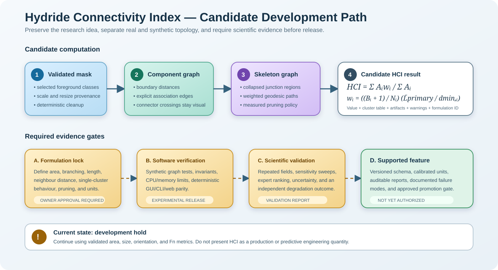

# Hydride Connectivity Index: Candidate Specification and Development Hold

## Status

The Hydride Continuity Index (HCI) is a promising advanced morphology descriptor,
but it is **not approved for production use** in MicroSeg. Development is on hold
until the scientific decisions in this document are resolved.

This page preserves the intern prototype's intent, the formulation presented in the
project report, the implementation audit findings, and the engineering principles
that must guide any future implementation. It is deliberately a specification and
decision record, not a claim that HCI has been scientifically validated.



## 1. Intended Scientific Purpose

Conventional hydride descriptors such as hydride area fraction and fractional
number describe amount and orientation. They do not fully describe whether
segmented hydrides form long, closely spaced, branching networks.

The proposed HCI attempts to combine:

- hydride-cluster area;
- branch topology;
- primary branch length;
- distance between neighbouring clusters; and
- a specimen-level area-weighted reduction.

The intended result is a dimensionless specimen-level descriptor. It is not bounded
to the interval 0 to 1. Larger values are intended to indicate longer and more
closely spaced hydride networks.

## 2. Formulation Presented in the Intern Work

For cluster \(i\), the proposed weight is:

\[
w_i =
\left(\frac{B_i+1}{N_i}\right)
\left(\frac{\bar{L}_{primary}}{d_{min,i}}\right)
\]

with:

\[
N_i = N_{E,i} + B_i
\]

The specimen HCI is:

\[
HCI =
\frac{\sum_i A_i w_i}{\sum_i A_i}
\]

where:

| Symbol | Intended meaning |
|---|---|
| \(A_i\) | Area of hydride cluster \(i\) |
| \(B_i\) | Number of junctions in cluster \(i\) |
| \(N_{E,i}\) | Number of free endpoints in cluster \(i\) |
| \(N_i\) | Effective nodes, \(N_{E,i}+B_i\) |
| \(\bar{L}_{primary}\) | Mean primary-branch length across the specimen |
| \(d_{min,i}\) | Minimum distance from cluster \(i\) to another cluster |
| \(w_i\) | Weight assigned to cluster \(i\) |

The prototype workflow uses the following nominal pixel parameters:

| Parameter | Prototype value | Intended purpose |
|---|---:|---|
| Minimum hydride area | 20 px | Remove small foreground artifacts |
| Maximum filled-hole area | 20 px | Fill small holes inside hydrides |
| Association distance | 5 px | Link nearby hydride components |
| Minimum secondary-branch length | 5 px | Exclude short skeleton branches |
| Pruning visualization threshold | 10 px | Display removal of short spurs |

These are development values, not universal material constants. A future
implementation must support calibrated physical units where scale is available and
must record the effective pixel and physical values in every result.

## 3. Intended Processing Stages

1. Normalize a selected foreground class or class set into a binary mask.
2. Remove small foreground objects and fill small holes.
3. identify connected hydride components using a declared connectivity convention.
4. Measure distances between component boundaries.
5. Associate nearby components according to an explicit connection policy.
6. Build a topology representation that distinguishes real hydride pixels from
   synthetic association edges.
7. Skeletonize the cleaned hydride geometry.
8. Optionally prune short spurs from the graph used for measurement.
9. Collapse junction-pixel regions into stable graph nodes.
10. Extract a primary geodesic branch and secondary graph branches.
11. Compute cluster-level measurements, quality flags, and weights.
12. Reduce the cluster measurements into a specimen HCI with full provenance.

## 4. Prototype Audit Findings

The prototype must not be copied directly into the production package. The audit
found the following scientifically material problems.

### 4.1 Divergent HCI code paths

The workbook-producing path uses mean primary-branch length. The standalone
`compute_hci()` path uses primary plus secondary length. The same mask can therefore
produce different values depending on which function is used.

### 4.2 Final-cluster-only accumulation

The accumulation in the standalone `compute_hci()` implementation is outside its
cluster loop. It therefore uses only the final cluster when calculating the
numerator and denominator.

### 4.3 Pruning is not part of the measured result

The report presents iterative pruning as an analysis stage, but the prototype
measures an unpruned skeleton. The pruned image is diagnostic only.

### 4.4 Cluster area is not hydride area

The prototype records skeleton-pixel count, including synthetic connector pixels,
as \(A_i\). This is not the area of the cleaned hydride cluster and can double-count
length-related effects.

The prototype `Area_%` value also divides skeleton pixels by total hydride pixels,
not by total image pixels. It must not be described as hydride area fraction.

### 4.5 Secondary-branch summary is mislabeled

The specimen summary reports the sum of junctions as total secondary branches.
These quantities can differ, particularly when several branches share one collapsed
junction.

### 4.6 Single-cluster failure mode

If every associated hydride belongs to one connected cluster, there is no neighbour
from which to calculate \(d_{min,i}\). The prototype assigns zero weight and
therefore HCI = 0. This contradicts the intended interpretation of a highly
continuous specimen.

### 4.7 Branching term may not measure branching as intended

For a tree containing only degree-three junctions, \(N_E=B+2\). The proposed
topology term becomes:

\[
\frac{B+1}{N_E+B} =
\frac{B+1}{2B+2} = 0.5
\]

Adding ordinary three-way branches therefore does not necessarily increase the
term. Higher-degree junctions can reduce it. The physical interpretation of this
factor must be reconsidered before implementation.

### 4.8 Path traversal is not a robust geodesic calculation

The prototype uses a depth-first, first-found pixel path. That is only unambiguous
for a strict tree. Cycles and multiple paths can make lengths dependent on traversal
order.

### 4.9 Raster connectors can create artificial junctions

Drawing every qualifying connector into a raster mask can create line crossings.
Skeletonization can turn those visual crossings into false topological junctions.
Synthetic association edges must therefore remain explicit graph edges; a visual
crossing must not silently become a physical connection.

### 4.10 Pairwise pixel distance is not scalable

Computing a full distance matrix for every pair of component-pixel sets has poor
CPU and memory scaling. A production implementation should use component
boundaries, bounding-box rejection, distance transforms, KD-trees, or another
validated spatial index.

### 4.11 Resolution sensitivity

All prototype thresholds are in pixels. Resizing or web downscaling can change
component removal, association, pruning, and therefore HCI. Results from differently
scaled images are not comparable unless the thresholds are transformed through a
validated calibration policy.

### 4.12 Validation evidence is insufficient

The intern report demonstrates three representative conditions, but it does not
establish repeatability, uncertainty, parameter sensitivity, resolution invariance,
or correlation with a mechanical-property outcome. The reported values must be
treated as feasibility examples, not acceptance targets, until the original masks
and workbooks are recovered.

## 5. Non-Negotiable Implementation Principles

A future HCI implementation must:

- remain an optional, off-by-default advanced analysis;
- be labelled experimental until scientific validation is complete;
- have a stable formulation identifier and versioned output schema;
- use typed configuration and result contracts;
- contain no hardcoded paths or import-time side effects;
- keep real hydride pixels separate from synthetic association geometry;
- define \(A_i\), branch length, junction, endpoint, association, and pruning
  precisely;
- return explicit `not_applicable`, warning, or failure states instead of silent
  numerical fallbacks;
- be deterministic for the same mask, configuration, and code version;
- support CPU-first execution and bounded memory use;
- record image scale, resizing, foreground classes, connectivity, all parameters,
  formulation ID, code version, and timing;
- calculate predicted and human-corrected results through the same core;
- expose identical core behavior through CLI, desktop GUI, and optional web
  adapters;
- export cluster-level evidence, not only a headline number; and
- include documentation and tests in the same behavior-changing change.

## 6. Candidate Modular Architecture

A future implementation should live outside the existing orientation and size
statistics module:

```text
src/microseg/evaluation/continuity/
    __init__.py
    contracts.py
    config.py
    component_graph.py
    skeleton_graph.py
    analyzer.py
    visualization.py
    serialization.py
```

Recommended public contracts:

### `ContinuityAnalysisConfig`

- `enabled`
- `formulation_id`
- `foreground_class_indices`
- `min_feature_area`
- `max_hole_area`
- `association_distance`
- `association_policy`
- `prune_spurs`
- `prune_spur_length`
- `connectivity`
- `units`
- optional spatial calibration

### `ContinuityClusterResult`

- stable cluster identifier;
- cleaned hydride area, excluding connectors;
- primary and secondary branch measurements;
- endpoint and collapsed-junction counts;
- nearest-neighbour distance;
- cluster weight;
- quality flags; and
- references to diagnostic artifacts.

### `ContinuityAnalysisResult`

- value or explicit non-applicable status;
- formulation and schema versions;
- specimen summary;
- cluster result table;
- stage images and overlays;
- full configuration and calibration;
- runtime and hardware profile where feasible; and
- warnings required for scientific interpretation.

## 7. Required Scientific Decisions

Development remains on hold until the project owner approves:

1. Whether production should reproduce the prototype formulation or define a
   corrected HCI candidate.
2. The exact physical meaning of the branching term.
3. Whether \(\bar L\) includes primary length only or another branch-length
   statistic.
4. The definition of cluster area and treatment of synthetic connectors.
5. The single-cluster and no-neighbour convention.
6. The association-edge policy, including how cycles and crossings are handled.
7. Whether pruning changes the measured graph and how its threshold is calibrated.
8. Pixel versus physical-unit requirements for valid comparisons.
9. The validation dataset, expert reference ranking, and promotion criteria.
10. Whether the published user-facing name should remain “Hydride Continuity
    Index” or use “Hydride Connectivity Index.”

## 8. Minimum Validation Program

Unit and property tests must cover:

- empty masks and fully filtered masks;
- a single line, Y, T, cross, and cyclic graph;
- one connected cluster;
- disconnected and near-associated components;
- connector crossings;
- diagonal and axial paths;
- border-truncated features;
- translation and rotation sensitivity;
- calibrated resolution scaling;
- deterministic repeatability; and
- predicted-versus-corrected result parity.

Scientific validation must include:

- original masks and expected prototype workbooks;
- repeated fields for each material condition;
- parameter sensitivity sweeps;
- controlled segmentation perturbations;
- uncertainty and confidence reporting;
- expert topology ranking; and
- correlation with an independent material-degradation measure before HCI is used
  as a predictive engineering quantity.

## 9. Promotion Gates

HCI may move from hold to experimental implementation only after the formulation
decisions are signed off. It may move from experimental to supported only after:

- all core and interface tests pass on CPU;
- cross-interface results are identical for the same mask and config;
- performance limits are documented and met;
- reports contain cluster-level audit evidence;
- a scientific validation report is approved; and
- README, algorithms, workflow, GUI, CLI, web, and testing documentation are
  synchronized.

Until then, MicroSeg should continue to report validated descriptors such as area,
size, orientation, and Fn, while describing HCI only as deferred research.
