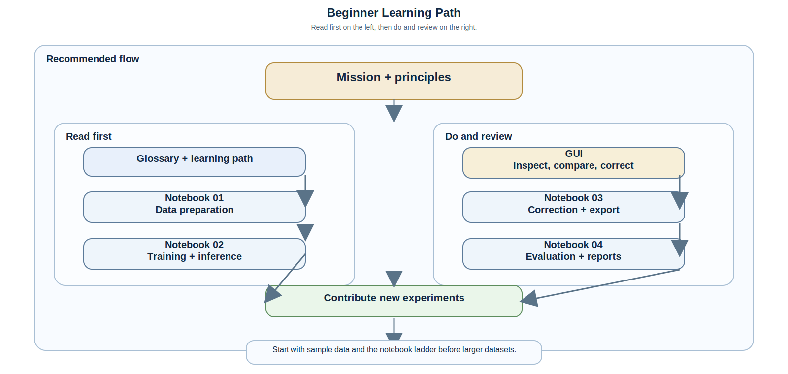

# Beginner Learning Path

This page is the shortest route from checkout to understanding.
It connects the repo mission, the notebook labs, the GUI, the CLI, and the outputs they generate.

## Recommended Flow



The flow sheet is published as a static SVG so it stays crisp in HTML and PDF.

## What To Read First

| Step | Read or Run | Why it matters |
|---|---|---|
| 1 | [`mission_statement.md`](mission_statement.md) | Establishes the scientific and product goals |
| 2 | [`documentation_principles.md`](documentation_principles.md) | Explains how docs, code, and artifacts stay traceable |
| 3 | [`glossary.md`](glossary.md) | Removes the jargon barrier for new contributors |
| 4 | [`student_notebooks.md`](student_notebooks.md) | Gives the hands-on workflow ladder |
| 5 | [`usage_commands.md`](usage_commands.md) | Shows exact copy-paste commands |
| 6 | [`gui_user_guide.md`](gui_user_guide.md) | Shows the visual workflow and correction loop |
| 7 | [`results_analysis.md`](results_analysis.md) | Explains how to read outputs and reports |
| 8 | [`scientific_validation.md`](scientific_validation.md) | Shows how to judge whether a result is actually better |

## What To Run First

Use the sample data and the notebook ladder before you touch a larger dataset.

```bash
python scripts/build_docs.py --html-only
jupyter lab docs/notebooks/
hydride-gui --ui-config configs/app/desktop_ui.default.yml
```

If you prefer a CLI-first path:

```bash
microseg-cli models --details
microseg-cli infer --config configs/inference.default.yml --set params.area_threshold=120
microseg-cli evaluate --config configs/evaluate.default.yml --set split=test
```

## What Good Looks Like

- The dataset layout is explicit and reproducible.
- The training notebook writes a manifest and a model artifact.
- The inference notebook shows a real mask and overlay, not just numbers.
- The correction notebook produces a versioned export record.
- The evaluation notebook lets you compare plots and metrics together.
- The GUI keeps the image or plot area dominant while hiding advanced controls until needed.

## Next Step

When the basic flow makes sense, move to [`why_tradeoffs.md`](why_tradeoffs.md) to understand why the repo prefers some choices over others.
