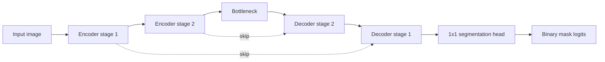
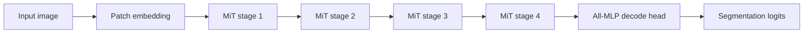
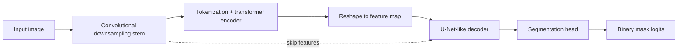

# Model Architecture Manuscript Foundation

## Purpose

This document is a manuscript-oriented technical foundation for the model families used in this repository.
It focuses on architecture behavior, comparative strengths/weaknesses, pretrained-weight provenance, and practical research considerations for hydride and broader microstructural segmentation.

Scope in this repo:
- `unet_binary`
- `smp_unet_resnet18`
- `hf_segformer_b0`
- `hf_segformer_b2`
- `hf_segformer_b5`
- `transunet_tiny`
- `segformer_mini`

Important interpretation note:
- `transunet_tiny` and `segformer_mini` are in-repo lightweight research variants.
- They are inspired by transformer-hybrid ideas, but they are not official checkpoint-equivalent reproductions of external papers.

## Architecture Flow Diagrams

### U-Net Family (`unet_binary`, `smp_unet_resnet18`)

### SegFormer Family (`hf_segformer_b0/b2/b5`, concept basis for `segformer_mini`)

### Hybrid Transformer-U-Net (`transunet_tiny`)

## Per-Model Technical Notes

## `unet_binary`

Architecture lineage:
- U-Net encoder-decoder pattern ([U-Net paper](https://arxiv.org/abs/1505.04597))
- optional ResNet-derived warm-start source ([ResNet paper](https://arxiv.org/abs/1512.03385))

Unique features in this repo:
- lightweight baseline with deterministic, robust behavior
- local-pretrained bootstrap supported via `unet_binary_resnet18_imagenet_partial`
- good controllability for ablation and debugging

Major considerations:
- strongest on local texture and boundary fidelity when data is moderate
- can underperform transformer backbones when long-range context dominates
- usually easiest to stabilize across seeds and node types

Critical comparison:
- compared to SegFormer variants: often lower global-context quality, but lower operational complexity
- compared to `transunet_tiny`: usually simpler and more reproducible; less global relation modeling

## `smp_unet_resnet18`

Architecture lineage:
- U-Net decoder + ResNet18 encoder via segmentation-models-pytorch
- references: [U-Net](https://arxiv.org/abs/1505.04597), [ResNet](https://arxiv.org/abs/1512.03385)

Unique features:
- mature external implementation and encoder ecosystem
- practical transfer-learning baseline using ImageNet encoder initialization

Major considerations:
- external dependency footprint is larger than internal `unet_binary`
- encoder-pretrained benefits are strongest when texture primitives transfer well

Critical comparison:
- stronger transfer baseline than pure scratch U-Net in many small/medium-data regimes
- still more locality-biased than transformer-heavy models

## `hf_segformer_b0`, `hf_segformer_b2`, `hf_segformer_b5`

Architecture lineage:
- SegFormer/MiT family ([paper](https://arxiv.org/abs/2105.15203), [official repo](https://github.com/NVlabs/SegFormer))

Variant-level intuition:
- `b0`: lowest compute/memory among the three; best for rapid iteration
- `b2`: balanced midpoint for quality vs cost
- `b5`: highest capacity; best when GPU memory/time budget is acceptable

Unique features:
- strong global context modeling from transformer hierarchy
- robust benchmark relevance due to wide ecosystem usage
- local-pretrained ADE20K checkpoints available for offline reuse

Major considerations:
- transformer training is sensitive to learning-rate/batch-size policy
- higher variants (`b5`) increase memory and runtime sharply
- domain gap (ADE20K -> microstructure) can help initialization but must be validated empirically

Critical comparison:
- often higher ceiling than U-Net baselines on complex global structures
- may not always dominate on tiny datasets or strict compute budgets

## `transunet_tiny`

Architecture lineage:
- inspired by TransUNet concept ([paper](https://arxiv.org/abs/2102.04306)) and ViT ([paper](https://arxiv.org/abs/2010.11929))

Unique features in this repo:
- compact hybrid model combining local conv priors with transformer context blocks
- offline local-pretrained bootstrap via ViT-tiny mapped tensors

Major considerations:
- local-pretrained bundle is a partial warm-start mapping, not official TransUNet author checkpoint
- optimization may be less forgiving than pure U-Net under weak hyperparameter settings

Critical comparison:
- can outperform pure U-Net on context-heavy patterns while staying lighter than larger SegFormer variants
- may require more careful tuning than `unet_binary`

## `segformer_mini`

Architecture lineage:
- lightweight internal transformer variant conceptually aligned with SegFormer-style encoding
- bootstrap source from ViT-tiny model family

Unique features:
- small transformer research baseline for fast comparative experiments
- local-pretrained partial warm-start available in offline workflow

Major considerations:
- not an official NVIDIA SegFormer checkpoint-equivalent architecture
- publication claims should clearly label it as an internal variant

Critical comparison:
- useful as a compute-efficient transformer reference against `transunet_tiny` and `hf_segformer_b0`
- lower representational capacity than larger HF SegFormer variants

## Cross-Model Critical Comparison

| Model | Core Strength | Main Weakness | Compute Profile | Best Use Case | High-Risk Failure Mode |
|---|---|---|---|---|---|
| `unet_binary` | Strong local boundary modeling and stability | Limited long-range context reasoning | Low | robust baseline and ablation anchor | fragmented predictions on globally ambiguous regions |
| `smp_unet_resnet18` | Practical transfer start via pretrained encoder | Locality bias remains | Low-Medium | fast transfer baseline with known tooling | encoder transfer mismatch to microstructure textures |
| `hf_segformer_b0` | Efficient global-context transformer baseline | can underfit very complex structures vs larger variants | Medium | first transformer benchmark on constrained GPUs | unstable gains if LR/batch policy is poor |
| `hf_segformer_b2` | Better quality/capacity balance than B0 | more memory/runtime cost | Medium-High | primary transformer candidate for full studies | longer convergence and higher tuning cost |
| `hf_segformer_b5` | Highest capacity in current HF set | expensive in memory/time | High | maximum-quality attempt with sufficient resources | OOM/slow turnaround causing weak experiment coverage |
| `transunet_tiny` | Hybrid local+global inductive bias | tuning sensitivity; partial bootstrap only | Medium | bridge model between CNN and transformers | unstable optimization under aggressive LR |
| `segformer_mini` | Lightweight transformer comparison point | internal, lower-capacity variant | Medium-Low | quick transformer-side ablations | underfitting on complex morphologies |

## Pretrained Weight Provenance And Manual Download URLs

Repository-local bundles are generated into `pre_trained_weights/` and indexed in `pre_trained_weights/registry.json`.

Direct upstream/manual download URLs used for air-gap preparation:

| Local Model ID | Upstream Source | Direct Manual Download URL(s) | Remarks |
|---|---|---|---|
| `hf_segformer_b0_ade20k` | Hugging Face NVIDIA SegFormer-B0 | `https://huggingface.co/nvidia/segformer-b0-finetuned-ade-512-512/resolve/main/pytorch_model.bin`  `https://huggingface.co/nvidia/segformer-b0-finetuned-ade-512-512/resolve/main/model.safetensors` | ADE20K-finetuned checkpoint used for local directory snapshot |
| `hf_segformer_b2_ade20k` | Hugging Face NVIDIA SegFormer-B2 | `https://huggingface.co/nvidia/segformer-b2-finetuned-ade-512-512/resolve/main/pytorch_model.bin` | ADE20K-finetuned checkpoint |
| `hf_segformer_b5_ade20k` | Hugging Face NVIDIA SegFormer-B5 | `https://huggingface.co/nvidia/segformer-b5-finetuned-ade-640-640/resolve/main/pytorch_model.bin` | ADE20K-finetuned checkpoint |
| `smp_unet_resnet18_imagenet` | segmentation-models-pytorch U-Net + ImageNet ResNet18 encoder | encoder source URLs: `https://huggingface.co/timm/resnet18.a1_in1k/resolve/main/model.safetensors`  `https://huggingface.co/timm/resnet18.a1_in1k/resolve/main/pytorch_model.bin` | final U-Net state dict is assembled locally by script from initialized SMP model |
| `unet_binary_resnet18_imagenet_partial` | timm ResNet18 | `https://huggingface.co/timm/resnet18.a1_in1k/resolve/main/model.safetensors`  `https://huggingface.co/timm/resnet18.a1_in1k/resolve/main/pytorch_model.bin` | partial warm-start mapping into internal `unet_binary` encoder tensors |
| `transunet_tiny_vit_tiny_patch16_imagenet` | timm ViT-tiny | `https://huggingface.co/timm/vit_tiny_patch16_224.augreg_in21k_ft_in1k/resolve/main/model.safetensors`  `https://huggingface.co/timm/vit_tiny_patch16_224.augreg_in21k_ft_in1k/resolve/main/pytorch_model.bin` | partial warm-start mapping; not official TransUNet weights |
| `segformer_mini_vit_tiny_patch16_imagenet` | timm ViT-tiny | `https://huggingface.co/timm/vit_tiny_patch16_224.augreg_in21k_ft_in1k/resolve/main/model.safetensors`  `https://huggingface.co/timm/vit_tiny_patch16_224.augreg_in21k_ft_in1k/resolve/main/pytorch_model.bin` | partial warm-start mapping for internal `segformer_mini` |

Current pinned upstream snapshot SHAs (from `pre_trained_weights/registry.json` at documentation time):
- `hf_segformer_b0_ade20k`: `489d5cd81a0b59fab9b7ea758d3548ebe99677da`
- `hf_segformer_b2_ade20k`: `de01bae28967510f9ddd496c60a969357195400c`
- `hf_segformer_b5_ade20k`: `739f5d4692954e4a185eac280dec1ba5a7d52f1d`
- `timm/vit_tiny_patch16_224.augreg_in21k_ft_in1k`: `7d3afdd0cf93ad84d986eb2d6bcc5812ebd0b106`
- `timm/resnet18.a1_in1k`: `491b427b45c94c7fb0e78b5474cc919aff584bbf`

## Original Publications And Primary References

- U-Net: [https://arxiv.org/abs/1505.04597](https://arxiv.org/abs/1505.04597)
- ResNet: [https://arxiv.org/abs/1512.03385](https://arxiv.org/abs/1512.03385)
- ViT: [https://arxiv.org/abs/2010.11929](https://arxiv.org/abs/2010.11929)
- SegFormer: [https://arxiv.org/abs/2105.15203](https://arxiv.org/abs/2105.15203)
- TransUNet: [https://arxiv.org/abs/2102.04306](https://arxiv.org/abs/2102.04306)
- SegFormer official implementation: [https://github.com/NVlabs/SegFormer](https://github.com/NVlabs/SegFormer)
- segmentation-models-pytorch docs: [https://segmentation-models-pytorch.readthedocs.io/](https://segmentation-models-pytorch.readthedocs.io/)

## Manuscript Discussion Guidance

Recommended framing for future discussion sections:
1. Separate architecture capacity effects from initialization effects (scratch vs local-pretrained).
2. Explicitly state that internal bootstrap bundles are partial warm-start mappings.
3. Report both metric quality (`mean_iou`, `macro_f1`) and operational cost (runtime, memory pressure, convergence stability).
4. Discuss failure modes by morphology type (thin boundaries, low contrast, clustered hydrides, texture ambiguity).
5. Justify final model selection with both quantitative results and annotation-correction burden.

Related companion docs:
- `docs/pretrained_model_catalog.md`
- `docs/pretrained_model_citations.bib`
- `docs/hpc_airgap_top5_realdata_runbook.md`
- `docs/hydride_research_workflow.md`
