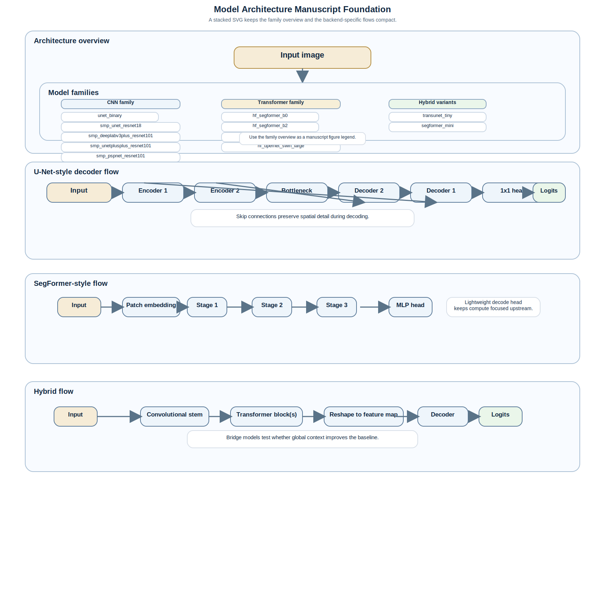

# Model Architecture Manuscript Foundation

## Purpose

This document is the manuscript-oriented reference for the segmentation backends implemented in the repository. It is written for scientific reporting, comparison studies, and student-facing explanation of why one model family behaves differently from another.

The goal is not to advertise a single winner. The goal is to make architectural trade-offs explicit so that model selection is defensible.

## Scope

Supported backends covered here:

- `unet_binary`
- `smp_unet_resnet18`
- `smp_deeplabv3plus_resnet101`
- `smp_unetplusplus_resnet101`
- `smp_pspnet_resnet101`
- `smp_fpn_resnet101`
- `hf_segformer_b0`
- `hf_segformer_b2`
- `hf_segformer_b5`
- `hf_upernet_swin_large`
- `transunet_tiny`
- `segformer_mini`

Related baseline note:

- the classical, non-learned baseline is documented separately in [`docs/conventional_segmentation_pipeline.md`](conventional_segmentation_pipeline.md)

Important interpretation note:

- `transunet_tiny` and `segformer_mini` are internal research variants.
- They are inspired by published ideas, but they are not official checkpoint-equivalent reproductions of the original papers.
- If you write about them in a manuscript, label them as internal implementations or adapted baselines.

## Architecture Overview

The composite SVG contains the overview plus the family-specific flow sheets.

### U-Net-Style Decoder Flow

The figure above includes the U-Net, SegFormer, and hybrid flow sheets in one stacked composite.

## Model Family Overview

| Model | Family | Core Idea | Primary Citation(s) | Best When | Main Caution |
|---|---|---|---|---|---|
| `unet_binary` | compact CNN encoder-decoder | small, fully local U-Net-style baseline | [U-Net](https://arxiv.org/abs/1505.04597) | you need a simple, reproducible baseline | limited long-range context |
| `smp_unet_resnet18` | U-Net with pretrained encoder | U-Net decoder plus ResNet18 encoder | [U-Net](https://arxiv.org/abs/1505.04597), [ResNet](https://arxiv.org/abs/1512.03385) | transfer learning on modest data | still biased toward local texture |
| `smp_deeplabv3plus_resnet101` | encoder-decoder with atrous context | DeepLabV3+ head with ResNet101 encoder | [DeepLabV3+](https://arxiv.org/abs/1802.02611), [ResNet](https://arxiv.org/abs/1512.03385) | thin boundaries plus broader context | larger compute and tuning cost |
| `smp_unetplusplus_resnet101` | nested U-Net | dense skip hierarchy for feature refinement | [U-Net++](https://arxiv.org/abs/1807.10165), [ResNet](https://arxiv.org/abs/1512.03385) | complex boundaries and multi-scale detail | more memory and more moving parts |
| `smp_pspnet_resnet101` | pyramid pooling | global context by pooling across regions | [PSPNet](https://arxiv.org/abs/1612.01105), [ResNet](https://arxiv.org/abs/1512.03385) | morphology benefits from scene-level context | can oversmooth small features |
| `smp_fpn_resnet101` | feature pyramid fusion | multi-resolution fusion of encoder features | [FPN](https://arxiv.org/abs/1612.03144), [ResNet](https://arxiv.org/abs/1512.03385) | scale variation is a major issue | decoder may be less expressive than newer designs |
| `hf_segformer_b0` | transformer encoder-decoder | hierarchical transformer with tiny capacity | [SegFormer](https://arxiv.org/abs/2105.15203) | compute-constrained transformer baseline | can underfit difficult textures |
| `hf_segformer_b2` | transformer encoder-decoder | balanced SegFormer variant | [SegFormer](https://arxiv.org/abs/2105.15203) | general-purpose transformer study | higher runtime than B0 |
| `hf_segformer_b5` | transformer encoder-decoder | highest-capacity SegFormer variant in this repo | [SegFormer](https://arxiv.org/abs/2105.15203) | maximum-capacity benchmark attempt | memory and runtime pressure |
| `hf_upernet_swin_large` | hierarchical transformer + pyramid decoder | Swin backbone with UPerNet head | [UPerNet](https://arxiv.org/abs/1807.10221), [Swin Transformer](https://arxiv.org/abs/2103.14030) | large-context segmentation with a strong decoder | expensive, especially on small GPUs |
| `transunet_tiny` | hybrid transformer-CNN | compact bridge between local and global features | [TransUNet](https://arxiv.org/abs/2102.04306), [ViT](https://arxiv.org/abs/2010.11929) | educational bridge model and hybrid ablations | more tuning-sensitive than pure CNNs |
| `segformer_mini` | internal lightweight transformer | small SegFormer-like research variant | [SegFormer](https://arxiv.org/abs/2105.15203), [ViT](https://arxiv.org/abs/2010.11929) | low-cost transformer-side comparison | internal variant, not an official paper checkpoint |

## Detailed Model Notes

### `unet_binary`

Architecture:

- compact encoder-decoder with two downsampling stages and two upsampling stages,
- skip connections pass encoder feature maps directly into the decoder,
- final `1x1` convolution produces a single binary logit channel.

Implemented knobs:

- `model_base_channels` controls the width of the network,
- default in the trainer is `16`,
- larger values increase capacity but also memory and overfitting risk.

Working principle:

- local edges and textures are encoded in the early layers,
- high-level structure is compressed in the bottleneck,
- skip connections restore spatial detail during decoding.

Why it matters:

- this is the simplest deep-learning baseline in the repository,
- it is usually the easiest to train and reproduce,
- it is the best anchor for ablation studies.

Primary citation:

- [Ronneberger et al., 2015](https://arxiv.org/abs/1505.04597)

### `smp_unet_resnet18`

Architecture:

- standard U-Net decoder,
- ResNet18 encoder initialized from ImageNet-pretrained weights when requested,
- external implementation via `segmentation_models_pytorch`.

Working principle:

- the encoder learns robust early features from generic natural images,
- the decoder reconstructs pixel-aligned segmentation from those features,
- ImageNet initialization often improves data efficiency in small-to-medium datasets.

Why it differs from `unet_binary`:

- the encoder is deeper and pretrained,
- the implementation is more modular and externally maintained,
- it is typically stronger when the dataset is not large enough to train everything from scratch.

Primary citations:

- [Ronneberger et al., 2015](https://arxiv.org/abs/1505.04597)
- [He et al., 2016](https://arxiv.org/abs/1512.03385)

### `smp_deeplabv3plus_resnet101`

Architecture:

- DeepLabV3+ decoder,
- ResNet101 encoder,
- atrous / dilated context aggregation in the decoder path.

Working principle:

- dilated convolutions expand the receptive field without excessive downsampling,
- the decoder combines semantic context with boundary refinement,
- useful when object extent and boundary precision both matter.

Why it differs:

- more context-aware than a plain U-Net,
- usually more expensive than `smp_unet_resnet18`,
- often better when the background contains texture clutter or repeated motifs.

Primary citations:

- [Chen et al., 2018](https://arxiv.org/abs/1802.02611)
- [He et al., 2016](https://arxiv.org/abs/1512.03385)

### `smp_unetplusplus_resnet101`

Architecture:

- nested U-Net decoder with dense skip refinement,
- ResNet101 encoder,
- multiple paths between encoder and decoder scales.

Working principle:

- intermediate decoder stages are refined by nested feature reuse,
- the architecture tries to reduce the semantic gap between encoder and decoder features,
- this can help on boundaries where one skip path is not enough.

Why it differs:

- usually more expressive than a plain U-Net decoder,
- often more memory-hungry than `smp_unet_resnet18`,
- can be a good compromise when boundary detail matters more than raw speed.

Primary citations:

- [Zhou et al., 2018](https://arxiv.org/abs/1807.10165)
- [He et al., 2016](https://arxiv.org/abs/1512.03385)

### `smp_pspnet_resnet101`

Architecture:

- PSPNet decoder with pyramid pooling,
- ResNet101 encoder.

Working principle:

- the decoder pools context at multiple scales,
- the network mixes local evidence with larger scene context,
- this helps when the same local texture may be foreground or background depending on the surrounding area.

Why it differs:

- stronger global-context bias than a basic U-Net,
- sometimes too smooth for very thin or very small structures,
- useful when segmentation should respect broader morphology context.

Primary citations:

- [Zhao et al., 2017](https://arxiv.org/abs/1612.01105)
- [He et al., 2016](https://arxiv.org/abs/1512.03385)

### `smp_fpn_resnet101`

Architecture:

- Feature Pyramid Network decoder,
- ResNet101 encoder,
- feature fusion across multiple spatial scales.

Working principle:

- lower-level and higher-level features are merged across the pyramid,
- the network sees both fine details and coarse structure,
- scale-consistent fusion is often useful when feature size varies substantially.

Why it differs:

- designed for multi-scale representation rather than a single bottleneck view,
- generally lighter than some context-heavy decoders,
- can be a strong middle ground for scale-sensitive segmentation.

Primary citations:

- [Lin et al., 2017](https://arxiv.org/abs/1612.03144)
- [He et al., 2016](https://arxiv.org/abs/1512.03385)

### `hf_segformer_b0`, `hf_segformer_b2`, `hf_segformer_b5`

Architecture:

- hierarchical transformer backbone,
- lightweight all-MLP decode head,
- implemented through Hugging Face `SegformerForSemanticSegmentation`.

Implemented variant settings:

| Variant | Hidden sizes | Depths | Attention heads | Decoder hidden size | Drop path |
|---|---|---|---|---|---|
| `b0` | `[32, 64, 160, 256]` | `[2, 2, 2, 2]` | `[1, 2, 5, 8]` | `256` | `0.1` |
| `b2` | `[64, 128, 320, 512]` | `[3, 4, 6, 3]` | `[1, 2, 5, 8]` | `768` | `0.1` |
| `b5` | `[64, 128, 320, 512]` | `[3, 6, 40, 3]` | `[1, 2, 5, 8]` | `768` | `0.1` |

Working principle:

- patch embedding turns the image into a token hierarchy,
- each stage mixes local detail with broader context,
- the decode head stays lightweight so compute is focused on the encoder hierarchy.

Why the variants differ:

- `b0` is the smallest and fastest,
- `b2` balances capacity and efficiency,
- `b5` is the largest and most expensive in this repo.

Primary citation:

- [Xie et al., 2021](https://arxiv.org/abs/2105.15203)

### `hf_upernet_swin_large`

Architecture:

- Swin Transformer backbone,
- UPerNet decode head,
- implemented through Hugging Face `UperNetForSemanticSegmentation`.

Implemented settings:

- backbone image size: `512`
- patch size: `4`
- embedding dimension: `192`
- backbone depths: `[2, 2, 18, 2]`
- attention heads: `[6, 12, 24, 48]`
- window size: `7`
- drop path rate: `0.3`
- UPerNet pool scales: `[1, 2, 3, 6]`
- auxiliary head enabled

Working principle:

- Swin encodes the image with shifted-window attention,
- UPerNet aggregates multi-scale context in the decoder,
- this combination is strong when both global structure and multi-resolution detail matter.

Why it differs:

- compared with SegFormer, the decoder is more explicitly pyramid-oriented,
- compared with CNNs, the backbone can model broader relations with fewer locality assumptions,
- the model is usually expensive enough that it should be justified by measured gains.

Primary citations:

- [Xiao et al., 2018](https://arxiv.org/abs/1807.10221)
- [Liu et al., 2021](https://arxiv.org/abs/2103.14030)

### `transunet_tiny`

Architecture:

- small U-Net-like CNN stem,
- transformer encoder at the bottleneck,
- U-Net-style decoder.

Implemented settings:

- `base_channels = 16` by default,
- `transformer_depth = 2`,
- `transformer_num_heads = 4`,
- `transformer_mlp_ratio = 2.0`,
- `transformer_dropout = 0.0`

Working principle:

- the convolutional stem captures local texture,
- the transformer bottleneck injects global relation modeling,
- the decoder restores spatial detail after the transformer pass.

Why it differs:

- it bridges CNN and transformer behavior in one compact model,
- it is more sensitive to optimization choices than `unet_binary`,
- it is useful for teaching and for hybrid ablations.

Primary citations:

- [Chen et al., 2021](https://arxiv.org/abs/2102.04306)
- [Dosovitskiy et al., 2021](https://arxiv.org/abs/2010.11929)

### `segformer_mini`

Architecture:

- internal miniature patch-transformer segmentation model,
- patch embedding + transformer encoder + small convolutional decoder.

Implemented settings:

- `base_channels = 16` by default,
- `transformer_depth = 2`,
- `transformer_num_heads = 4`,
- `transformer_mlp_ratio = 2.0`,
- `patch_size = 4`

Working principle:

- patch embedding compresses the image into a learned token grid,
- the transformer mixes information globally,
- the decoder upsamples the transformed features back to pixel space.

Why it differs:

- it is a lightweight internal comparison point for transformer-style segmentation,
- it is not an official NVIDIA SegFormer checkpoint or a direct paper reproduction,
- use it as an internal baseline, not as a canonical published architecture.

Primary citations:

- [Xie et al., 2021](https://arxiv.org/abs/2105.15203)
- [Dosovitskiy et al., 2021](https://arxiv.org/abs/2010.11929)

## Critical Comparison

| Model | Local detail | Global context | Compute cost | Training sensitivity | Best role in the repo |
|---|---|---|---|---|---|
| `unet_binary` | strong | limited | low | low | baseline anchor |
| `smp_unet_resnet18` | strong | moderate | low-medium | low-medium | practical transfer baseline |
| `smp_deeplabv3plus_resnet101` | strong | strong | medium-high | medium | context-aware CNN benchmark |
| `smp_unetplusplus_resnet101` | strong | moderate-strong | medium-high | medium | detail-heavy comparison model |
| `smp_pspnet_resnet101` | moderate | strong | medium-high | medium | large-context benchmark |
| `smp_fpn_resnet101` | strong | moderate | medium | medium | multi-scale fusion benchmark |
| `hf_segformer_b0` | moderate | strong | medium | medium-high | smallest transformer benchmark |
| `hf_segformer_b2` | strong | strong | medium-high | medium-high | balanced transformer candidate |
| `hf_segformer_b5` | strong | very strong | high | high | high-capacity transformer attempt |
| `hf_upernet_swin_large` | strong | very strong | high | high | strong but expensive transformer-pyramid benchmark |
| `transunet_tiny` | strong | strong | medium | medium-high | hybrid bridge model |
| `segformer_mini` | moderate | moderate-strong | medium-low | medium-high | internal lightweight transformer baseline |

## Architecture-Specific Parameters

This section translates the most important implementation knobs into plain language.

### CNN family knobs

| Knob | Meaning | Typical Effect When Increased |
|---|---|---|
| `base_channels` | width of the first convolutional stage | more capacity, more memory use |
| encoder depth | how many downsampling scales the encoder uses | stronger abstraction, coarser detail |
| skip connections | whether decoder receives encoder features | better boundary recovery |
| decoder type | how context is fused back into pixel space | changes balance between detail and context |

### SegFormer knobs

| Knob | Meaning | Typical Effect When Increased |
|---|---|---|
| `hidden_sizes` | channel width at each transformer stage | more capacity and memory use |
| `depths` | number of blocks per stage | deeper contextual modeling |
| `num_attention_heads` | attention parallelism | more representational flexibility but more tuning sensitivity |
| `decoder_hidden_size` | width of the decode head | stronger pixel refinement but more compute |
| `drop_path_rate` | stochastic depth regularization | better regularization, slower convergence if too high |

### UPerNet-Swin knobs

| Knob | Meaning | Typical Effect When Increased |
|---|---|---|
| `embed_dim` | starting width of the Swin backbone | higher capacity and memory use |
| `depths` | number of blocks in each stage | more context modeling |
| `num_heads` | heads per stage | more feature diversity |
| `window_size` | local attention window | larger receptive windows, higher cost |
| `pool_scales` | multi-scale pooling bins in the decoder | broader contextual fusion |

### Hybrid knobs

| Knob | Meaning | Typical Effect When Increased |
|---|---|---|
| `transformer_depth` | number of transformer encoder blocks | more context modeling, more cost |
| `transformer_num_heads` | number of attention heads | richer interactions, more sensitivity to divisibility constraints |
| `transformer_mlp_ratio` | feed-forward expansion ratio | more capacity in the transformer block |
| `transformer_dropout` | dropout probability | more regularization, sometimes slower convergence |
| `patch_size` | size of the patch embedding step | smaller patches preserve detail but cost more compute |

## Factors That Affect Performance

The same architecture can behave very differently depending on the following factors:

1. dataset size and diversity,
2. label quality and correction consistency,
3. class imbalance,
4. contrast normalization and preprocessing,
5. input resolution,
6. crop policy,
7. pretrained initialization,
8. learning rate and batch size,
9. augmentation strength,
10. seed and determinism settings,
11. hardware memory pressure,
12. whether validation is used for tuning only or also for final reporting.

## What Usually Helps Which Family

### When the images are small and contrast-driven

Prefer:

- `unet_binary`
- `smp_unet_resnet18`

Reason:

- local texture is often enough,
- simpler architectures are easier to debug.

### When global morphology matters

Prefer:

- `smp_deeplabv3plus_resnet101`
- `smp_pspnet_resnet101`
- `hf_segformer_b2`
- `hf_upernet_swin_large`

Reason:

- these architectures can integrate broader context.

### When you need a strong but efficient transformer baseline

Prefer:

- `hf_segformer_b0`
- `hf_segformer_b2`

Reason:

- they are easier to justify than a very large model when compute is constrained.

### When you want a pedagogical bridge between CNNs and transformers

Prefer:

- `transunet_tiny`
- `segformer_mini`

Reason:

- these are useful for explaining how local inductive bias and global attention interact.

## Manuscript Writing Guidance

When describing a result set in a report or paper:

1. state the model family and whether it is official or internal,
2. state the initialization regime: scratch, pretrained, or partial warm start,
3. state the input and output contract,
4. compare quality metrics and runtime cost together,
5. discuss failure cases by morphology type,
6. report across seeds when possible,
7. separate architecture effects from data/preprocessing effects,
8. avoid claiming superiority from a single seed or a single image.

## Citation And Provenance Policy

For any manuscript table or figure, include:

- model ID,
- architecture family,
- source citation,
- initialization source,
- source revision or weight provenance when applicable,
- whether the implementation is official, adapted, or internal.

The complementary provenance table for pretrained bundles lives in [`docs/pretrained_model_catalog.md`](pretrained_model_catalog.md), and the canonical BibTeX entries live in [`docs/pretrained_model_citations.bib`](pretrained_model_citations.bib).

## Related Documentation

- [`docs/pretrained_model_catalog.md`](pretrained_model_catalog.md)
- [`docs/pretrained_model_citations.bib`](pretrained_model_citations.bib)
- [`docs/hydride_research_workflow.md`](hydride_research_workflow.md)
- [`docs/benchmark_metrics_reference.md`](benchmark_metrics_reference.md)
- [`docs/scientific_validation.md`](scientific_validation.md)
