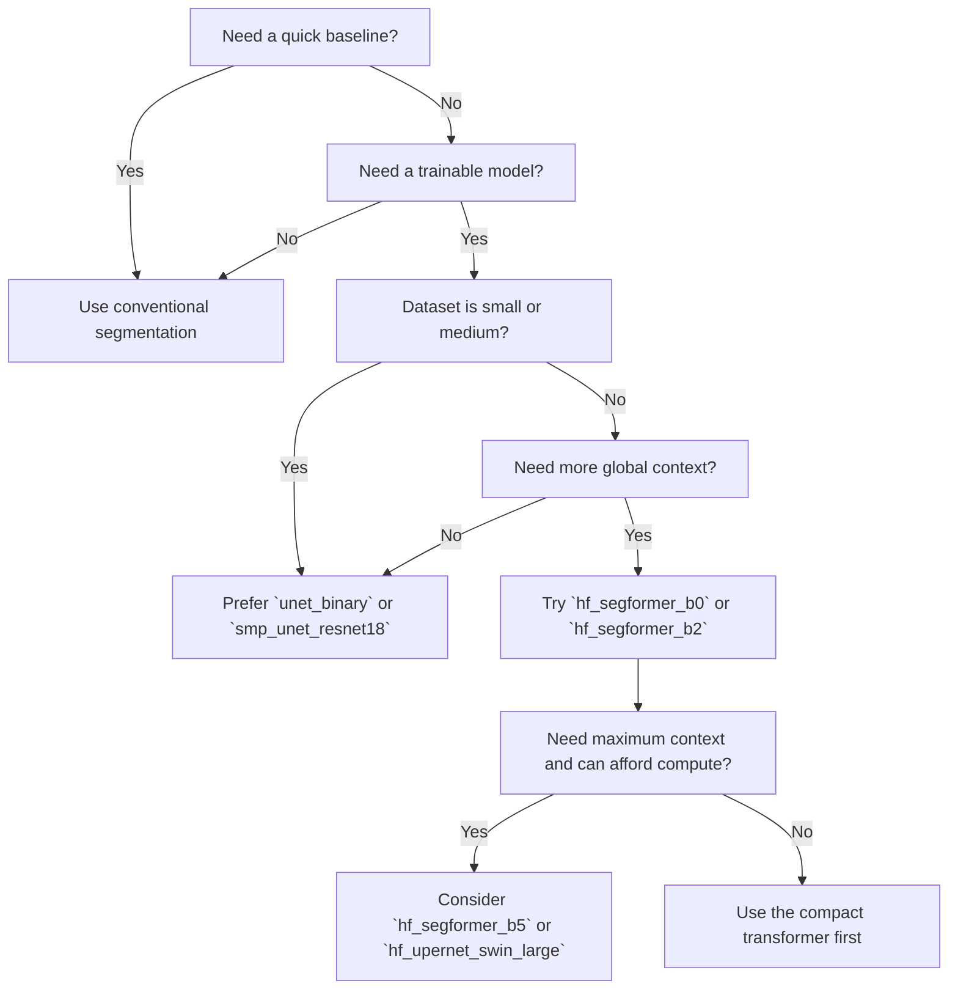

# Which Model Should I Use?

## Purpose

This page is a practical selection guide. It is meant to help new users choose a starting point before they invest time in training or deployment.

## Selection Rule

Start with the simplest model that can reasonably solve the problem.

That usually means:

1. try the conventional baseline first,
2. then try a compact CNN,
3. then try a transformer or hybrid model only if the simpler methods miss an important failure mode.

## Decision Tree

## Practical Recommendations

### If you are just starting

Use:

- the conventional baseline,
- then `unet_binary`.

Why:

- both are easier to interpret,
- both are simpler to debug,
- both provide a strong reference for later comparison.

### If your data are limited

Prefer:

- `smp_unet_resnet18`,
- `unet_binary`.

Why:

- pretrained or compact CNNs often generalize better on small datasets than large transformers trained from scratch.

### If the background is cluttered or the morphology is complex

Prefer:

- `smp_deeplabv3plus_resnet101`,
- `smp_pspnet_resnet101`,
- `hf_segformer_b2`,
- `hf_upernet_swin_large`.

Why:

- these models can capture broader context and often handle ambiguous neighborhoods better.

### If you want a low-cost transformer comparison

Prefer:

- `hf_segformer_b0`,
- `segformer_mini`.

Why:

- they are lighter than the largest transformer options and easier to run repeatedly.

### If you want a bridge between CNNs and transformers

Prefer:

- `transunet_tiny`.

Why:

- it is useful for teaching and for testing whether global context helps without moving immediately to a large transformer stack.

## What Not To Do

- Do not start with the heaviest model first unless you already know why you need it.
- Do not pick a model only because it has the largest name or most layers.
- Do not compare models without keeping the preprocessing, split policy, and seed policy fixed.

## Related Pages

- [`docs/conventional_segmentation_pipeline.md`](conventional_segmentation_pipeline.md)
- [`docs/model_architecture_manuscript_foundation.md`](model_architecture_manuscript_foundation.md)
- [`docs/worked_example_conventional_vs_ml.md`](worked_example_conventional_vs_ml.md)
- [`docs/gui_model_integration_guide.md`](gui_model_integration_guide.md)

