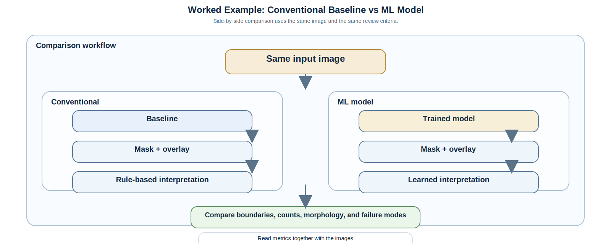

# Worked Example: Conventional Baseline vs ML Model

## Purpose

This page shows how to compare the same image through the classical baseline and a trained ML backend in a scientifically honest way.

Use this page when you want to understand:

- what improved,
- what got worse,
- whether the improvement is real or just numerical,
- how to explain the result to a student or reviewer.

## Comparison Workflow

The comparison figure is a static SVG so the side-by-side layout remains compact.

## What To Compare

### 1. Boundary quality

Ask whether the model:

- traces the hydride boundary more completely,
- preserves thin plates,
- avoids spurious edge fragments.

### 2. Object fidelity

Ask whether the model:

- keeps discrete plates separate,
- avoids merging neighboring plates,
- avoids breaking one plate into many fragments.

### 3. Size distribution

Ask whether the predicted objects have a realistic size profile compared with the reference mask or known physics.

### 4. Orientation behavior

Ask whether the predicted mask still produces a sensible orientation distribution.

### 5. Operational cost

Ask whether the gain is worth the added compute, tuning burden, and training complexity.

## How To Interpret The Result

Use the following decision logic:

- If the ML model improves IoU but destroys thin boundaries, that is a mixed result.
- If the ML model improves visual quality but not metrics, inspect the metric choice and annotation consistency.
- If the ML model improves both images and metrics, check whether the gain holds across multiple seeds.
- If the conventional baseline is already strong, a more complex model may not justify its cost.

## Example Reporting Template

When you describe a comparison, write something like:

> The conventional baseline provided a fast, transparent segmentation reference. The trained model improved contextual consistency in low-contrast regions, but the final choice also depended on runtime, stability, and correction burden.

Do not write only:

> The model was better.

That statement is not scientifically useful on its own.

## Minimal Review Checklist

- same image,
- same preprocessing policy,
- same class map,
- same output scaling,
- same evaluation split,
- same seed where relevant,
- side-by-side visual inspection,
- metric summary,
- note of failure modes.

## Related Pages

- [`docs/conventional_segmentation_pipeline.md`](conventional_segmentation_pipeline.md)
- [`docs/model_architecture_manuscript_foundation.md`](model_architecture_manuscript_foundation.md)
- [`docs/scientific_validation.md`](scientific_validation.md)
